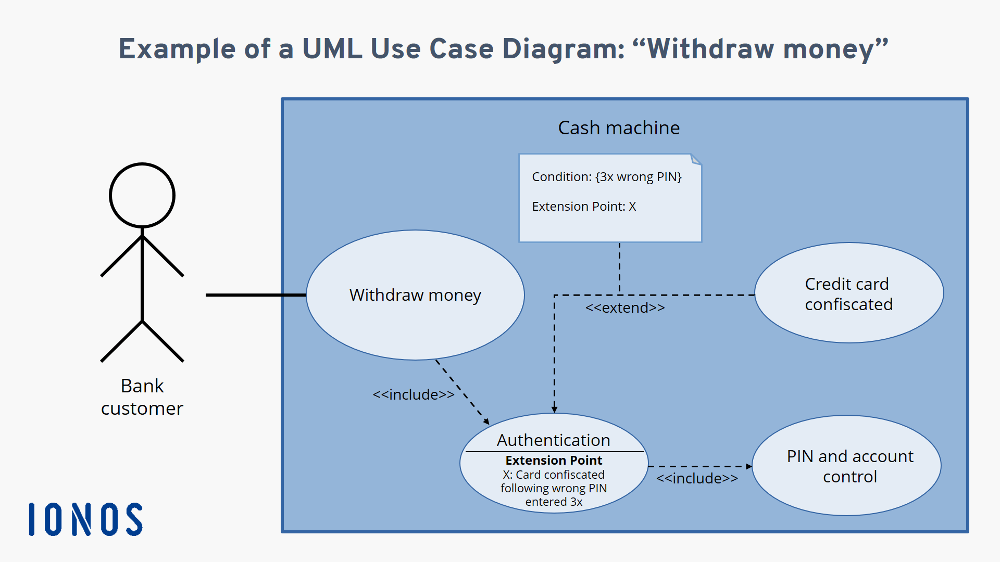
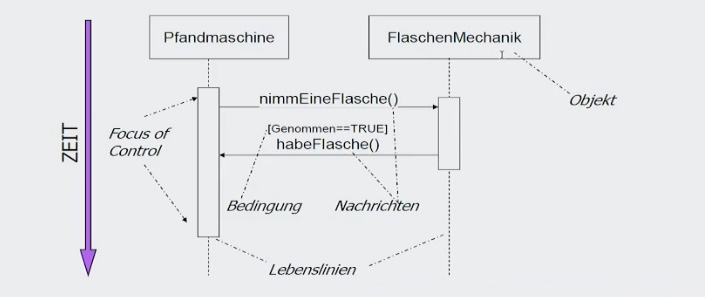
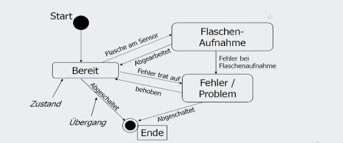
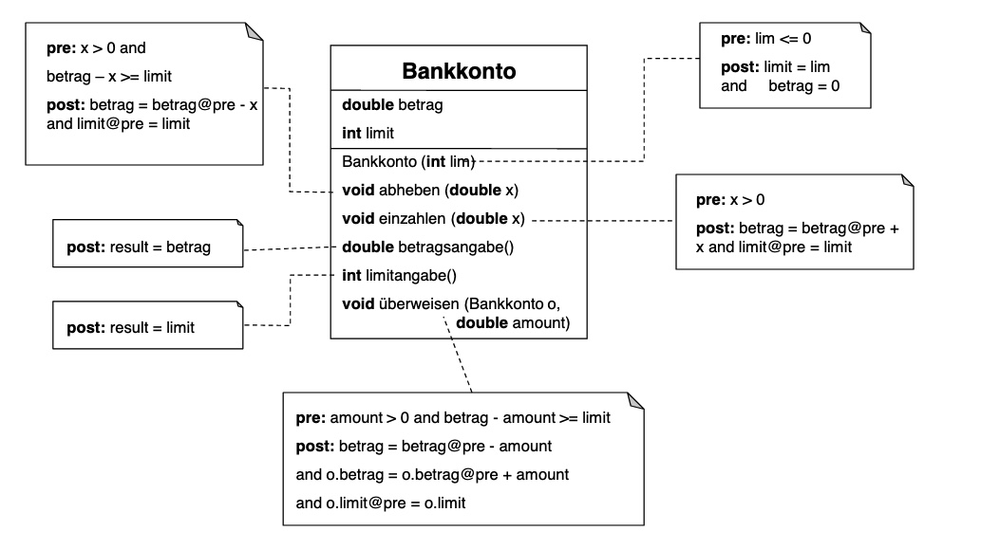
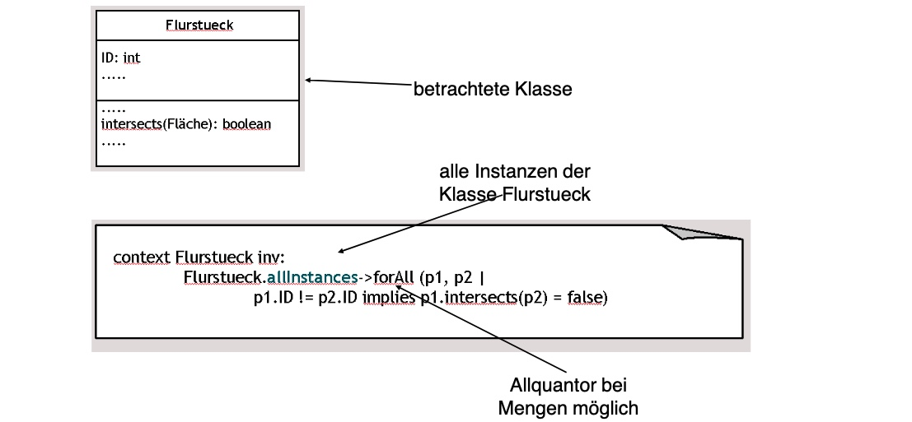

# 06.12.2021 UML 2 

andere Diagrammtypen als Klassendiagramme, nur wichtig ist das **Use-Case-Diagramm**

### weitere Diagramme

#### Use-Case-Diagramm

Verbindungen im Use-Case-Diagram:

- **Erweiterung** <<extend\>\> : optionale Ausführung 
    - Optional bei Abhebung: nach 3 Versuchen Konfsizierung
- **Unteranwendung** <<includes\>\> : notwendige Bedingung
    - Geldabhebung benötigt Authentifizierung der Karte
- **Verallgemeinerung** (Vererbung )

#### Interaktionsdiagramme

Beschreibung zeitlicher Interaktionen zwischen Objekten

Interaktion erfolgt mithilfe von **Nachrichten**

- von Sender -> Empfänger
- besitzt Namen,
- Parameter
- Nachrichtenlaufzeit

#### Kommunikationsdiagramm

nützlich für viele Objekte, Nummerierung der Nachrichten

#### Zustandsdiagramm

 Beschreibung des Verhaltens eines Teilsystems im Zeitverlauf

- Zustand als Knoten
- Zustandsübergänge durch Pfeil mit Beschriftung
- Beginn und Ende als schwarzer Punkt

#### Aktivitätsdiagramm

Beschreibung des Ablaufes eines Anwendungsfalles

---

### Object Constraint Language OCL

formale Erweiterung von UML für Sicherheitsrelevante Maschinen

- Verwendung von Vor- / Nachbedigungen für Methoden / Schleifen
- Darstellung Konditionen als "Post-It" mit umgeknickter Ecke und gestrichelter Linie

Konditionen wurden hier als **pre** und **post** dargestellt als Checks

Weiteres Beispiel mit Allquantor 

