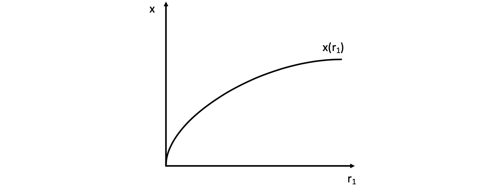

# 22.04.2022 Unternehmen und Rationalkalkül

Gegenseite zur Haushalte und Nachfrage: **Unternehmen** und **Angebot**

Annahmen:
- Kosten *C*
- Inputs/Faktoren $r_1,r_2$ mit Preisen $q_1,q_2$, oft:
    - $r_1$ = Arbeit mit Lohn $q_1$
    - $r_2$ = Kapital mit Zins $q_2$

- Maximierung von Gewinn *G*

## Isoquantenfunktion

aus Inputs $r_1,r_2$ wird Gut *x* hergestellt in Produktionsfunktion $x(r_1,r_2)$

- jedes weitere eingebrachte Input steigert, aber mit abnehmenden Grenzertrag

Produktionskurve für ein Gut: 

1. Ableitung = **Grenzproduktivität** > 0
2. Ableitung = **Steigerung der Grenzprod.** < 0

für Güterkombination: *Isoquantenkurve* (*iso* = gleich, *quant* = Menge -> gleiche Menge)

Bilden des totalen Differentials und umstellen:
$$
\text{Grenzprod. * Veraenderung erster Faktor + ...} \\

\to dx = \frac{\partial x}{\partial r_1} * \Delta r_1 + \frac{\partial x}{\partial r_2} * \Delta r_2  \\

\frac{\Delta r_2}{\Delta r_1} \bigg|_T
= -\frac{\frac{\partial x}{\partial r_1}}{\frac{\partial x}{\partial r_2}}
= MRTS \text{ (Marginal Rate of Technical Subst.)}
$$

hier sind das die Opportunitätskosten von $r_1$ (eine Einheit mehr von $r_1$, wieiviel Verzicht auf $r_2$)

> **MRTS:** Grenzrate der technischen Substitution, beschreibt technisches Substitutionskönnen des Unternehmens

## Isokostengerade

Kostenfunktion eines Unternehmens: $C = q_1 * r_1 + q_2 * r_2$ 
- unter Annahme eines perfekten Marktes

Darstellung mit *Isokostengerade*: 

> **MRMS:** (Marginal Rate of Market Substitution) das Preisverhältnis zweier Güter

## Produktionsgleichgewicht

in optimalen Punkt $Z_1$ ist $|MRTS| = |MRMS| $ 

Betrachtung mit *Lagrange-Funktion* 
$$
L = x(r_1,r_2) + \lambda * (C- r_1*q_1 - r_2 *q_2)
$$

- der hintere Summand ist bei rationalen Unternehmen 0
    - alles Geld wird verwendet für Faktoren
- $\lambda$ = Grenznutzen des Geldes 
    - wieviel mehr *x* wenn *C* um 1 Euro erhöht wird
    - = erste  Ableitung der Zielfunktion $\frac{\partial x}{\partial C}$

Ableitung der Lagrange Funktion
$$
\to \frac{\partial L}{\partial r_1} = 
\frac{\partial x}{\partial r_1} - \lambda*q_1 = 0
\\
\to \frac{\partial L}{\partial r_2} = 
\frac{\partial x}{\partial r_2} - \lambda*q_2 = 0
\\
\to \frac{\partial L}{\partial \lambda} = C- r_1*q_1 - r_2 *q_2
$$

### Exkurs marginale Zahlungsbereitschaft

> **MZB:** *persönliche* Bereitschaft zu Zahlung eines Preis

$$
P_1 = \frac{\frac{\partial U}{\partial x_1}}{\lambda} = MZB
$$

- $\lambda$ ist Faktor und U verändert sich => abnehmender Grenznutzen
- bei Menschen ohne Geld ist Grenznutzen des Geldes $\infty$ 
    - Dadurch $\lambda = \infty$ und *MZB = 0*
    - nur wenn Subsistenzeinkommen für Marktteilnehmer können sie sich überhaupt etwas kaufen
    - deswegen Sozialstaat! 

## Expansionspfad

beschreibt Verhältnis zwischen Inputs-Outputs, die bei Unternehmen nach oben offen sind (langfristig)

## Gewinnmaximierung

Gewinn = Erlös - Kosten: $G(x) = E(x) - C(x)$

- Maximum bei $\frac{\partial G}{\partial x} = \frac{\partial E}{\partial x} - \frac{\partial C}{\partial x} = 0$
- Grenzgewinn ist null und Grenzerlöse = Grenzkosten

nach Einsetzen der Erlösfunktion $p = \frac{\partial C}{\partial x}$

- Preis für Gut = Grenzkosten

 

## Übung 

### Isoquante

Beispiel-Produktionsfunktion $x (L,K) = L^{0,5} K^{0,5}$

Punkte:

1. (2,8)
2. (3,12)
3. (8,2)
4. (12,3)

---

Nutzen der Punkte (Einsetzen in *x*)

1. x = 4
2. x= 6
3. x = 4
4. x = 6

---

Gleichung der Isoquanten hier: $K = \frac{x^2}{L}$

- Erste Outputfunktion x= 6  $\to \frac{36}{L}$
- x = 4 $\to \frac{16}{L}$

---

Grenzproduktivitäten:

- der Arbeit: $MP_L = \frac{\partial x}{\partial L} = \frac{1}{2} \sqrt{\frac{K}{L}}$
- des Kapitals: $MP_K = \frac{\partial x}{\partial K} = \frac{1}{2} \sqrt{\frac{L}{K}}$

---

Steigung der Isoquante
$$
Funktion: K = \frac{x^2}{L} \\
Ableitung: \frac{\partial K}{\partial L} = - \frac{x^2}{L^2}
$$

die Ableitung ist die Steigung der Isoquante = MRTS

---

Effekt von gestiegener Arbeitsproduktivität:

Marginal Rate of Market Substituions: (andere Formel) $MRTS = \frac{MP_L}{MP_K} = -\frac{\frac{\partial x}{\partial L}}{\frac{\partial x}{\partial K}} $
$$
Effekt: MRTS \uparrow= \frac{MP_L \uparrow}{MP_K}
$$
= größere Steigung = steilerer Anstieg der Isoquante

analog Steigung der Produktivität des Kapitals: $Effekt: MRTS \downarrow= \frac{MP_L}{MP_K \uparrow}$

### Isokosten

- Kostenfunktion generell: $C = wL+qK$ 
    - bei *w = 4*, *q=1* und *C = 16*   
    - $16 = 4L + K$
- Funktionsumstellung: $K = -\frac{w}{q}L+\frac{C}{q}$
    - $K = -4L + 16$

Schnittpunkte:

- Ordinate: $\frac{C}{q} = 16$
- Abszisse: $\frac{C}{w} = 4$

Steigung der Kostenfunktion = $\frac{\partial K}{\partial L} = \big|-\frac{w}{q} \big| = \frac{w}{q}$

- Hier: *-4* (Kosten der Arbeit in Einheiten von Kapital)
- Ist MRMS (Marginal Rate of Market Subst.)

Graphisch: (mit noch anderen Kostenniveau)

### Kostenminimum mit Lagrange-Funktion

Kostenminimum analytisch!

#### 1: Aufstellen des Optimierungsproblems

$$
min_{L,K} \ C = min(wL+qK) \\
s.t \\
L^{0,5} K^{0,5} = x
$$

#### 2: Aufstellen der Lagrange Funktion

$$
LF = (wL+qK)+\lambda(x-L^{0,5}K^{0,5})
$$

#### 3: Ableiten der Lagrange Funktion (nach $L,K, \lambda$ )

$$
\frac{\partial LF}{\partial L} &= w- \lambda \frac{K^{0,5}}{2L^{0,5}} = 0 \\
\frac{\partial LF}{\partial K} &= q- \lambda \frac{L^{0,5}}{2K^{0,5}} = 0 \\
\frac{\partial LF}{\partial \lambda} &= x- L^{0,5}K^{0,5} = 0
$$

#### 4: Lösen des LGS 

- Auflösen der ersten und zweiten nach Lambda

$$
\frac{\partial LF}{\partial L} \implies \lambda = 2w \frac{L^{0,5}}{K^{0,5}} \\

\frac{\partial LF}{\partial K} \implies \lambda = 2q \frac{K^{0,5}}{L^{0,5}}
$$

- Gleichsetzen und auflösen nach Menge Arbeit

$$
2w \frac{L^{0,5}}{K^{0,5}} = 2q \frac{K^{0,5}}{L^{0,5}} \\
L = \frac{q}{w} K
$$
- Einsetzen in dritte Gleichung

$$
x - \bigg(\frac{q}{w}K \bigg)^{0,5}K^{0,5} = 0 \\
K = x \bigg( \frac{w}{q}\bigg)^{0,5}
$$

*= kostenminimaler Einsatz von Kapital*

- Einsetzen davon in Restriktion

$$
L = x \bigg( \frac{q}{w} \bigg)^{0,5}
$$

*= kostenminimaler Einsatz von Arbeit*

- Bestimmung des Optimums für Output *x=4*

### Kostenmimimum graphisch

im Mimimum: $\frac{MP_L}{MP_K} = MRTS = MRMS = \frac{w}{q}$
