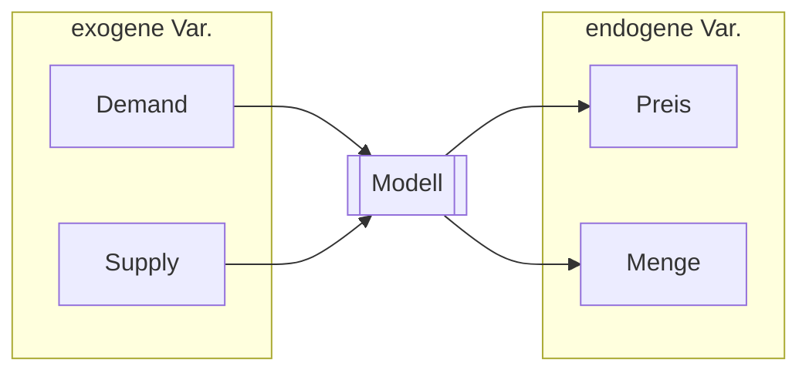
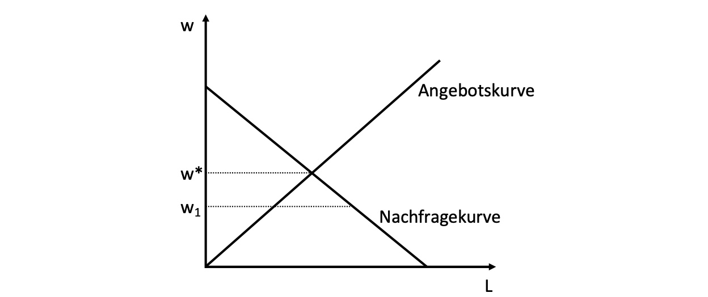
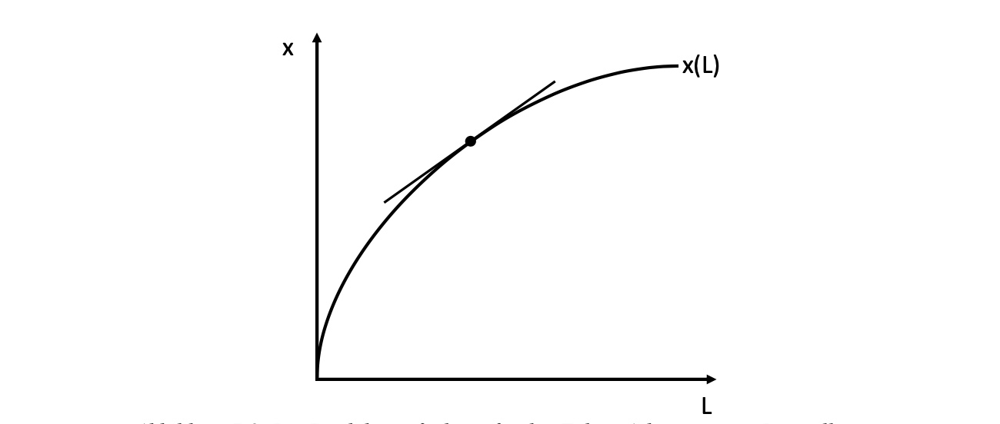
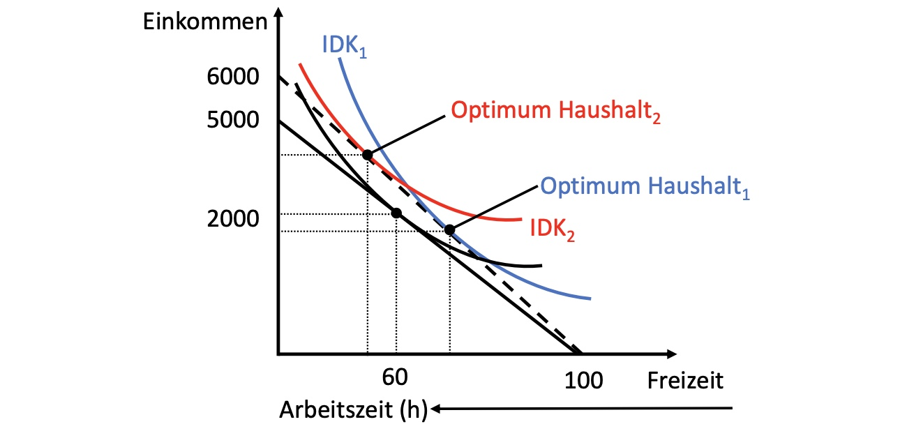
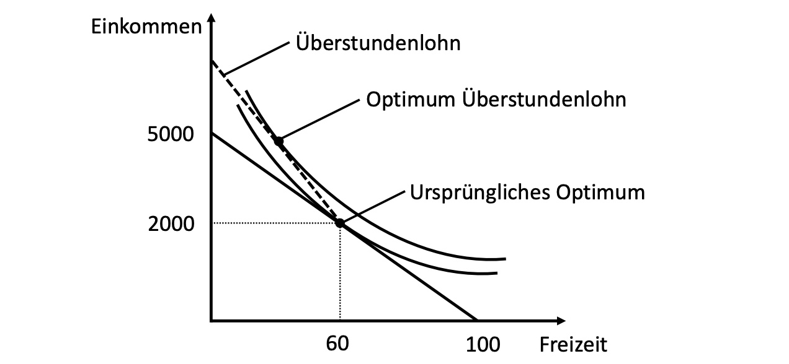
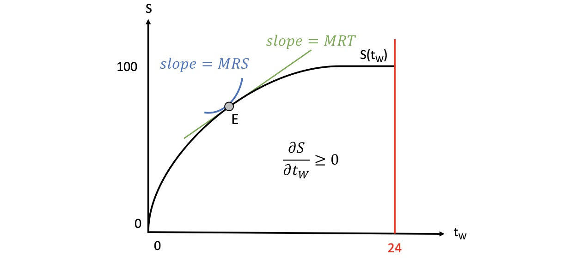
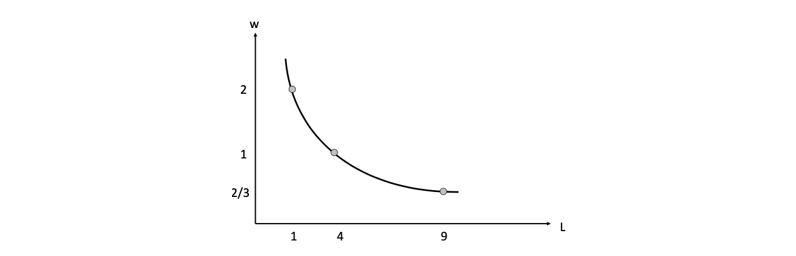
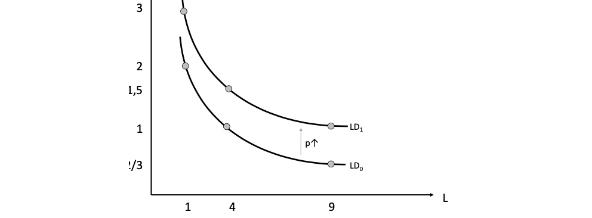

# 05.05.2022 Arbeitsmarkt

Wiederholung: mikroökonomisches Modell

> never start reasoning from Price / Quantity Change!

## Inputfaktoren der Produktion

`Frage: woher kommen die Produktionsfaktoren der Unternehmen?`

Produktionsfaktoren:

- Arbeit *L* für Lohn *w* 
- Kapital *K* für Zinsrate *i*

beide kommen von Haushalten als Anbieter

Darstellung: Arbeitsmarkt

## Arbeitsnachfrage

Produktionsfunktion eines Unternehmens für den Faktor Arbeit bei konstanten Kapital: $x(L, \bar{K})$  

- Grenzproduktivität: $\frac{\partial X}{\partial L} > 0$ , oder eine Einheit mehr Arbeit => wieviel mehr Güter?

Gewinnfunktion eines profitorientierten Unternehmens: 
$$
\begin{aligned}
G &= p*x(L,K) - C(L,K) \\
  &= p*x(L,K) - w*L-i*K
\end{aligned}
$$
rationaler Arbeitseinsatz = erste Ableitung
$$
\frac{\partial G}{\partial L} 
= p*\frac{\partial x(L,K)}{\partial L} 
- \frac{\partial C(L,K)}{\partial L} \\
\to p * \frac{\partial x(L,K)}{\partial L} - w = 0 \\
\implies \bold{w = p * \frac{\partial x(L,K)}{\partial L}} = WGP_A
$$

>  **Wertgrenzprodukt der Arbeit WGP:** Beitrag des letzten eingestellten Mitarbeiters zum Umsatz = *Grenzvorteil*

dazu sind *Grenzkosten* die Lohnkosten

### Schocks der Nachfrage

- Marktpreis *p* des angebotenen Gutes steigt   $\implies WGP_A \uparrow \implies N \uparrow$ 
- Technologie Veränderung  $\implies \frac{\partial x}{\partial L} \implies N \uparrow$ 
- steigender Kapitaleinsatz -> zwei Optionen:
    - *K* und *L* sind **komplementär** => Grenzproduktivität $\frac{\partial x}{\partial L} \uparrow \implies N \uparrow$
    - *K* und *L* sind **substitutiv** => Grenzproduktivität $\frac{\partial x}{\partial L} \downarrow \implies N \downarrow$

## Arbeitsangebot

Opportunitätskosten der Arbeit für Haushalte = verlorene *Freizeit*

- Arbeitsangebot = Haushalts-TradeOff-Entscheidung zwischen Arbeit und Freizeit
- Angebotskurve = Veränderung der Arbeit bezüglich Lohnsatz *w*

also: Lohn = Grenzkosten der Freizeit

Einkommen $I = w * t_A$ (Lohn * Arbeitszeit)

Effekt einer Lohnerhöhung auf eine Haushaltsentscheidung:

persönliche Präferenzen abhängig von *Einkommenseffekt (EE)* und *Substiutionseffekt (SE)*!

- Haushalt 1 = starke Freizeitpräferenz
    - Lohnerhöhung: *EE > SE*
- Haushalt 2 = niedrige Freizeitpräferenz
    - Lohnerhöhung: *SE > EE*

---

Lösung des Freizeitproblems für Unternehmen: **Überstundenlohn**

- Kann nur in Richtung mehr Arbeitszeit führen

### Zeitallokation

`Frage: wieviel Lernen für die nächste Klausur?`

- Klausurergebnis *S* zwischen 0 und 100 Punkten 
- Arbeitseinsatz $t_w$ 
- Student hat Interesse an Freizeit $t_F$ und *S* 
    - Nutzenfunktion $U(t_F,S)$ mit $\frac{\partial U}{\partial t_F}> 0$ und $\frac{\partial U}{\partial S}> 0$

- Steigung der Gerade: $\frac{\partial S(t_w)}{\partial t_w} \ge 0$
- Zeitrestriktion $T = t_F + t_W$

Lagrange-Funktion aufstellen und ableiten:
$$
L = U \big(t_F, S(t_W) \big) + \lambda * [T- t_F - t_W] \\
\begin{aligned}
\to \frac{\partial L}{\partial t_F} &= 
\frac{\partial U}{\partial t_F} - \lambda = 0  \\
\to \frac{\partial L}{\partial t_W} &= 
\frac{\partial U}{\partial S} \frac{\partial S}{\partial t_W} - \lambda = 0
\end{aligned}
$$
Gleichsetzen der beiden Lambdas:
$$
\frac{\partial U}{\partial S} \frac{\partial S}{\partial t_W} = \frac{\partial U}{\partial t_F} = \lambda \\ 

MRS\bigg\{ \frac{\frac{\partial U}{\partial t_F}}{\frac{\partial U}{\partial S}} = \frac{\partial S}{\partial t_W} \bigg\} MRT
$$
$\lambda$ = Grenznutzen der Zeit

- Änderung der Nutzenfunktion, wenn Restriktion T um eins gelockert wird
- Ist ausgeglichen zwischen beiden Zeitnutzungen (im Optimum)

## Arbeitslosigkeit

woran kann es liegen?

1. Erklärung: Der Mindestlohn/Tariflöhne sind schuld (**empirisch nicht nachgewiesen!**)
2. Erklärung: *Effizienzlohntheorie*

### Effizienzlohntheorie

Ausgangsituation:

- Arbeitgeber AG können Mitarbeiterleistung nicht (komplett) kontrollieren

- zahlen deswegen höheren Lohn (als Vergleichslohn) für Effizienzanreiz

Folgen:

- alle AG versuchen Löhne zu erhöhen
- künstliche Erhöhung des Preises der Arbeit => sinkender Nachfrage
- AN können sich nicht in den Markt hineinpreisen, da Unternehmen ja nur höhere Löhne zahlen wollen
- Arbeitslosigkeit als Effekt

## Übung 

### Aufgabe 1: Arbeitsnachfrage

Produktionsfunktion $L^{1/2}$ 

Gewinnoptimum: $G(L) = E(L) - C(L) = p*x(L) - w*L$

ableiten nach der Arbeit und 0 setzen
$$
\frac{\partial G}{\partial L} = p \frac{\partial x}{\partial L} - w = 0 \\
\to w = p * \frac{\partial x}{\partial L} \\
\to \frac{\partial x}{\partial L} = \frac{w}{p} \text{ Steigung der Produktionsfunktion}
$$
für p = 4 
$$
w = p * \frac{\partial x}{\partial L} = 4 \frac{1}{2}*L^{-1/2} = \frac{2}{L^{1/2}}
$$

| L     | 0    | 1    | 4    | 9    |
| ----- | ---- | ---- | ---- | ---- |
| **w** | 0    | 2    | 1    | 2/3  |

Nachfrage nach Arbeit bei w=1 und p=4
$$
1 = 2*L^{-1/2} \to& L = 4 \\
x = L^{1/2} = 4^{1/2} \to& x = 2 \\
G = p*x - w*L = 4*2 - 4 \to& G = 4
$$

### Aufgabe 2: Preisänderung auf Absatzmarkt

Nachfrageerhöhung auf p=6, w=1 bleibt
$$
w = p * \frac{\partial x}{\partial L} \to 1= 6 * \frac{1}{2} *   L^{-1/2}\\ 
\to 1/3^{-2} \to & L = 9 \\
x = 9^{1/2} \to & x= 3 \\
G = 6*3 - 9 \to& G = 9
$$

### Aufgabe 3: Produktivitätssteigerung

gegebenes w=1 und p=4,  neue Produktionsfunktion

neues Optimum:
$$
\implies x = L^{3/4} \\ 
w = p * \frac{\partial x}{\partial L} \to 1 = 4*\frac{3}{4}*L^{-1/4} \\
L = 1/3^{-4}\to & L = 81 \\
x = L^{3/4} \to 81^{3/4}\to & x= 27 \\
G = 4*27 - 1*81 \to & G=  27
$$
um altes Output x=2 zu erreichen
$$
2 = L^{3/4} \to 2^{4/3} = 8/3
$$
neue Nachfragekurve:
$$
w = p * \frac{\partial x}{\partial L} = \frac{3}{L^{1/4}}
$$
neue Punkte einsetzen und zeichnen

