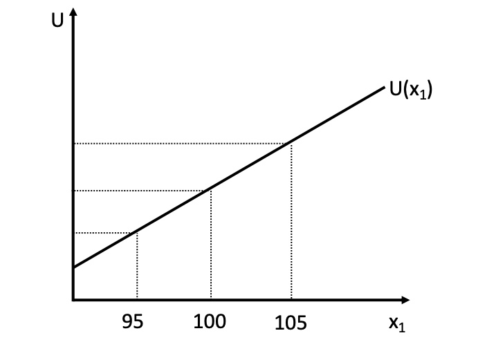
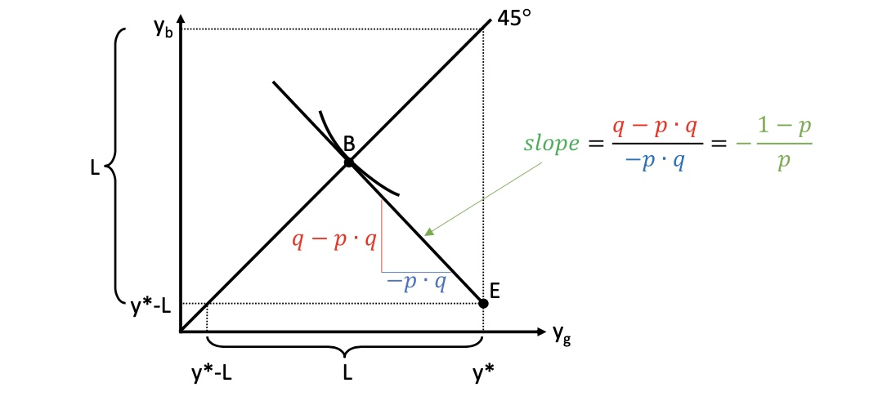
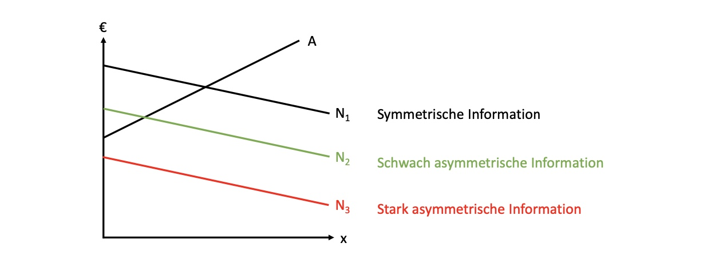
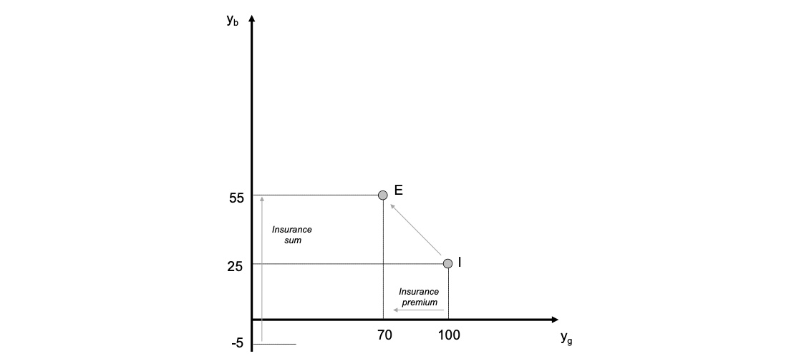
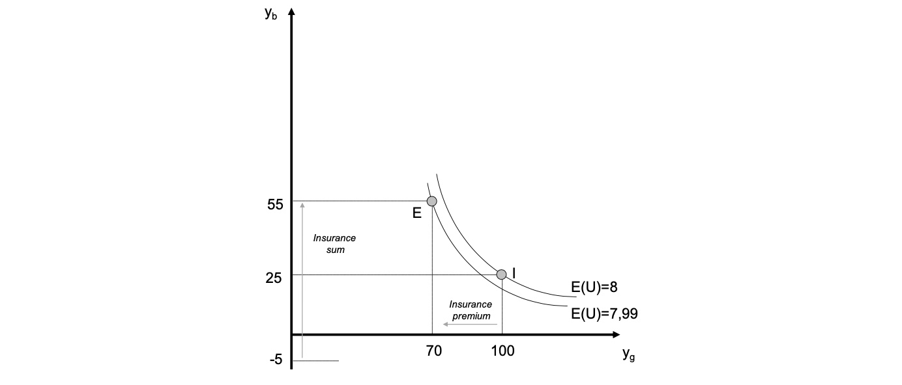

# 20.05.2022 Versicherung

## Risikofreude

Entscheidungen von Akteuren sind risikobehaftet, Bereitschaft zu Risiko = individuell

- Mögliche Wahrscheinlichkeitsverteilung einer Entscheidung $W = [s_1,...,s_n \ ; \ \pi_1, ...,\pi_n]$
- mit Ergebnissen $(s_1,..,s_n)$ und Wahrscheinlichkeiten $(\pi_1,...,\pi_n)$

### Beispiel Lotterie

- 100€ Ausgangsvermögen
- 5€ Losticket, 
- 50% Gewinnchance, 10€ Gewinn

```mermaid
graph LR
A(Ausgangsvermögen: 100) --50%--> B(Gewinn: 100-5+10 = 105)
A --50%--> C(Verlust: 100-5 = 95)
```

- $W = [95,105; 0.5,0.5]$
- Erwartungswert: $105*0.5 + 95*0.5 = 100$

Entscheidung mithilfe von Neumann-Morgenstern-Nutzenfunktion des *Erwartungswerts U(s)* 
$$
U(s) =& U(s_1) * \pi_1 + U(s_2) * \pi_2 + ... + U(s_n) * \pi_n \\
U(s) =& 0.5 * U(95) + 0.5 * U(105)
$$
Verhalten dann abhängig von persönlicher Nutzenkurve des Loskäufers

| Käufer 1 (risikoavers)                                    | Käufer 2 (risikofreudig)                                  | Käufer 3 (risikoneutral)                                  |
| --------------------------------------------------------- | --------------------------------------------------------- | --------------------------------------------------------- |
|  |  |  |
| strikt konkav                                             | strikt konvex                                             | Strikt geradlinig                                         |
| $U(100) > 0.5 * U(95) + 0.5 * U(105)$                     | $U(100) < 0.5 * U(95) + 0.5 * U(105)$                     | $U(100) = 0.5 * U(95) + 0.5 * U(105)$                     |

- Risikoaverser Käufer ist bereit, Versicherung gegen Risiko anzunehmen
    - Prämie in Höhe des Sicherheitsäquivalentes
    - wenn er gezwungen wäre zu spielen!

mögliche Fälle

| Outcomes       | keinen Schaden | Schaden             |
| -------------- | -------------- | ------------------- |
| **ohne Vers.** | $y^*$          | $y^* -L$            |
| **mit Vers.**  | $y^*- (p*q)$   | $y^* - L+q - (p*q)$ |

- y* = yield
- L = loss 
- p = Versicherungsprämie
- q = Versicherungssumme 

## Nachfrage nach Versicherungen

- Fälle *g = good* und *b = bad*
- Abszisse = good Outcome
- Ordinate = bad Outcome

- $y_b$ = Einkommen im Schadensfall, das wir erhöhen wollen
- $y_g$ = Einkommen ohne Schadensfall
- 45° Linie = gleichmäßige Verteilung zwischen Eintreten beider Fälle
    - Haushalt ist dann indifferent zwischen beiden Fällen: $MU_{y_b}=MU_{y_g}$
    - Wichtig: Raum unterhalb der Achse, da nur dann positiver Fall
- Ausgangsituation E ohne Versicherung
    - im guten Fall: $y^*$
    - im schlechten Fall: $y^* - L$ 
- Punkt B: mit Versicherung
    - wir geben $y_g$ auf, um bei $y_b$ hochzuwandern
    - Punkt B = indifferent zwischen Eintreten beider Fälle
    - im guten und schlechten Fall zwischen $y^*$ und  $y^* - L$

### Substitutionskönnen

Marginal Rate of Transformation: $\frac{1-p}{p} = MRT$ 

- Substitutionskönnen zwischen Einkomen im guten / schlechten Fall
- durch aufgeben von 1€ -> im Schadensfall $\frac{1-p}{p}$ Euro mehr

### Substitutionswollen

Schadenswahrscheinlichkeit = $\pi$

$$
\text{Nutzenerwartungswert: } EU = \pi * U(y_b)+ (1- \pi)* U(y_g) \\
\to \text{totales Differential: } dEU = 
\pi * \frac{\partial U}{\partial y_b} * dy_b 
+ (1- \pi)* \frac{\partial U}{\partial y_g} * dy_g \\
\to \frac{d y_b}{d y_g} = - \frac{1-\pi}{\pi} * \frac{\frac{\partial U}{\partial y_g}}{\frac{\partial U}{\partial y_b}} = MRS
$$
höhere Schadenswahrscheinlichkeit => höhere Bereitschaft für Verzicht

### Gleichgewicht

in optimalen Punkt: MRS = MRT mit festem $\pi$ !
$$
\frac{1-\pi}{\pi} * \frac{MU_{y_g}}{MU_{y_g}} = \frac{1-p}{p}
$$
Verhalten bei verschiedenen Prämiensätzen:

- bei fairer Prämie: Haushalt wählt Vollversicherung
    - $p = \pi$ ist aktuarisch fair
- bei unfairer Prämie $p > \pi$: Haushalt wählt Unterversicherung, Punkt A
- Bei gönnerhafter $p < \pi$: Haushalt überversichert, Punkt C

## Probleme asymmetrischer Information

### Adverse Selection

**Problem:** ungenaue Information der Versicherung über exakte Schadenswahrscheinlichkeit 

Informationsasymmetrie **vor Abschluss**

Beispiel: zwei Haushalte mit unterschiedlichen Risiken $\pi_1 >\pi_2$

- Haushalt mit hohem Risiko verschleiert sein wahres Risiko
- Versicherung schützt sich, indem es hohe Risikoprämien verlangt
- oder nur noch Teilversicherungen anbietet

= **adverse Selection** = negativauslese = risikolose Haushalte werden verdrängt

### Moral Hazard

Problem für Versicherer nach Abschluss:

- Haushalt lässt $\pi$ ansteigen
- oder vergrößert *L*

Informationasymmetrie **nach Abschluss**

### Marktversagen

Autoverkauf im Gebrauchtmarkt: Risiko eines schlechten Autos

große Unsicherheit => niedrigere Nachfrage => Marktineffizienz

**Lösung:** Verkäufer gibt Garantieerklärung

## Übung

### Aufgabe 1

Ausgangsituation: *I*

- Einkommen = 100
- möglicher Verlust = 75

mit Versicherung: *E*

- p = 0.5
- q = 60
- P = p*q = 30

Graphik: 

### Aufgabe 2: Erwarteter Nutzen

- Nutzenfunktion des Haushalts: $U = y^{0.5}$
- Schadenswahrscheinlichkeit: $\pi = 0.4$

Ausgangsituation:

- Nutzen im guten Fall = $100^{0.5} = 10$
- Nutzen im schlechten Fall = $25^{0.5} = 5$
- Erwarteter Nutzen: $E(U)=0.4 * 5+ 0.6 * 10 = 8$

Gleichung der Indifferenzkurve:
$$
8 =0.4 * y_b^{0.5}+ 0.6 * y_g^{0.5} \\
8 - 0.6 * y_g^{0.5} = 0.4 * y_b^{0.5} \\
y_b^{0.5} = 20 - 1.5 y_g^{0.5} \\
y_b = \big[20-1.5y_g^{0.5} \big]^2
$$
mit Versicherung: 

- $E(U) = 0.4 * 55+ 0.6 * 70 = 7.99$ 
- weniger als ohne Versicherung

### Aufgabe 3: Budgetgerade

Bestimmung bei Prämie = 0.5
$$
\begin{aligned}
MRT &= - \frac{1-p}{p} = -\frac{0.5}{0.5} = -1  \\
SPO &= \frac{y^*}{p}-L = \frac{100}{0.5}-75 = 125\\
y_b &= MRT \cdot y_g + SPO \\
y_b &= -1 \cdot y_g + 125 \\
\end{aligned}
$$
Gleichung: $y_b = -1\cdot y_g+ 125$ (anhand des Ausgangspunktes bestimmt)

### Aufgabe 4: Haushaltsgleichgewicht

Maximierungsbedingung
$$
\underset{y_g,y_g}{max E(U)} = 
\underset{y_g,y_g}{max}(0.4y_b^{0.5} + 0.6y_g^{0.5})  \\
s.t. \; y_b = -y_g+125
$$
Langrange Funktion
$$
\begin{aligned}
LF = 0.4y_b^{0.5} &+ 0.6y_g^{0.5} + \lambda [y_b+y_g-125] \\ \\
1)\ \frac{\partial L}{\partial y_b} &= 0.6*0.5y_b^{-0.5}+ \lambda = 0 \\
2)\ \frac{\partial L}{\partial y_g} &= 0.4*0.5y_g^{-0.5}+ \lambda = 0 \\
3)\ \frac{\partial L}{\partial \lambda} &= y_b+y_g-125 = 0
\end{aligned}
$$
Gleichsetzen von 1) und 2)
$$
-0.3 y_g^{-0.5} = -0.2y_b^{-0.5} \\
y_g^{-0.5} = \frac{2}{3}y_b^{-0.5} \\
y_g = \frac{9}{4}y_b
$$
Einsetzen in 3)
$$
y_b + \frac{9}{4}y_b - 125 = 0 \\
\frac{13}{4}y_b = 125 \\
y_b^* = \frac{4*125}{13} = 38.5
$$
Einsetzen in erstes Ergebnis
$$
y_g^* = \frac{9}{4}y_b \implies \frac{9}{4} \cdot 38.5 = 86.5
$$
Optimum: 

- optimales Einkommen im Guten Fall = 86.5 €
- Prämie = 100-86.5 = 13.5€
- $P = q\cdot p \to 13.5/0.5 = 27€ = q$

Erwarteter Nutzen der Versicherung dann
$$
E(U) = 0.4*y_b^{0.5} + 0.6*y_g^{0.5} = 0.4*38.5^{0.5} + 0.6*86.5^{0.5} = 8.06 > 8
$$
der Nutzen dank der Versicherung ist größer als in der Ausgangsituation:

Gewinn der Versicherung:
$$
G = E - K = p*q - \pi *q \\
0.5*27 - 0.4* 27 = 2.7
$$
**Versicherung und Konsument sind bessergestellt; trotz aktuarisch unfairer Prämie!**

### Aufgabe 5: langfristiges Gleichgewicht

- langfristig wird $p=\pi$  und Prämie aktuarisch fair
- der Haushalt gleicht Einkommen in beiden Fällen exakt an
- und wählt dann Vollversicherung (75€ abgesichert)

$$
P = p*q = 0.4*75 \implies P=30 \\
y_g = y^* - P = 100-30 \implies y_g = 70 \\
y_g = y_b = 70
$$

Graphisch: 