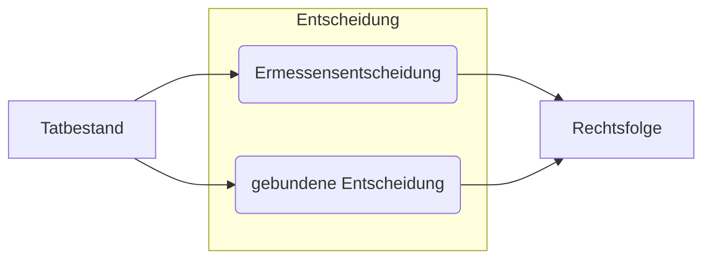

# 15.04.2022 Rechtsgebiete und Rechtsnormen

## Abgrenzung der Rechtsgebiete

- **Öffentliches Recht**
    - Staatsrecht
    - Verwaltungsrecht
    - Stafrecht
 - **Privatrecht**
     - Bürgerliches Recht
     - Handelsrecht
     - Urheberrecht

|                       |    öffentliches Recht              |    Strafrecht          |    Zivilrecht                        |
|:----------------------|:-----------------------------------|:-----------------------|:-------------------------------------|
|    *Involvierte*      |    Staat - Bürger / juris. Person  |    Staat - Bürger      |    Bürger - Bürger               |
|    *Handlungsform*    |    subordinativ                    |    subordinativ        |    Augenhöhe                         |
|    *Handlungsart*     |    Verwaltungsakt, Verordnung      |    Strafe, Geldbuße    |    Vertrag, Kündigung (einseitig)    |
| *Beispiel*            | VwVfG                              | StGB                   | BGB                                  |

> **§ 35 VwVfg:** Verwaltungsakt = hoheitliche Maßnahme von Behörde mit Außenwirkung (klassische subordinative Norm des Öff. R)

## Aufbau einer Rechtsnorm

### Beispiel: Gebundene Entscheidung

> **§ 35 GewO:** Ausübung eines Gewerbes ist von der zuständigen Behörde ganz oder teilweise zu untersagen, wenn Tatsachen vorliegen, welche die Unzuverlässigkeit des Gewerbetreibenden dartun

Analyse
1. Tatbestand: *Tatsache, Unzuverlässigkeit*
2. gebundene Entscheidung: *ist* (Zwangsläufigkeit)
3. Rechtsfolge: *untersagen des Gewerbes*

### Beispiel: Ermessensentscheidung

> **§ 48 VwVfG:** ein rechtswidriger Verwaltungsakt kann ... zurückgenommen werden

Analyse
1. Tatbestand: *rechtswidriger Verwaltungsakt*
2. Ermessensentscheidung: *kann*
3. Rechtsfolge: abhängig von Ermessen

Kennwörter: *kann, in der Regel, darf, ist berechtigt, soll*
