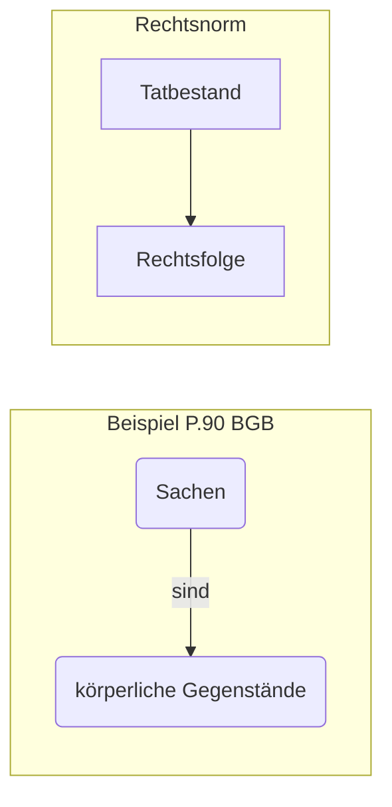

# 22.04.2022 Subsumtion

> **Subsumtion** *(in der Jur.)*: Anwendung einer Rechtsnorm auf Lebensachverhalt (Fall)
>
> => Unterordnung des Sachverhalts unter Normvoraussetzung

Beispiel:



Beispiel: *Ist ein Auto eine Sache?*

1. Hyopthese: *Auto könnte Sache im Sinne §90 BGB sein*
2. Definition: *Sachen sind gemäß §90 BGB körperliche Gegenstände*
3. Subsumtion: *Auto ist ein körperlicher Gegenstand*
4. Schlussatz: *Auto ist eine Sache*

---

Anwendungsbeispiel

```
Gerangel in einer Kneipe. A verletzt B absichtlich mit Messer. Ist A wegen §223 StGB strafbar?
```

> **§223 StGB:** Wer eine andere Person körperlich mißhandelt, wird mit Freiheitstrafe bis zu 5 Jahren oder mit Geldstrafe bestraft.

- **Tatbestand**: körperliche Mißhandlung anderer Person
- **Rechtsfolge**: 5 Jahre oder Geldstrafe

1. Hypothese: *As Angriff ist möglicherweise strafbar nach §223 StGB, da A B körperlich mißhandelt hat*
2. Definition: *körperliche Mißhandlung ist üble unangemessene Behandlung, die das körperliche Wohlbefinden mehr als unangemessen beeinträchtigt*
3. Subsumtion: *ein Messerangriff ist eine körperliche Mißhandlung*
4. Schlussatz: *A ist nach §223 StGB strafbar*
