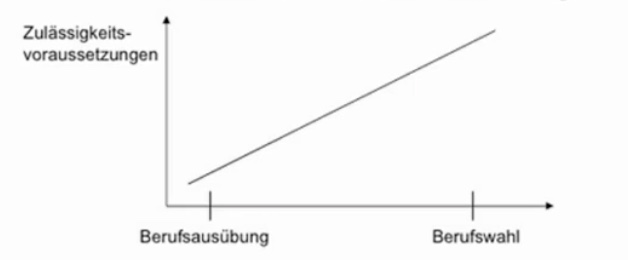

# 10.06.2022 Grundrechte II

## Artikel 5: Meingunsfreiheit

> **(1)** Jeder hat das Recht, seine Meinung in Wort, Schrift und Bild frei zu äußern und zu verbreiten und sich aus allgemein zugänglichen Quellen ungehindert zu unterrichten.
>
> Die Pressefreiheit und die Freiheit der Berichterstattung durch Rundfunk und Film werden gewährleistet.
>
> Eine Zensur findet nicht statt.

> **(2)** Diese Rechte finden ihre Schranken in den Vorschriften der allgemeinen Gesetze, den gesetzlichen Bestimmungen zum Schutze der Jugend und in dem Recht der persönlichen Ehre.

> **(3)** Kunst und Wissenschaft, Forschung und Lehre sind frei.
>
> Die Freiheit der Lehre entbindet nicht von der Treue zur Verfassung.


Prüfungschema für Freiheitsgrundrechte:

1. Eröffnung des Schutzbereiches
2. Eingriff
3. Rechtfertigung

---
```
Fallbeispiel: 
Schüler S. wird beim Sprayen von der Polizei auf frischer Tat ertappt und ins Gefängsnis gesteckt
```

Ist S. in seinen Grundrechten verletzt?

- Ist Graffiti Kunst? Ja denn

    > **Offener Kunstbegriff (BVerfG):** Danach liegt das künstlerische Merkmal einer künstlerischen Äusserung in der Mannigfaltigkeit ihres Aussagegehalts

- Aber: Kollision mit Eigentumsrechten aus dem Grundgesetz (`Art.14`), und genauer

    > **§303 StGB Sachbeschädigung:** Wer rechtswidrig eine fremde Sache beschädigt ..., wird ... bestraft 


### Rechtfertigung

1. **Schranken:**
    - Art. 5 III GG unterliegt keinem Schrankenvorbehalt, kollidiert aber
    - Art. 14 I GG -> Kollision zweier Verfassungsgüter
2. **Schranken-Schranken:**
    - Legitimer Zweck?
    - **Geeignetheit**? Ist Gefängnis eine praktische Maßnahme
    - **Erforderlichkeit**? Gibt es eine einfachere Maßnahme, S. vom Sprayen abzuhalten
    - **Angemessenheit**? und hier spielt die Musik

laut BVerfG: zugunsten des Eigentums, niemand darf unter Berufung auf die Kunstfreiheit das Eigentum anderer verletzen

S. könnte seine Graffitis auch auf anderen Stellen sprayen und somit seine Kunst frei verfügbar machen

## Artikel 12: Berufsfreiheit

> **(1)** Alle Deutschen haben das Recht, Beruf, Arbeitsplatz und Ausbildungsstätte frei zu wählen. Die Berufsausübung kann durch Gesetz oder auf Grund eines Gesetzes geregelt werden

> **(2)** Niemand darf zu einer bestimmten Arbeit gezwungen werden, außer im Rahmen einer herkömmlichen allgemeinen, für alle gleichen öffentlichen Dienstleistungspflicht.

> **(3)** Zwangsarbeit ist nur bei einer gerichtlich angeordneten Freiheitsentziehung zulässig.

Merke: Unterschied zwischen Berufswahl und Berufsausübung

### Schutzbereich

- **persönlicher Schutzbereich**: alle Deutschen und somit auch alle juristischen Personen
- **sachlicher Schutzbereich:** Beruf = jede Tätigkeit, die auf Dauer angelegt ist und ... Erhaltung einer Lebensgrundlage dient und nicht an sich verboten ist

### Eingriff

*Drei-Stufen-Theorie*: wo erfolgt der Eingriff?

1. **Berufswahlfreiheit**: "ob" der beruflichen Tätigkeit
    - *objektive Zulassungsvoraussetzung* außerhalb des Einzelnen (bspw. Kontingente für Zulassungen)
    - *subjektive Zulassungsvoraussetzung*, die vom Einzelnen beinflussbar ist (bspw. Note für Richter)
2. **Berufsausübungsfreiheit**: "wie"  der Tätigkeit
    - Bspw. Ladenschluss, Werbeverbote, Nachtflugverbote

### Rechtfertigung

1. **Schranken**:
   
    - Einfacher Gesetzesvorbehalt: keine strikte Trennung von Berufwahl und Ausübung
    
2. **Schranken-Schranken**
   
    - Drei-Stufen-Theorie als Anwendung des Verhältnismäßigkeitsgrundsatzes
    1. *objektive Zulassungsvoraussetzung*: Schutz eines überragenden Gemeinschaftgutes
    1. *subjektive Zulassungsvoraussetzung*: Schutz des Berufsstandes
    1. *Ausübungsregelung*: aufgrund von Zweckmäßigkeit

Graphik:

## Artikel 14: Eigentumsfreiheit

- *BVerfG*: wichtigstes Rechtsinstitut zu Abgrenzung privater Vermögensbereiche
- **Abwehrrecht** der Eigentümer gegen Staat
- **Institutionsgarantie** 
- Absage an Eigentumsordnung, die nur dem Individualinteresse dient

> **(1)** Das Eigentum und das Erbrecht werden gewährleistet. Inhalt und Schranken werden durch die Gesetze bestimmt.

> **(2)** Eigentum verpflichtet. Sein Gebrauch soll zugleich dem Wohle der Allgemeinheit dienen.

> **(3)**  Eine Enteignung ist nur zum Wohle der Allgemeinheit zulässig. Sie darf nur durch Gesetz oder auf Grund eines Gesetzes erfolgen, das Art und Ausmaß der Entschädigung regelt. Die Entschädigung ist unter gerechter Abwägung der Interessen der Allgemeinheit und der Beteiligten zu bestimmen. Wegen der Höhe der Entschädigung steht im Streitfalle der Rechtsweg vor den ordentlichen Gerichten offen

### Schutzbereich

- **Persönlicher Schutzbereich**
    - natürliche Personen
    - nach Art. 19 III auch inländische juristische Personen
- **Sachlicher Schutzbereich**
    - *Eigentum*: Positionen die der Gesetzgeber durch die Rechtsordnung definiert
    - unterliegt einem Wandel 
    - *u.a. private Vermögenswerte:* geistiges Eigentum, dingliche Rechte
    - *u.a. öffentlich rechtliche Vermögenspositionen*: Renten, ALG

### Eingriff

a) Inhalts- und Schrankenbestimmungen

- abstrakt-generelle Regelung:
    - bspw. Verbot der Zweckentfremdung von Wohnungen
- durch Einzelmaßnahme
    - bspw. Haus wird unter Denkmalschutz gestellt -> Abrissverbot

b) Enteignungen

- "**finale** Entziehung von Eigentumsrechten für **öffentliche** Zwecke"
- z.B. Grundenteignung für Straßenbau

#### aus Vorlesung: Recht am eingerichteten und ausgeübten Gewerbebetrieb als Eigentum?

1. Ansicht: BGH, BVerwG (nicht BVerfG):
    - sach und Rechtsgemeinschaft eines wirtschaftlichen Unternehmens geschützt
    - bsps. Praxis (aber nicht Gewinnaussicht!)
2. Ansicht = nicht relevant

**immer im Einzelfall betrachten!**

### Rechtfertigung

Schranken

Schranken-Schranken:

- **Junktimklausel** (Bedingungszusammenhang): bei Enteignung nur, wenn direkt über Entschädigung entschieden wird
- **Verhältnisnmäßigkeit**: schwerwiegende dringende öffentliche Interesse
    - bspw. Dörfer für Kohlebau = Energieversorgung
