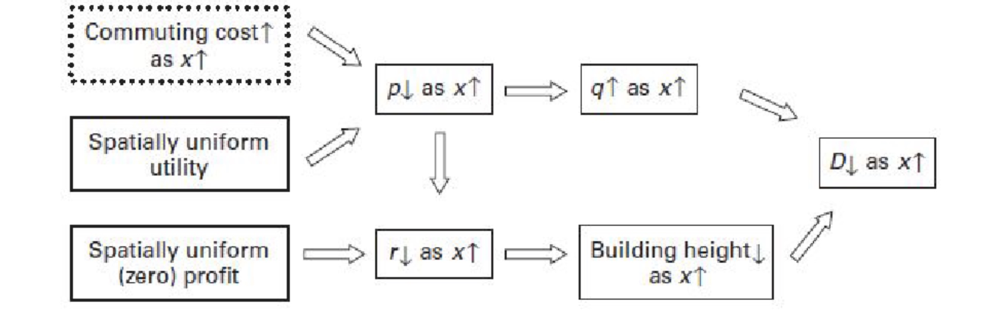

# 12.04.2022 Alonso-Muth-Mills Model

**monozentrisches Standard-Modell** der Stadtökonomie

- räumliche Zusammenhänge zwischen ökonomischen Akteuren
- für datengetriebene Forschung 

## Annahmen

- Einwohner:

    * Einwohner* identisch, gleiches Einkommen
    * sie konsumieren Wohnraum + ein Konsumgut zu gleichem Preis
    * Einwohner kaufen/mieten von Baufirmen

- Stadtaufbau

    - Immobilienpreise variieren

    - monozentrische Stadt

    - Alle Arbeitsplätze im Stadtzentrum

- Land gehört externen und verpachten an *Baufirmen*

## Nachfrageseite: Einwohner

Einwohner haben Einkommen *y* für

- **Konsumgut** *c* zum Preis 1
- **Wohnraum** *q* in qm, zu Preis *p*
    - *p* ist Funktion der Entfernung vom Stadtzentrum *x* in km

Nutzenfunktion: $v(c,q) = u$ 

Kostenfunktion für Pendeln: $\tau * x$

> **Gleichgewichtsbedingung:** alle Bewohner erreichen gleichen Nutzen

resultiert in niedrigere Mietpreise mit steigenden Fahrtkosten

1. Budgetrestriktion: $y - \tau * x = p(x) * q + c* 1$
2. Nutzenmaximierung nach *x* : $max_x = v(c,q) = v(y-\tau*x - p(x)*q)$
    - Bedingung 1. Ordnung: Grenzrate Substitution = Preisverhältnis der Güter = $\frac{p}{1}$
3. => Alonso-Muth-Mills Bedigung: $\frac{\partial p(x)}{\partial x} = \frac{- \tau}{q(x)} < 0$
    - Abhängigkeit Mietpreis von Entfernung Stadtzentrum ist **negativ**

Resultierende Indifferenzkurve

- Innenstadtbewohnerin = wenig Wohnraum, viel Konsum 
- Stadtrandbewohnerin = viel Wohnraum, wenig Konsum

## Angebotsseite: Bauunternehmen

- agieren in perfektem Wettbewerb
- Input-Faktoren zum Hausbau: *Land L* und *Kapital K*
    - leihen zu exogenen Zinsatz *i*
    - standortabhängiger Pachtzins *r(x)*

abnehmender Grenzertrag von Kapital => Hochhäuser sind kapitalintensiv

1. Gewinnfunktion $ p(x) * H(K,L) - i*K - r(x) * L$
2. Resultat: pachtzins sinkt mit Entfernung Stadtzentrum

## Bevölkerungsdichte

Bebaung H ist Produkt aus Bevölkerung *N* und Wohnraum *q* pro Person

## Erkenntnisse

zunehmende Entfernung vom Stadtzentrum

- Mietpreise sinken
- nachgefragter Wohnraum nimmt zu
- Bevölkerungsdichte + Gebäudehöhe sinkt

Wirkungskette des Modells:

