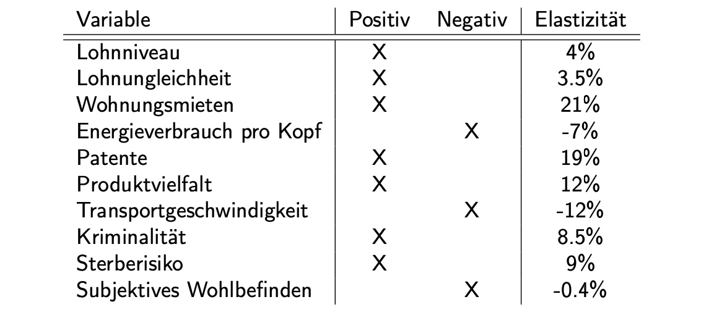

# 24.05.2022 Bevölkerungsdichte und Agglomerationseffekte

## Bevölkerungsdichte

### Komponenten

- **Crowding:** Anzahl Einwohner pro Quadratkilometer Stadtfläche
- **Building Height**: Wohnfläche pro Gebäudegrundfläche
- **Residential Coverage:** Wohn-Abdeckungsquote (wie viel Platz nehmen Häuser vs Parks, Straßen, ... an)

welche der Komponenten treibt Stadtdichte ?

unterschiedlich in verschiedenen. Städten: 


### Effekte von Bevölkerungsdichte



- Städte mit 1% höherer Bevölkerungsdichte => 0.04% höheres Lohnniveau
    - oder 100% dichter => 4% Lohnsteigerung


## Agglomerationseffekte

verschiedene Arten:

- **Sharing:** Inputfaktoren günstiger aufgrund aggregierter Nachfrage mehrerer Firmen
    - gemeinsame Nutzung Infrastruktur
    - stärkere Spezialisierung
    - größere Märkte = weniger Risiko
- **Matching:** größerer Arbeitskräftepool = höhere Passgenauigkeit
    - größerer Angebots-/Nachfragepool
    - weniger Hold-Up Probleme (Ausbeutung mangels Alternativen)
- **Learning:** Interaktion der Firmen / Arbeitnehmer => *Technology Spillovers*
    - Wissenverbreitung durch Austausch 


## Produktivität und Löhne

Worauf sind höhere Löhne zurückzuführen? **People vs Places**

- **People:** AN in Großstädten sind besser ausgebildet, spezialisert und produktiver
- **Places:** durch Aggolmerationseffekte sind AN produktiver (Knowledge Spillover, größere Firmen)

schwierig zu trennen, aber ein Paper untersucht

```
natürliches Experiment von Eckert et al (2022):
===============================================
Dänemark verteilte in 80ern 100.000 Geflüchtete zufällig auf das Land.
Messung von Kopenhagen Effekt auf späteren Stundenlohn

Ergebnis: nur in Verbindung mit Arbeitserfahrung ist Großstadteffekt messbar, einfach so eher nicht
- aufgrund der Arbeit in höherqualifizierten Bereichen
```

