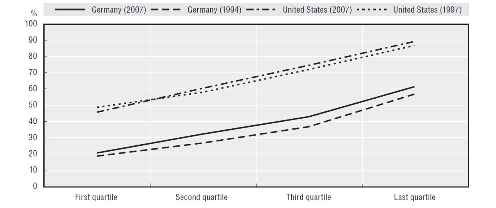

# 31.05.2022 Immobilienmarkt

## Wohneigentum

Deutschland hat im historischen Vergleich extrem niedrige Wohneigentumsquote

Vorteile:

- Vermögensbildung und Altersvorsorge
- Stabilität

Nachteile:

- Hohe Transaktionskosten, lange Verpflichtung
- geringe räumliche Flexibilität


Einkommensquartile mit Wohneigentum: 

und im EU-Vergleich: 

### Erklärungsfaktoren

- **Urbanisierungsgrad** 
    - höhere Quoten auf dem Land
- **Haushaltsgröße**
    - geringere Quote bei Single-Haushalten
- **Finanzierungsbedingungen** 
    - Eigenkapitalanforderungen
- **gesetzl. Rahmenbedingungen** 
    - mieterfreundliche Gesetze
- **alternative Altersvorsorge** 
    - Vertrauen in deutsches Rentensystem


#### Kulturelle Komponente

Messung mithilfe von Einwanderern der 2 Generation mit US-Daten *(Huber et Schmidt 2019)*

Ergebnis: höhere Wohneigentumsquote in Herkunftsland der Eltern und bei Partner => 3.1% höhere Quote

### Deutsches Modell

- starker sozialer Wohnungsbau
- hohe Grunderwerbssteuer
- kein steuerlicher Abzug von Zinszahlungen

diese Faktoren erklären 2/3 der Unterschiede zwischen DE und USA


## Preisdeterminanten

Arbeit mit *hedonischem Preismodell*

- benötigt Transaktionsdaten bei Immobilienverkäufe + Charakteristika des Eigentums
- Zerlegung in nutzengebende (hedonischen) Charakteristika
- Regressionsmodell


Definierende Eigenschaften:

- **Strukturell**
    - Alter, Größe, Renovierungsgrad ...
- **Nachbarschaft**
    - Durchschnittseinkommen, Arbeitslosigkeit 
- **Lage**
    - Entfernung Stadtzentrum, ÖPNV / Straßenanschluss, Amenities

```
merke: in den USA ist die Entfernung vom Stadtzentrum positiv, in Europa nicht
```


## Mietpreisbegrenzung

starke Nachfrage trifft auf begrenztes Angebot => starke Steigerungen


### Regulatorische Instrumente

- **Mietpreisbremse**: 2015 eingeführtes Instrument, sodass
    - Mieten nicht mehr als 10% über Vergleichsmiete liegen dürfen
- **Mietendeckel:** Berliner Abgeordnetenhaus 2020 verabschiedet
    - Einfrieren auf Niveau von 2019
    - vom BVerfG wegen fehlender Kompetenz gekippt

#### Folgen

**kurzfristig**: Vermieter verlieren, Mieter gewinnen

**langfristig:** (umstritten!)

- tendenziell negative Auswirkung auf Quantität / Qualität
- geringere Mobilität der Mieter
- mehr teure Eigentumswohnungen statt Mietwohnungen
- Insider vs Outsider bei Mietern


