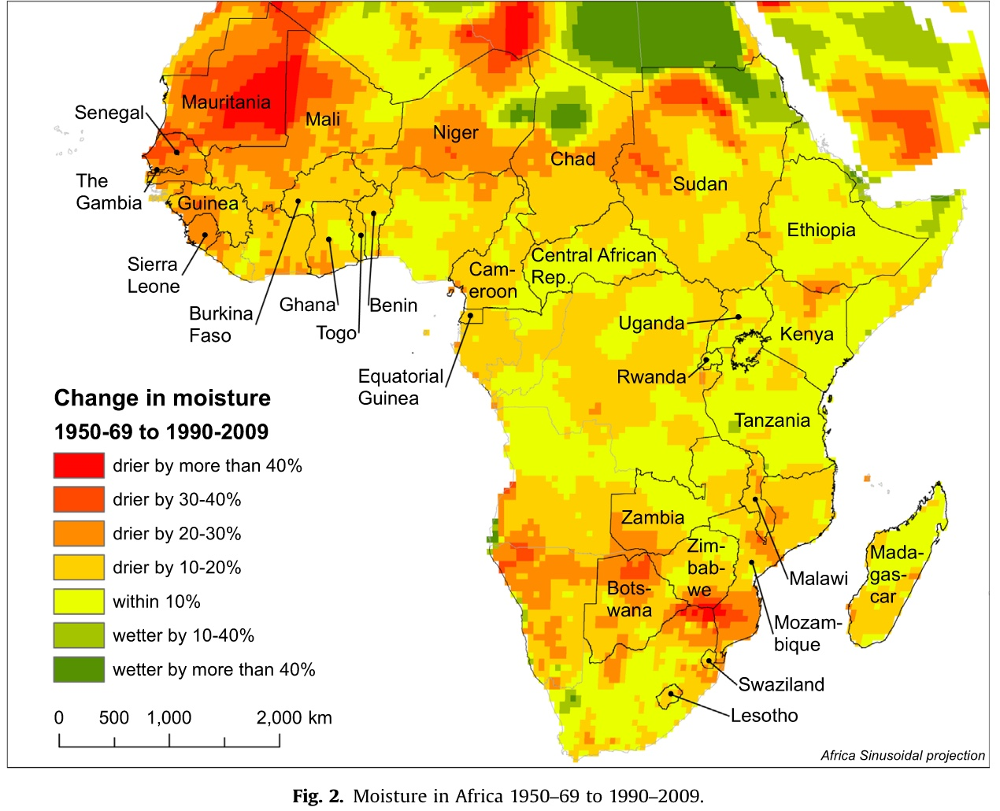
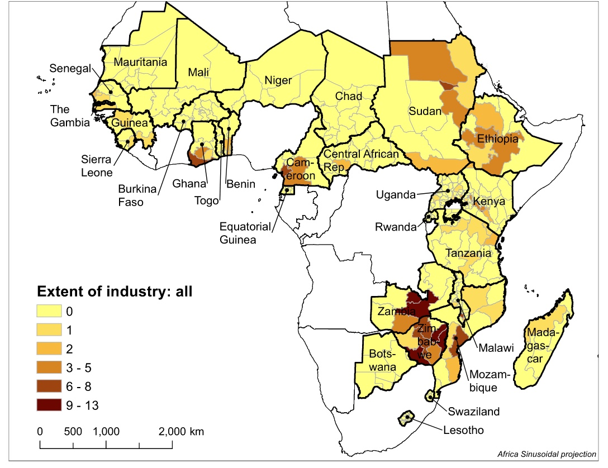
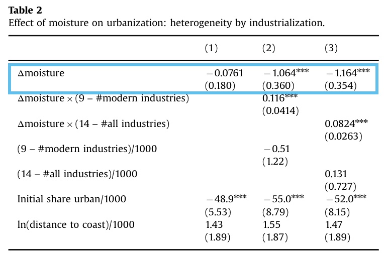
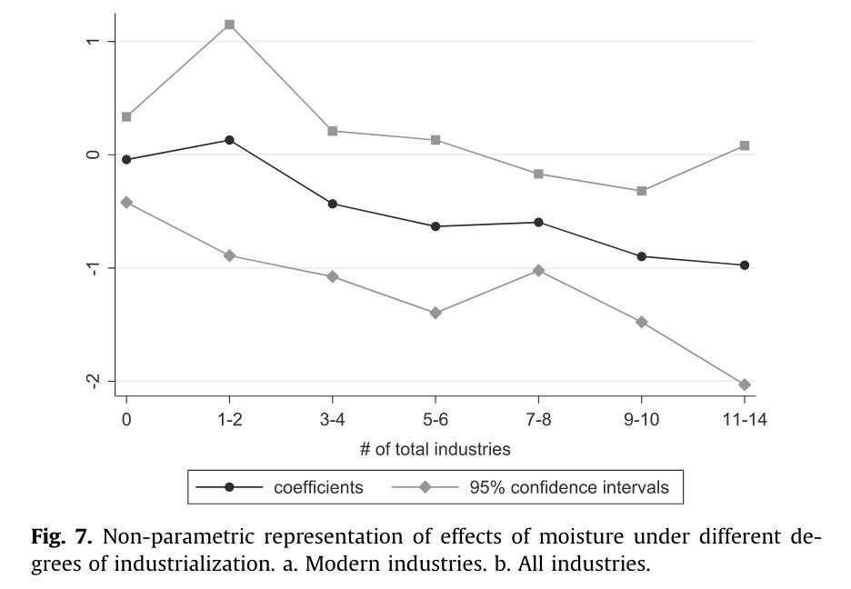
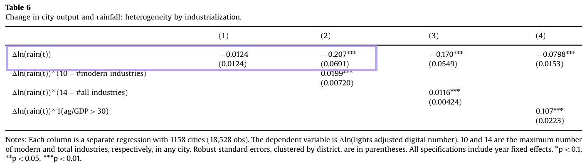

# Lesenotizen

**Has Climate Change driven Urbanization in Africa?**

-   J. Vernon Henderson, *LSE, UK*

-   Adam Storeygard, *Tufts University, US*

-   Uwe Deichmann, *World Bank*

-   Veröffentlicht September 2016

-   Journal of Development Economics

> **Abstract:** This paper documents strong but differentiated links between climate and urbanization in large panels of districts and cities in Sub-Saharan Africa, which has dried substantially in the past fifty years. The key dimension of heterogeneity is whether cities are likely to have manufacturing for export outside their regions, as opposed to being exclusively market towns providing local services to agricultural hinterlands. In regions where cities are likely to be manufacturing centers (25% of our sample), drier conditions increase urbanization and total urban incomes. There, urban migration provides an "escape" from negative agricultural moisture shocks. However, in the remaining market towns (75% of our sample), cities just service agriculture. Reduced farm incomes from negative shocks reduce demand for urban services and derived demand for urban labor. There, drying has little impact on urbanization or total urban incomes. Lack of structural transformation in Africa inhibits a better response to climate change.

2 Questions:

-   Do adverse changes in climate push people out of rural areas into cities?
-   does this push increase total income of cities

=> does urbanization provide an escape in changing climates?

### 2: Literature

shortcomings of existing papers: (on this question)

-   use national data

    -   even though significant within country climate variation

-   population data based on 10-year intervals and interpolation!

    -   not good data basis

-   or use microdata like surveys (a lot of risks)

papers on climate change

-   africa is diverse

    -   hyperarid sahara - humid tropics of central africa

-   predictions:

    -   temperature increase by 1.5° In 2° scenario
    -   are with heat extrames to 45 %
    -   falling precipitation

on agriculture

-   yield losses 8-15 %

-   up to 47% for wheat

-   less adaptation with fertilisers

    -   stagnated with 19080

-   only 4% irrigation

### 3: Modell

**das Modell hat nichts mit der Empirie zu tun, haben sie nur einfach so noch drin!**

Districts: - small open economies - only in-district migration!

-   consist of city and rural sector

-   Arbitrage between city and rural

    -   full emplyoment
    -   equal income

City:

-   services industry (not traded)

    -   constant returns to scale

-   (maybe) manufacutring industry

    -   exporting goods out of district
    -   economies of scale

-   diseconomies of commuting

rural sector:

-   agricultural products = fixed prices in international markets

Ergebnisse nach auflösung des Modells

1.  city has manufacturing:

    -   decline in moisture -> increase urban pop.
    -   increase total city income

2.  city has no manufacturing

    -   decline in moisture -> no effect
    -   total city income declines

### 4: Data

really scarce data in Africa

##### Population

-   population measures for sub-national districts from *censuses*

    -   not distinguishable between migration and births etc

-   29 countries with 2 to 5 censuses between 1960 and 2010

-   369 districts ; average 41100 sq km

##### climate and precipitation

-   measurement used: Precipitation divided by potential evapotranspiration = climatic agricultural potential measurement
-   Source: University Delaware climate data set

##### Industrial extent

-   very scarce data!

-   Oxford Regional Economic Atlas (1965) Ady

    -   maps industries in africa

    -   26 different industries

        -   15 of these "modern" (not based on agricultural processing)

-   19 countries have a industry

-   23 % of Districts have idnustrial base

    -   shared between arid and non-arid

### 5a: Empirical Analysis. Effect of climate on urbanization

natürlich Regressionsmodell , was sonst

-   Variablen: district i, country j, year t

-   $u_{ijt} = \beta_0 w_{ijt} + \beta_1 X_{ij} + \beta_2 X_{ij} \ w_{ijt} + \alpha_{jt}+ \varepsilon _{ijt}$

    -   u = growth of urban pop.

    -   w = moisture

        -   smoothed over three years

    -   X = time invariant controls

    -   a = country year fixed effect

        -   control for variation across countries

    -   e = error term

Ergebnisse der Regression (mit vielen Robustness Checks)

Columns:

1.  all districts
2.  districts with modern industries
3.  districts with industries

Graphik aufgeschlüsselt nach Anzahl Industrien

one standard deviation decrease in growth rate of moisture => increate grwoth rate of share urban by about 0.015

Robustness Checks:

-   impact of conflict on urbanization
-   distance to coast (industry often based there)

## 6 Climate Change and City Income

now: impct of annual climate fluctuations on annual city incomes

Data:

-   cities and rainfall within 30 km of them (vs 41000 sqkm districts)

-   income measure: light emittance current or prior year

    -   US Defence Meteorological Satellite Program (DMSP)
    -   1992 - 2008
    -   major Dataset from Henderson et al (2012) and the work it did
    -   1158 cities and towns in 42 countries
    -   outer envelope of lights

-   rainfall from Africa Rainfall Climatology Version 2

Specification:

-   $light_{it}$ = light summed over pixels in city i year t
-   Rain = average rainfall per day in city i
-   x = time invariant city controls
-   $\phi$ = city fiex effect
-   $\lambda_t$ = year fixed effect
-   $a_i t$ city specific linear trend
-   error term

only looking at year to year fluctuations => only small responses, but insignificant

shorter period, starts later

Ergebnisse:

-   most industrialized areas -> elasticity = -0.21
-   zero industry areas -> e close to zero
-   Take a measurement for light-GDP elasticity from Henderson 2012

=> A one standard deviation rainfall increase reduces lights by 11%, and income by approximately 3.5%

Columns:

1.  effect on all cities
2.  effect on industrialized cities (measure from Atlas)
3.  effect on industrialized cities (different measure)

Robustness Checks:

-   against floods
-   cities served by hydro power

## 7 Mechanisms

Micro Evidence from India

-   annual Survey of manufacturers (problem of bad data)
-   not inconsistent with model

## 8 Conclusions

-   Africa at high risk from CC
-   already highly variable and marginally suitable. agro-climate

Climatic conditions influence urbanization rates in industrialized districts and add to city income

for non-industrialized = less income, no migration

might help industrialized sitricts facing climate change

but:

-   Africa Lack os structural transformation to industry

-   not much usage of fertilizer and technic from farmers

    -   help agricultural adaptation

Africa can nog use "Leapfrogging" and skip industrialization
