# Statistik 

Zusammenfassung für das Modul Statistik II 


- [**Wahrscheinlichkeiten**](#wahrscheinlichkeiten)
  - [Mengen](#mengen)
  - [Laplace-Wahrscheinlichkeit](#laplace-wahrscheinlichkeit)
  - [bedingte Wahrscheinlichkeit](#bedingte-wahrscheinlichkeit)
  - [totale Wahrscheinlichkeit](#totale-wahrscheinlichkeit)
  - [Satz von Bayes](#satz-von-bayes)
  - [Unabhängigkeit](#unabhängigkeit)
- [**Stichproben**](#stichproben)
- [**Zufallsvariabeln** (Eindimensional)](#zufallsvariabeln-eindimensional)
  - [Dichte- und Verteilungsfunktion](#dichte--und-verteilungsfunktion)
  - [Rechnen mit der Verteilungsfunktion](#rechnen-mit-der-verteilungsfunktion)
- [**Zufallsvariablen** (mehrdimensional)](#zufallsvariablen-mehrdimensional)
  - [bedingte Dichte](#bedingte-dichte)
  - [stochastische Unabhängigkeit](#stochastische-unabhngigkeit)
  - [Kovarianz](#kovarianz)
- [**Verteilungen**](#verteilungen)
  - [Diskrete Verteilungen](#diskrete-verteilungen)
      - [Bernoulli Verteilung](#bernoulli-verteilung)
      - [Binomialverteilung](#binomialverteilung)
      - [hypergeometrische Verteilung](#hypergeometrische-verteilung)
      - [Poisson Verteilung](#poisson-verteilung)
  - [Normalverteilung](#normalverteilung)
    - [Standardnormalverteilung](#standardnormalverteilung)
    - [Rechnungen](#rechnungen)
- [**Schätzen**](#schätzen)


# Wahrscheinlichkeiten

Ergebnisse $\{ w_{1}, w_{2},... \} = \Omega$  Ergebnismenge

Ereignis = eine Teilmenge der Ergebnismenge $A \subseteq  \Omega$

## Mengen

- Schnittmenge $A \cap B$
- Vereinigungsmenge $A \cup B$
- Komplementärmenge $A^{C}$  bzw. $\bar{A}$

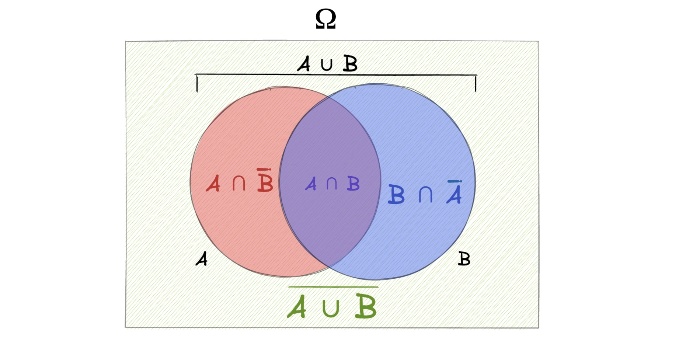

## Laplace-Wahrscheinlichkeit

einfachste Wahrscheinlichkeit: 
$$
P(A) = \frac{m}{n} = \frac{\text{Anzahl Ereignisse A}}{\text{Gesamtzahl Ereignisse}}
$$
Beispiel: 20 Menschen in Raum, davon 10 cool => Wahrscheinlichkeit mit coolen Menschen zu reden: $P(A) = \frac{10}{20} = 0.5 = 50\%$

## bedingte Wahrscheinlichkeit

Wahrscheinlichkeit von Ereignis A, wenn B schon eingetreten ist = bedingte Wahrscheinlichkeit A gegeben B = $P(A | B)$

Berechnung: $P(A|B) = \frac{P (A\cap B)}{P(B)}$ 

---

Beispiel: Porschefahrer: 10% der Bevölkerung sind Porschefahrer und 50% von denen sind Arschlöcher (isso)

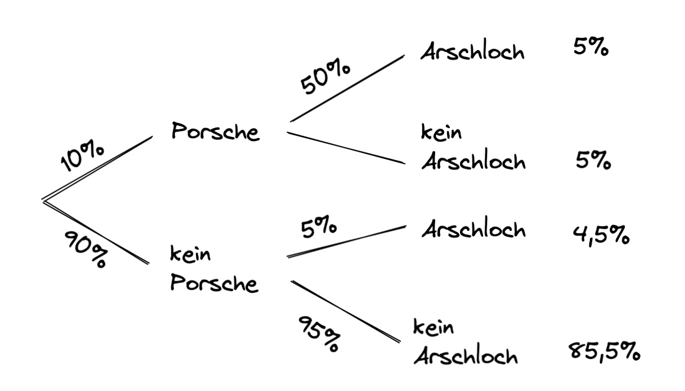

- Wahrscheinlichkeit Porschefahrer: $P(B) = 10\%$
- Wahrscheinlichkeit dass Porschefahrer Arschlöcher sind: $P(A|B) = 50\%$

wie hoch ist die Wahrscheinlichkeit, dass zufällige Person vor dir Porschefahrer und Arschloch ist?

$P(A \cap B) = P(A|B) \cdot P(B)= 0.5 \cdot 0.1 = 0.05 = 5\%$

## totale Wahrscheinlichkeit

wenn die Bedingungen die Ergebnismenge disjunkt zerlegen, heißt alle Möglichkeiten darstellen, bspw. regnet und regnet nicht = $B ; \bar{B}$

für die Wahrscheinlichkeit A eines Eregnisses: $P(A) = \sum_{i=1}^{k}P(A|B_{i})* P(B_{i})$

---

Beispiel: wie hoch ist die Wahrscheinlichkeit, dass Person vor dir Arschloch ist?

- Arschlöcher unter Porschefahrern : $P(A|B) \cdot P(B) = 0.05$
- Arschlöcher in Gesamtbevölkerung: $P(A|\bar{B}) \cdot P(\bar{B}) = 0.9 \cdot 0.2 = 0.045$

$P(A) = 0.05+0.045 = 0.095 = 9,5 \%$


## Satz von Bayes

mit diesem lässt sich in Verbindung mit der totalen Wahrscheinlichket eine Umkehranalyse betreiben:
$$
P(B_i | A) = \frac{P(A|B_i) \cdot P(B_i)}{\sum_{i=1}^{k}P(A|B_{i})* P(B_{i})} = \frac{P(A|B_i) \cdot P(B_i)}{P(A)}
$$

---

Beispiel: Wie hoch ist die Wahrscheinlichkeit, dass das Arschloch vor dir nen Porsche fährt?
$$
P(B|A) = \frac{0.5 \cdot 0.1 }{0.095} \approx 53\%
$$
=> obwohl Porschefahrer nur 10% der Bevölkerung ausmachen, stellen sie 53% der Arschlöcher 

Graphik der Rückwärtsanalyse


## Unabhängigkeit

zweier Ereignisse = kein Zusammenhang:

$P(A \cap B) = P(A) * P(B)$

---

Beispiel: ist es nur zufällig mit den Porschefahrern?

- $P(A \cap B) = 0.05$
- $P(A) \cdot P(B) = 0.095 \cdot 0.1 = 0.0095$

$0.05 \neq 0.0095$ : ist nicht zufällig!


# Stichproben

Wir wollen aus den Eigenschaften einer großen Menge die Eigenschaften einer Stichprobe benennen: bspw. wir wissen alles über Würfel, wie wahrscheinlich ist dann eine Stichprobe, bei der 3 Mal hintereinander eine 6 gewürfelt wird.

wenn Ergebnissmenge eines Experiments nicht bekannt => **Stichproben**

- aus Stichproben Wahrscheinlichkeit ablesen
- Wahrscheinlichkeit für Objekt in Grundgesamtheit benötigt

wichtig: 

- Fakultät $k!$ und Binomialkoeffizienten $\binom{a}{b}$
- Umfang Grundgesamtheit $N$
- Umfang Stichprobe $n$

Anzahl möglicher Stichproben: 

|                      | mit Zurücklegen     | ohne Zurücklegen   |
| -------------------- | ------------------- | ------------------ |
| **mit Reihenfolge**  | $\frac{N!}{(N-n)!}$ | $N^n$              |
| **ohne Reihenfolge** | $\binom{N}{n}$      | $\binom{N+n-1}{n}$ |


# Zufallsvariabeln (Eindimensional)

[Empfehlenswertes Video](https://www.youtube.com/watch?v=-drfVhwHZcU) zum grundlegenden Verstehen!

| mathematisch                     | Beispiel                                           |
| -------------------------------- | -------------------------------------------------- |
| Ergebnismenge $\Omega$           | Studis in VL mit Attributen Alter, Kontostand, ... |
| Auswahl $\omega$                 | Ein Teilnehmer aus der VL                          |
| Abbildung X auf Omega $X:\Omega$ | Verteilungen des Alters unter den Studenten        |
| $X(\omega)$                      | Kontostand des ausgewählten Studenten              |

Alter, Geschlecht etc sind **Zufallsvariablen** unter den Studierenden

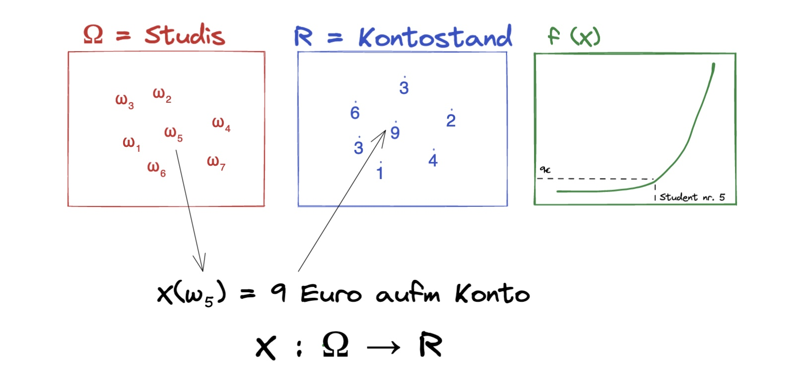

Arten von Zufallsvariablen:

- **stetig:** nicht abzählbar, kann unendlich sein 
- **diskret:** Zählbar (wie natürliche Zahlen)


## Dichte- und Verteilungsfunktion

Verteilung der Zufallsvariable (stetig oder diskret) = Dichtefunktion *f(x)* genannt

Kumulieren der Dichtefunktion = Verteilungsfunktion $F(x) = \sum f(x_i)$

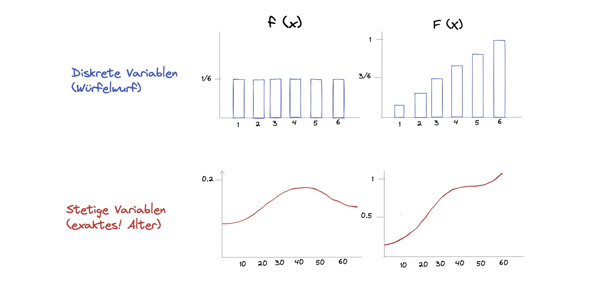

### Berechnung der Verteilungsfunktion

bei stetigen Variablen muss die Verteilungsfunktion aufwendiger berechnet werden = Integrieren

- Wertebereich: $X(\Omega) = \mathbb{R}$
- *es gilt:* $f(x) \ge 0  \ \forall x;\ \int_{-\infty}^\infty f(t)dt=1$
    - Fläche unter Kurve = 1 = 100%

Beispielrechnung:  $P(X \le x) = F(x) = \int_{-\infty}^x f(t)dt$

- bei Dichtefunktion mit Grenzen: $f(x) = x\ ,\  a\le x \le b$
- Verteilungsfunktion: 
  $$
  F(x) = \begin{cases} 
    0 & x < a \\
    \int_a^b x & a \le x \le b \\
    1 & x > b
    \end{cases}
  $$

und der Test $P(x \le X) = \int_a^x f(x)$


## Rechnen mit der Verteilungsfunktion 

Würfelwürfe zwischen 2 und einschließlich 5: 

- f(x) = Dichte der Würfelwürfe
- F(x) = Verteilungsfunktion der Würfelwürfe

$$
F(2 < X \le 5) = F(5) - F(2) = 3/6 \implies \underline{50\%}
$$


Oder Anzahl Menschen unter 50: (stetiges Alter)

- $f(x)$ = Dichtefunktion des Alters
- $F(x)$ = Verteilungsfunktion
- Gesucht: $\sum_{i=1}^{50} f(x_i)$

Lösung: $F(50)$

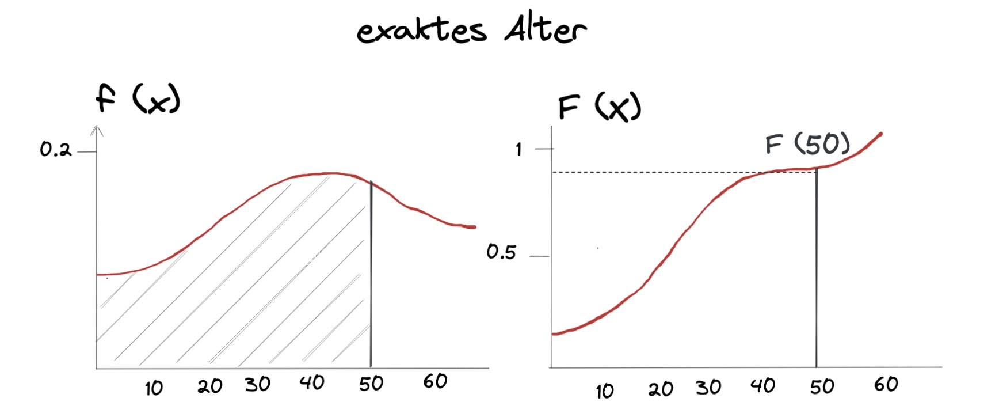

weiteres in der Formelsammlung

### Modus

Definition: x-Wert, bei dem f(x) maximal

- bei zwei gleichen Werten = *undefiniert*
- berechnen über Extrema der Funktion?


### Erwartungswert E(X)

Gegenstück zu arithmetischen MIttel, meist "Schwerpunkt" / Symmetriestelle der Funktion

**diskrete** Variable: 

- $E(X) = \sum_{i=1}^\infin x_i \cdot f(x_i) = x_1 \cdot f(x_1)+ x_2 \cdot f(x_2)+...$
- Beispiel: Erwartungswert eines Würfelwurfes
- $\frac{1}{6} \cdot 1+ \frac{1}{6} \cdot 2+ ... = 3.5$ 

**stetige** Variable:

- $E(x) =\int_{-\infty}^\infty x * f(x)dx$
- Beispiel: Alle 6 Minuten kommt Straßenbahn, wie lange muss ich wahrscheinlich warten wenn ich irgendwann losgehe? 

$$
\begin{aligned}
E(x) 
&= \int_{-\infty}^\infty x * f(x)dx \\ 
&= \int_0^6 x * \frac{1}{6}dx  \\
&= \frac{1}{6}*\Big( \frac{1}{2}* x^2\Big)\bigg|_0^6 \\
&= \frac{1}{12}*(36-0) = \frac{36}{12} = 3
\end{aligned}
$$

graphische Darstellung:

### Quantile

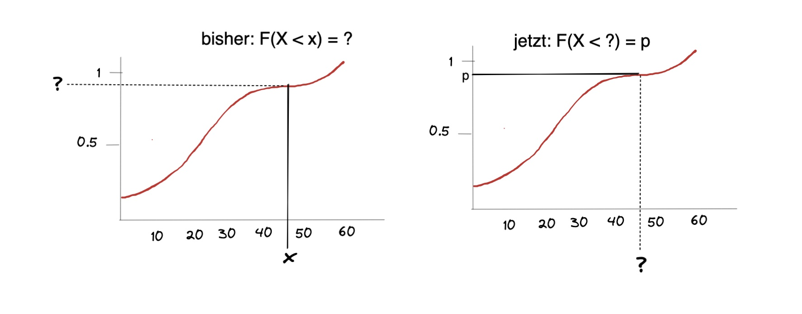

Berechnung: entweder ablesen, kompliziert berechnen oder mit [Normalverteilung](#normalverteilung) später

### Varianz + Standardabweichung

wie bei Statistik I

Varianz für **diskrete** *X*:
$$
Var(x) = \sum_{i=1}^\infty x_i^2 *f(x_i) - (E(X))^2
$$
für **stetige** *X*
$$
Var(x) = \int_{-\infty}^\infty x^2 *f(x)dx - (E(X))^2
$$

Varianz: $\sigma_X = \sqrt{Var(x)}$

Beispiel: Würfel mit E(X) = 3.5 (Standardwürfel)
$$
Var(x) = E(X^2) - (E(X))^2 \\
E(X^2) = \sum_{i=1}^\infty x_i^2 *f(x_i) = \frac{1}{6} \cdot 1^2+...= 15.666 \\
Var(x) = 15.666 - 3.5^2 = 3.4166 \\
\sigma_X = \sqrt{3.4166} \approx 1.8480
$$

# Zufallsvariablen (mehrdimensional)

jetzt eine Abbildung von Stichproben auf mehrere Variablen, beispielsweise Studierende mit Alter X und Notenschnitt Y

für diskrete Verteilungen:

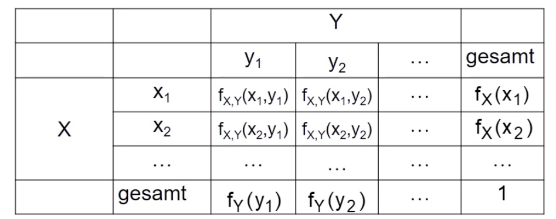

---

**Beispiel**

4mal Münzewerfen und Reihenfolge notieren (Z=Zahl, K=Kopf)

- mögliche Kombination: $N=2, n=4 \to N^n = 16$

| mögliche Ereignisse                                       | Verteilung                                                |
| --------------------------------------------------------- | --------------------------------------------------------- |
| 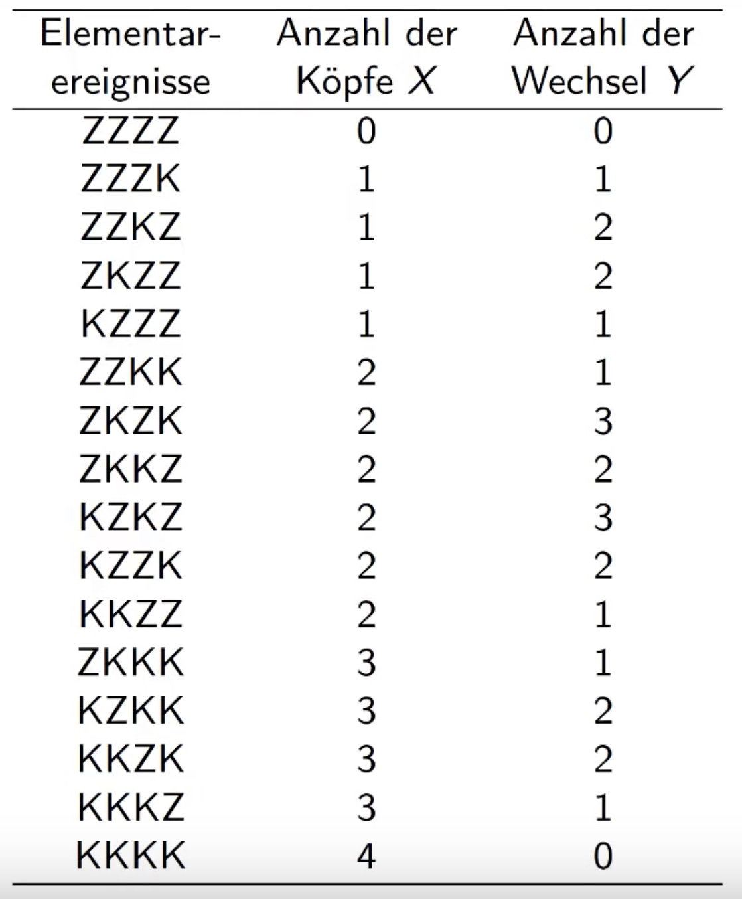 | 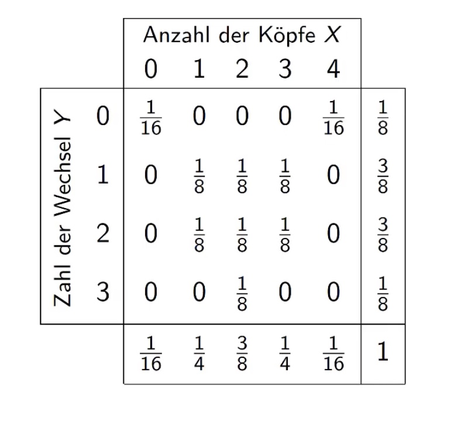 |

## bedingte Dichte

- von X gegeben Y = $\frac{\text{Wahrscheinlichkeit dass beides eintritt}}{\text{Wahrscheinlichkeit dass y eintritt}} \to f_X = \frac{f(x,y)}{f_Y(y)}$

Graphisch: 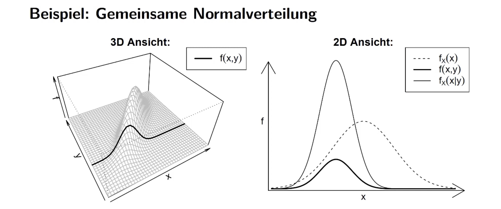


---

**Beispiel**

Anzahl der Köpfe gegeben Anzahl der Wechsel 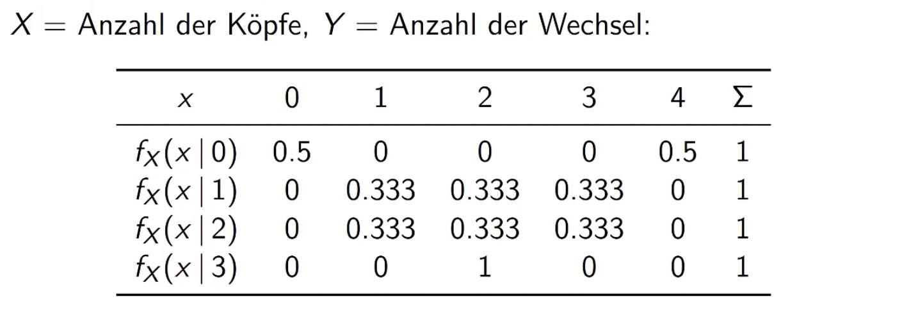

also Spalten nehmen und durch Randdichte des gegebenen teilen!

Beispiel in erster Zeile, erster Spalte: $f(x=0 | \underbrace{y=0}_{gegeben})= \frac{f(x,y)}{f_y(y)} = \frac{1/16}{1/8}= 0.5$

---

## stochastische Unabhängigkeit

gegeben, wenn $f(x,y) = f_X(x) \cdot f_Y(y)$

im Beispiel: $f(0,0)\to \underbrace{\frac{1}{16} \neq \frac{1}{8} \cdot \frac{1}{16}}_{nicht \ unabh.} \gets f_X(x) \cdot f_Y(y)$

## Kovarianz

Allgemein: $Cov(X,Y)= E\Big[ \big(X-E(X)\big) - \big( Y - E(Y) \big) \Big]$

Veranschaulichung: 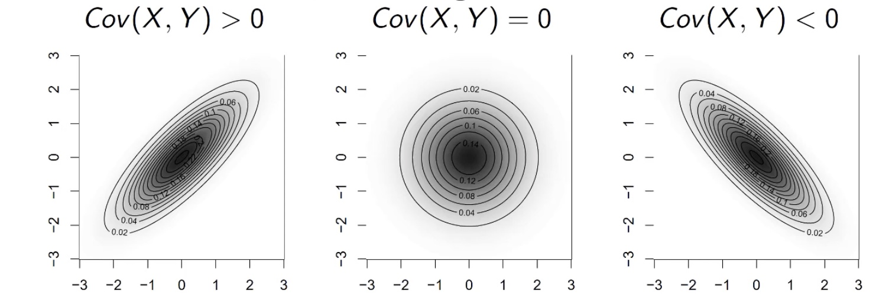

Also: Kovarianz kleiner 0 => große Werte von x hängen mit kleinen Werten von y zusammen

Berechnung: **ist scheiße!**

Beispieltabelle: 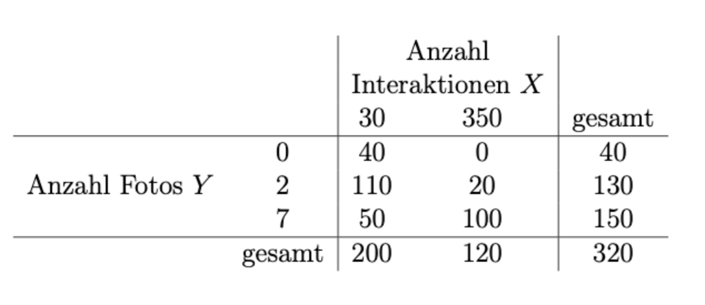

Vorgehen: (diskret)

- Randhäufigkeiten bestimmen: bspw. für X: 200/320 und 120/320
- bedingte Häufigkeiten bestimmen: Zelle / Gesamtergebnis: 40/320
- dann alle Zellen mit bedingten Häufigkeiten * Randhäufigkeit X * Randhäufigkeit Y
- und dann alles aufsummieren 

Vorgehen: (stetig)

- Randdichte von X bestimmen: $f_X(x)=\int_a^b f(x,y) dy$ = Dichtefunktion nach Y integrieren
- dann $E(X) = \int_a^b x  f_X(x)$= mit x multipliziert integrieren
- Dann $E(X Y) =  \int \int x \cdot y \cdot f(x,y) \ dx dy$

---

**Beispiel:**

- E(X) = 1.5
- E(Y) = 2

und dann ganz viel Müll, letztendlich: $Cov(X,Y) = 0$

=> gibt Zusammenhang zwischen Anzahl Köpfe und Anzahl Wechsel, aber nicht stochastisch unabhängig!

# Verteilungen

für Verteilungen gibt es einige typische, anhand derer Sachen einfacher berechenbar sind, insbesondere von Interesse ist die Normalverteilung

## Diskrete Verteilungen

Verteilungen mit diskreten (abzählbaren) Zufallsvariablen

### Bernoulli Verteilung

binäre Verteilung als 0 oder 1

- bspw. Klausur bestanden / nicht bestanden mit Wahrscheinlichkeit *p*

Dichtefunktion: $f(x_i) = p^{x_i} * (1-p)^{1-x_i}$ für $x_i = 0,1$

ist Spezialfall der Binomialverteilung: $X \sim Bin(1,p)$


### Binomialverteilung

Dichtefunktion: 
$$
f(x_i) = \underbrace{\binom{n}{x_i}}_{\text{Binomkoeff}} * \underbrace{p^{x_i}}_{\text{Erfolge}} * \underbrace{(1-p)^{n-x_i}}_{\text{Misserfolge}}
$$
Binomkoeffizient beschreibt Anzahl aller möglichen Kombinationen

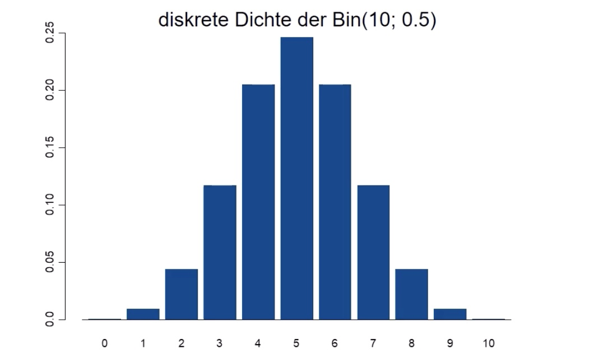

Binomialverteilung = Situation Ziehen mit Zurücklegen

- Urne mit N Kugeln, davon M mit interessierender Eigenschaft
- n Kugeln ziehen mit Zurücklegen
- $X \sim Bin(n,p)$ mit $p = M / N$

### hypergeometrische Verteilung

Ziehen ohne Zurücklegen

- Urne mit N Kugeln, davon M mit interessierender Eigenschaft
- n ziehen ohne zurücklegen
- $X \sim Hyp(n,M,N)$

Dichtefunktion:
$$
f(x_i) = \frac{ \binom{M}{x_i} * \binom{N-M}{n-x_i} }{ \binom{N}{n}}
$$

### Poisson Verteilung

X diskrete Zufallsvariable: 0, 1, 2, ...

Dichtefunktion: $f(x_i) = \frac{\lambda^{x_i}}{x_i!} e^{-\lambda}$

auch *Verteilung der seltenen Ereignisse*


## Normalverteilung

*"The one Verteilung to rule them all"*

- Dichtefunktion: $f(x)= \frac{1}{\sqrt{2\pi} * \sigma} * exp \Big( - \frac{(x-\mu^2)}{2 \sigma^2}\Big)$
- Erwartungswert = $\mu$
- Varianz = Standardabweichung^2 : $\sigma^2 = p$ 

kovergiert gegen 0, Fläche unter Kurve = 1

Schreibweise: $N(\mu, p)$

### Standardnormalverteilung

Falls $\mu = 0$ und $\sigma^2 = 1 \to$ N(0,1) = *Standardnormalverteilung*

Dichte $\phi(z)$ und Verteilungsfunktion $\Phi(z)$ der SNV

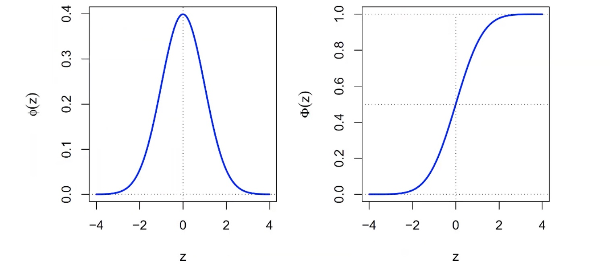

praktisch für: wir haben eine Verteilung, transformieren sie zu SNV, berechnen was wir berechnen wollen und transformieren zurück

### Rechnungen

**Wahrscheinlichkeit**

$\phi(x) = ?$ also Höhe der Normalverteilung an bestimmten X-Wert:

Rechnerisch: mit *R*, bspw. [hier](https://www.online-ide.com/online_r_compiler)

```R
x = 1 # das x
m = 0 # das mu der Verteilung
sd = 1 # die Standardabweichung
# Berechnung der Höhe mit pnorm()
dnorm(x,m,sd)
```

Output:

```R
0.2419
```

**kleiner als: Wahrscheinlichkeiten**

Wahrscheinlichkeitsrechnungen bei der Normalverteilung: Wie hoch ist die W., dass Wert x kleiner als 1 ist?

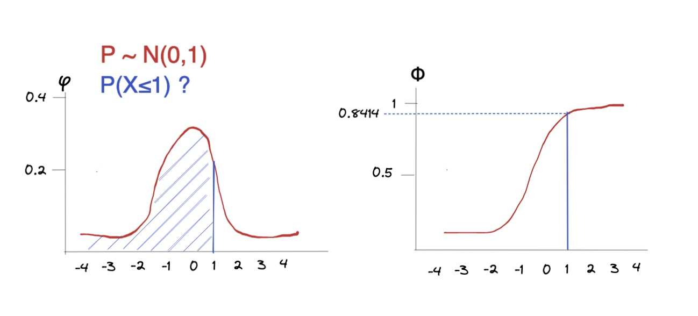

Rechnerisch: mit *R*, bspw. [hier](https://www.online-ide.com/online_r_compiler)

```R
p = 1 # der gesuchte Wert
m = 0 # das mu der Verteilung
sd = 1 # die Standardabweichung (Wurzel der Varianz!)
# Berechnung der Wahrscheinlichkeit mit pnorm()
pnorm(p,m,sd)
```

Output:

```R
0.8413447
```

wenn nicht unterhalb der Wert gesucht wird, sondern oberhalb:

```R
pnorm(p,m,sd,lower.tail=FALSE) 
```

**Quantile:**

bei welchem Wert werden 69 % der Ereignisse abgedeckt?

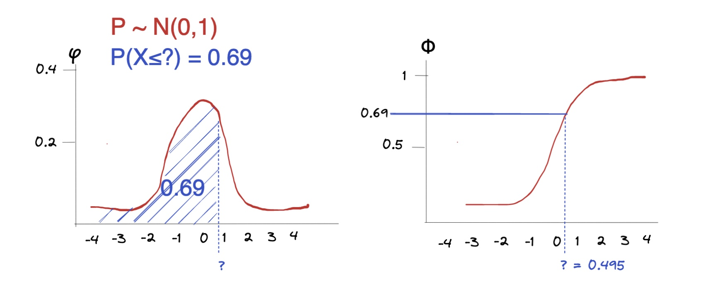

Rechnerisch:

```R
q = 0.69 # der gesuchte Wert
m = 0 # Mittelwert mu der Verteilung
sd = 1 # die Standardabweichung
# Berechnung der Wahrscheinlichkeit mit pnorm()
qnorm(p,m,sd)
```

Output

```
0.49585
```


# Schätzen

Wir wollen aus den Eigenschaften einer Stichprobe Informationen über die Grundgesamtheit in Erfahrung bringen, bspw. über Würfelwürfe etwas über die Gezinktheit eines Würfels = **induktive Statistik**

Beispiel: erwarteter Beliebtheitsgrad FDP  $E(\ \text{Bel}_{FDP} \ )$, anhand Stichprobe aus historischen Daten

Methoden zu Bsp.:

- **Punktschätzung:** beste Vermutung für Wert des Parameters in Grundgesamtheit
    - FDP wird nicht beliebt sein, nur 7%:
    - $E(\ \text{Bel}_{FDP} \ ) = 0.07$ 
- **Intervallschätzung:** in welchem Bereich liegt ein Parameter?
    - Ich bin mir zu 95% sicher, dass seine Beliebtheit zwischen 5 und 10 % ist
    - $0.05 \le E(\ \text{Bel}_{FDP} \ ) \le 0.1$
- **Test:** Treffen bestimmte Hypothesen zu?
    - Ich bin mir zu 99% sicher, dass meine Behauptung $E(\ \text{Bel}_{FDP} \ ) = 0.07$ stimmt

hoffen wir mal ne :grin:

## Punktschätzer

- Suchen Parameter $\theta$ der Stichprobe $X_1,...,X_n$
- Punktschätzer ist Funktion $t(X_1,...,X_n)$
- Anwenden dieser Funktion auf Gesamtheit

Erwartungswertschätzer = simpler Durchschnitt $\bar{X}$

Varianzschätzer:

1. $\tilde{S}^2 = \frac{1}{n} \sum (X_i-X_n)  \text{ mit } E(\bar{S}^2) = \frac{n-1}{n} \sigma^2$
2. korrigierter Schätzer: $S^2 = \frac{1}{n-1} \sum (X_i-X_n) \text{ mit } E(S^2) = \sigma^2$

Beispielaufgabe Schätzer: drei Melonen

- $t_1(X_1,X_2,X_3)= \frac{3}{6}(X_1+2 X_2 - X_3)$
- $t_2(X_1,X_2,X_3)= \frac{2}{8}(X_1+5 X_2 + X_3)$

Erwartungswerte der Schätzer: ersetzen $E(X) = \mu$
$$
E(t_1) = E[\frac{3}{6}(X_1+2 X_2 - X_3)] \\
= \frac{3}{6}(u+2u-u) = \frac{6}{6}u = u \\
\\
E(t_2) = E[\frac{2}{8}(X_1+5 X_2 + X_3)] \\
= \frac{2}{8}(u+5u+u) = 2/8 \cdot(7u) = 1.75 u
$$
Varianz der Schätzer: alleinstehende $Var(X)  = \sigma^2$(alles was rauskommt quadrieren!) 
$$
Var(t_1) = Var[\frac{3}{6}(X_1+2 X_2 - X_3)] \\
= \frac{3}{6}^2 \Big( 1^2 Var(X_1)+ 2^2 Var(X_1) + (-1)^2 Var(X_3) \Big) \\
= \frac{9}{36} (1+4+2) \cdot Var(X) = 1.5 \cdot \sigma^2
$$


## Intervallschätzer

Interesse ist Angabe eines Intervalls, das den Parameter enthält

Wahrscheinlichkeit $\alpha$ ($0 \le \alpha \le 1$) gegeben (genannt *Irrtumswahrscheinlichkeit*)

**Standardabweichung der Grundgesamtheit bekannt:**

Erinnerung: Standardabweichung $\sigma = \sqrt{Varianz: \ \sigma^2}$

```R
n <- 39       # Stichprobengröße
mean <- 7.77  # Stichprobenmittel
sd <- 0.46     # Stichprobenabweichung (Schätzung)
a <- 0.05     # alpha

error <- qnorm(1-a/2)*sd/sqrt(n) # Fehler berechnen mit Normalv.
high <- mean + error
low <- mean - error

print(c(low, high)) # untere Grenze, obere Grenze
```


**Varianz unbekannt, dafür Standardabweichungschätzung der Stichprobe:**

nur bei $n\ge 30$, weil erst dann t-Verteilung = SNV

```R
n <- 39       # Stichprobengröße
mean <- 7.77  # Stichprobenmittel
s <- 0.46     # Stichprobenabweichung (Schätzung)
a <- 0.05     # alpha

margin <- qt(1-a/2,df=n-1)*s/sqrt(n) # Konfidenzfehler aus t-Verteilung
high <- mean + margin
low <- mean - margin

print(c(low, high)) # untere Grenze, obere Grenze
```

## Tests

wir haben eine Hypothese und eine derzeitige Meinung

- Nullhypothese $H_0$: "*die Erde ist eine Scheibe*"
- Alternativhypothese $H_1$: *"Erde hat Kugelgestalt"*

=> Testproblem: $H_0$ vs. $H_1$

wir bauen Entscheidungsregel, ab der wir $H_0$ verwerfen

|                          | $H_0$ ist real     | $H_1$ ist real     |
| ------------------------ | ------------------ | ------------------ |
| $H_0$ **wird verworfen** | Fehler 1. Art      | :white_check_mark: |
| $H_0$ **bleibt**         | :white_check_mark: | Fehler 2. Art      |

Entscheidungsregel sagt, dass Fehler 1. Art nur mit Wahrscheinlichkeit $\alpha$ passieren soll

Arten von Hypothesen:

| Test         | Hypothese $H_1$ | Gegenhypothese $H_1$ |
| ------------ | --------------- | -------------------- |
| linksseitig  | $\mu \ge \mu_0$ | $\mu < \mu_0$        |
| rechtsseitig | $\mu \le \mu_0$ | $\mu > \mu_0$        |
| Zweiseitig   | $\mu = \mu_0$   | $\mu \ne \mu_0$      |

---

**Beispiel:**

- Bäcker behauptet, seine Brötchen sind im Schnitt schwerer/exakt 50 Gramm
- ich behaupte, dass die Brötchen kleiner als 50 Gramm sind

Aufbau des Tests: wir suchen realen Durchschnitt $\mu$

- Brötchengewicht X
- Annahme: Brötchen sind normalverteilt $X \sim N(\mu, \sigma^2)$
- $H_0: \mu \ge 50$ vs. $H_1: \mu < 50$ (unzufrieden)

Durchführung:

- wir ziehen Stichgröße vom Umfang n $X_1, ...,X_n$
- $\bar{X}$ = Durchschnittsgewicht = Prüfgröße

Berechnung: (mit beispielhaften Werten)

- $\sigma^2 = 1.44$
- $\alpha = 5\%$
- $\bar{X} = 51$
- $S = 2.5$

Entscheidungsregel: (aus Formelsammlung: t-Test, linksseitig)

---

**gauß-test** in R

maschine mit Varianz = 0.5

Stichprobe mit 36 Schrauben, Durchschnitt=9.7, Varianz= 0.5

- $H_0: \mu = 10$  (Schrauben sind im Durchschnitt 10 cm lang)
- $H_1: \mu \ne 10$ (nein sind sie nicht)

```R
library(compositions)
# x <- c() # wenn reale Daten
x <- rnorm(36,9.7, 0.5) # oder erstellen (n,mean,sd)

Gauss.test(x, y = NULL,
       mean = 10, # Nullhypothese über mu
       sd = 0.5, # die Varianz der Grundgesamtheit
       alternative =  "two.sided") # "two.sided", "less", "greater"
```

Output:

```R
data:  x
T = 9.8378, mean = 10, sd = 1, p-value = 0.05185
alternative hypothesis: two.sided
```

p > 0.05 = schlechte $H_0$ = $H_1$ wird angenommen.

Maschine muss rekalibriert werden, um Durchschnitt von 10cm wiederzubekommen. 

**t-test** in R

```R
# x <- c() # wenn reale Daten der Stichprobe
x <- rnorm(29,85.74, 3.43) # oder erstellen (n,mean,sd)

t.test(x, y = NULL,
       alternative =  "two.sided", # "two.sided", "less", "greater"
       mu = 84.1,
       conf.level = 0.95,)

# Output: true mean is not equal to 84.1 
```


praktische Sachen für Prüfung

- Bei Entscheidungen gegen H0 und damit für H1 spricht man von einem signifikanten
    Ergebnis
- Konfidenznivau + Signifikanzniveau = 100%

