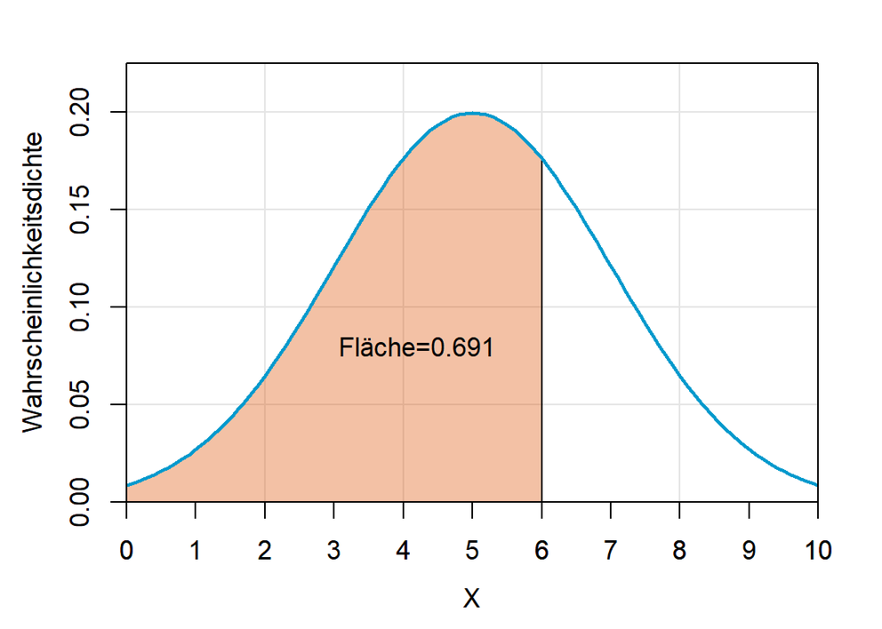
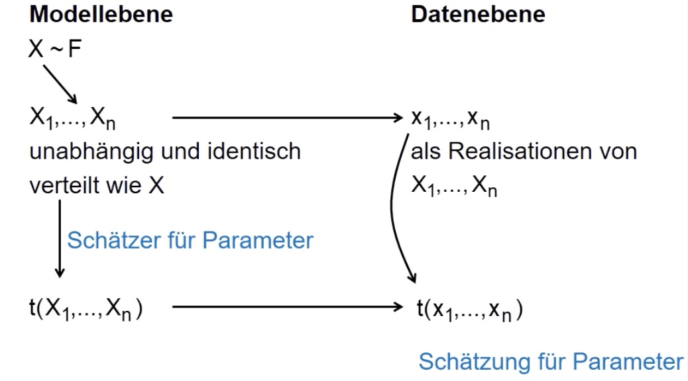

# 02.06.2022 Normalverteilung 2

## Quantile der Normalverteilung

bereits bekannt aus Statistik I

---

Suchen das *99% Quantil* der Standardnomalverteilung

Berechnung mit R

```R
q = 0.99 # der gesuchte Wert
m = 0 # Mittelwert mu der Verteilung
sd = 1 # die Standardabweichung
# Berechnung der Wahrscheinlichkeit mit pnorm()
qnorm(p,m,sd)
```

Output

```
2.326348
```

also ist 2.32 der Wert auf der Skala, an dem 99% der Verteilung inbegriffen sind

anders Beispiel:

```R
q = 0.691 # der gesuchte Wert
m = 5 # das mu der Verteilung
sd = 2 # die Standardabweichung
# Berechnung der Wahrscheinlichkeit mit pnorm()
pnorm(q,m,sd) 
# => 5.999
```

Darstellung:

`qnorm()` ist das Gegenteil von `pnorm()`!

### Beispiel

Produzierendes Unternehmen braucht Lager => *perfekte Dimensionierung?*

- Gegeben:
    - Durchschnittlich benötigte Lagerfläche: *120*
    - Variabilität der genutzen Fläche: *400*
- Gesucht:
    - Lagerfläche X 

Modellierung mithilfe von Normalverteilung: $X \sim N \ (120,400)$

- dann mithilfe der gewünschten Sicherheit Lagergröße bestimmen
- wir wollen 80% der Lagerzustände abdecken 
- `qnorm(0.8,m=120, sd=400)` => `456.6485` Quadratmeter sind dafür passende Fläche


 

## Schätzer

> **Modell:** vereinfachte Darstellung der Geschehnisse der Wirklichkeit



beachte Unterschied zwischen Schätzer und Schätzung!


