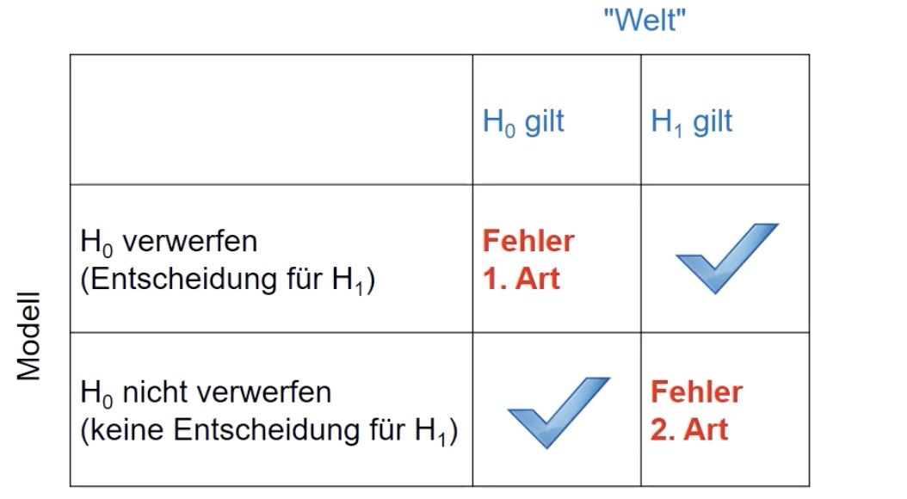

# 07.06.2022 Tests

## Testproblem

- Nullhypothese $H_0$: "*die Erde ist eine Scheibe*"
- Alternativhypothese $H_1$: *"Erde hat Kugelgestalt"*

=> Testproblem: $H_0$ vs. $H_1$

### Beispiel

Schmecken Leitungswasser und Mineralwasser gleich? 

- $H_0$: schmecken Gleich
- $H_1$: schmecmen unterschiedlich

Lasse Personen testen und messe Anteil Personen, die Leitungswasser besser finden

= Bernoulli Model mit Erfolgswahrscheinlichkeit p

- $H_0: p = 0.5$ (kein Unterschied) 
    - 50% der Personen entscheiden sich für eins von beidem
- $H_1: p \ne 0.5$ (Unterschied)
    - unterschiedliche Mengen an Menschen entscheiden sich für eines

Interpretation der Testergebnisse: 

Lösung: konstruiere **Entscheidungsregel**, sodass Fehler nur mit geringer Wahrscheinlichkeit passieren

> **Entscheidungsregel:** führt zu Entscheidung über Ablehnung oder Beibehalten von $H_0$

Problem: bei festem Stichpobenumfang beide Fehler nicht gleichtzeitig minimierbar

Dann:

- Fehler 1. Art soll nur mit vorgegebener Wahrscheinlichkeit passieren
- erst dann Fehler 2. Art minimieren

Sodass $P(\text{Fehler  1. Art}) \le \alpha$ 

Entscheidungsregel im Wassertest: $H_0$, wenn $0.4 > p >0.6$, sonst $H_1$

