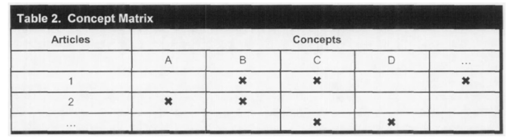

# 20.05.2022 systematische Literaturanalyse

> **Systematic Literature Review (SLR):** Zusammenfassung und Übersicht vorhandener Literatur

Ziele:

- Forschungslücken identifizieren
- Grundlage zur Konstruktion von Artefakten
- Strukturierung von Forschungsdomänen

## Fünf-Schritt-Framework für Literaturstudien

nach *Brocke et al (2009)*

### Review Scope

Spezifikation des Recherecheumfangs nach 6 Charakteristiken: *nach Cooper (1988)*

1. **Focus**: 
    - research outcomes
    - research methods
    - theories
    - applications
2. **Goal**: 
    - integration
    - criticism
    - central issues
3. **Organisation**: 
    - historical
    - conceptual
    - methodoligcal
4. **Perspective**:
    - neutral representation
    - espousal of position
5. **audience:** 
    - Specialised scholars
    - general scholars
    - Practitioners
    - general Public
6. **coverage:** 
    - exhaustive (so viel wie möglich)
    - exhaustive-selective
    - representative (Auswahl der Arbeiten)
    - pivotal (wegbereitende Arbeiten)

 

### Conceptualization of Topic

erklärung von zentralen Begriffen und Theorien

### Literature Search

- Journal Search
- Database Search
- Backward Search
- Forward Search

systematisches Vorgehen für Literatursuche

1. Suche mit *begründeter* Auswahl von Suchthemen
2. Suche in *begründeter* Auswahl von Datenbanken
3. *nachvollziehbare* Selektion der Suchtreffer aus Suchmaschinen
4. Anwendung *definierter* Inklusions / Exklusionskriterien 

### Literature Analysis and Synthesis

Untersuchung und Zusammenfassung von Literatur

- **Konzept-zentrisch** (häufig), historisch, Methoden-zentrisch

Nutzung von Konzeptmatrizen zur Klassifikation

Ausgangspunkt für schriftliche Diskussion

### Research Agenda

Beitrag zur wissensch. Community durch Literaturstudie

- durch Ansatzpunkte für zukünftige Forschung
- oder neue Modelle etc.
- nicht zwingend Agenda!

