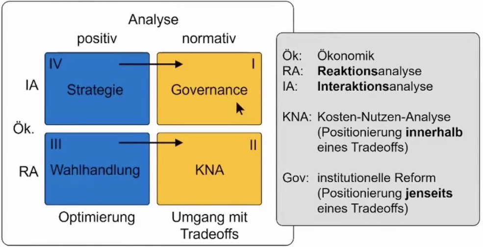

# 30.05.2022 Institutionenökonomik

## Wissenschaftsprozess

Ebenen des wissenschaftlichen Lernens:

- **Tatsachen**
- **Hypothesen**: Vermutungen über Fakten, die empirisch getestet werden
- **Theorien**: vermutete Wirkungszusammenhänhe zwischen Fakten
- **Forschungsprogramme**:  Theoriekern und Entwicklungsvision
- **Konsilienz:** Verbindung von Programmen zu Weltbild


> **Wissenschaft:** Prozess der Überführung von *heterodoxen* Ideen zu *orthodoxen* Erkenntnissen

Wissenschaft dient der *positiven* Erkenntnis!

## Ökonomik

*wie kann die Ökonomik als positive Wissenschaft Stellung zu normativen Fragen nehmen?*




## Der praktische Syllogismus

Figur für die Unterteilung zwischen *Meinung* und *Fakten*

```
1. Normative Prämisse:     Wollen
2. Positive Prämisse:      Können
---------------------------------
3. Normative Conclusio.    Sollen
=================================
```

Fehlschlüsse:

- *Non sequintur*: 3 folgt nicht aus 1 + 2
- *Normativistischer:* aus 1 ohne 2 folgt nicht 3
- *Positivistischer (Naturalistischer):* aus 2 ohne 1 folgt nicht 3

**wissenschaftliche Kritik setzt an Ebene 2 (positive) an!**