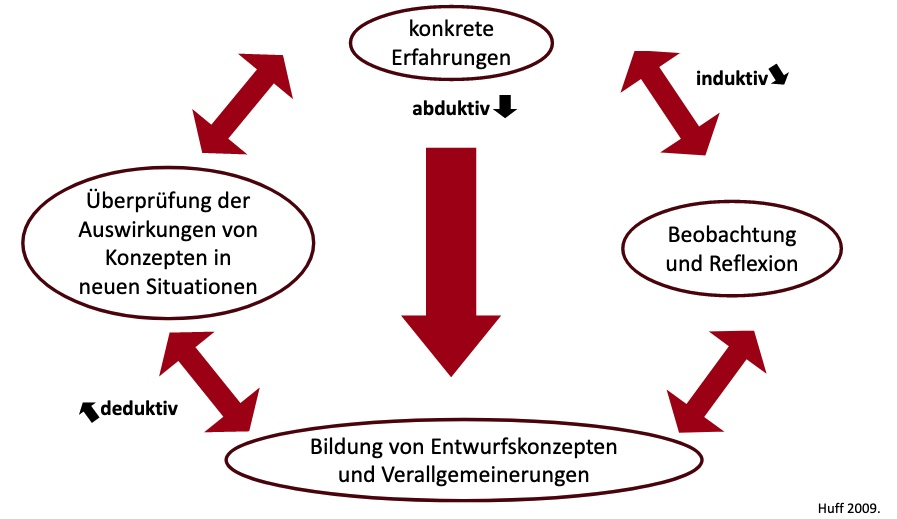
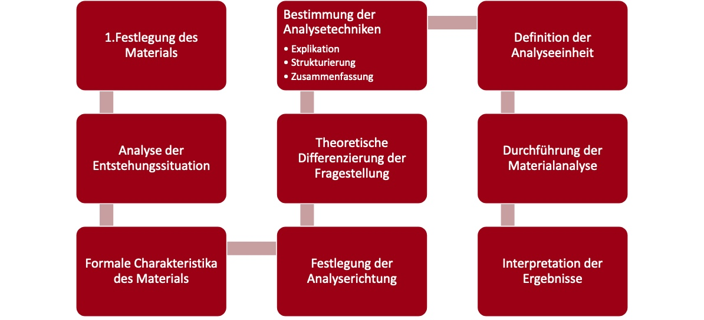

# 19.06.2022 qualitative Methoden

*was eine schrecklich unstrukturierte Zusammenklatschung die ganze Vorlesung diesmal!*

## Vorgehensweisen

Der Theoriebildung:

- **induktiv:** von speziellem Fall aufs Ganze
- **deduktiv:** von allgemeiner Erkenntnis auf Spezielle

exploratives Forschungsdesign für:

- Entscheidungsträger wenig Info
- Forschunbgsfrage ungenau
- Entscheidungsfindung in Entstehungsphase

Unterschiede zwischen Forschungsansätzen

| Quantitativ                          | Qualitativ                          |
| ------------------------------------ | ----------------------------------- |
| Erkenntnis aus repräsentativen Daten | Analyse aus sozialen Besonderheiten |
| verallgemeinerbare Erkenntnise       | subjektive Wirklichkeiten           |
| Hypothesenprüfung                    | Hypothesengenerierung               |
| statisch                             | Prozessual                          |
| große Stichproben                    | kleine Stichproben                  |
| "objektive" Einschätzung             | Verstehen von Bewegründen           |

## Prinzipien

1. **Offenheit**
    - Exploraionsfunktion
    - Hypothesenentwicklungsprozess
    - offen gegenüber neuen Erkenntnissen
2. **Kommunikation**
    - keine theorieabhängige Kommunikation
    - Aushandeln der Wirklichkeitsdefinition zwischen Forscher und Subjekt
3. **Prozesscharakter**
    - prozesshafte Forschung
    - Involviertheit des Forschers
4. **Reflexibilität**
    - reflektierte Forschung
    - Anpassung an Untersuchungsgegenstand
5. **Explikation**
    - Nachvollziehbarkeit des Ergebnisses 
    - Erklärung des Ergebnisses 
6. **Flexibilität**
    - Anpassung an Untersuchungsgegenstand
    - auch im laufenden Prozess flexible Veränderung

## Qualitative Interviewforschung

Ziel: 

- neue Erkenntnise über Lebenswelten

Charakteristika:

- meist halbstrukturierte / offene Interviews
- läßt Ambivalenzen zu

Methoden:

- **Visuelle**: Beobachtung; Fotoanalyse/Filmanalyse
- **Verbale**: Interviews; Gruppenverfahren

## Interviewführung

- Aufzeichnung (mit Einverständnis)
- Anonymität => nur aggregierte Ergebnisse
- ungestörter Ort
- nach I: : Transkription

Aufkärung des Subjekts über Vorgehen bei

- Thema
- Design
- Interviewsituation
- Transkription
- Analyse
- Überprüfung
- Bericht

ethische Gebote

1. nicht mit Tür ins Haus
2. Zweck des Interviews
3. Natürlich bleiben
4. Anteilnahme
5. Wahl komfortabler Ort
6. Akzeptanz einsilbiger Antworten
7. Höflichkeit
8. Üben
9. Freundlichkeit / Dankbarkeit

## Varianten

- **Leitfaden** I.: halbstrukturiertes Vorgehen
- **Experten** I.: Fokus auf institutionalisierte Wissenbestände 
- **Problemzentriertes** I. : Fokus auf eine Frage
- **Narratives** I. : Erzählungen der Befragten Fokus
- **Fokussiertes** I. : Vorgabe einer bestimmten Situation
- **Ethnografisches** I. : Verständnis fremder Kulturen
- **Episodisches** I. : Verknüpfung mehrerer Situationen
- **Gruppendiskussion**sverfahren: gemeinsame Befragung aller 

## Arbeitsschritte

### Inhaltliche Vorbereitung

- Befragungsthema 
- Überlegung über Partner
- Interviewdauer
- Fragen

### Organisatorische Vorbereitung

- Kontaktaufnahme
- Materialzusammenstellung

### Gespräch

- Vorstellung
- Check Aufnahmegerät

### Dokumentation

- Transkription
- Materialzusammenstellung

## Transkription

> **Tranksription:** *lat. transcribere*, Verschriftlichung verbaler / nonverbaler Daten

Übertragung von Sprache / Lauten / Mimik in Schrift

beispielhafte Regeln:

- unverständliche Wörter kennzeichnen
- emotionale nonverbale Äußerungen in Klammern (*lachen*)
- wörtlich transkribieren

## Inhaltsanalyse

Ziel: Komplexität durch Reduzierung und Strukturierung verringern

**Reduzierung**: Kodierung von Schlüsselbegriffen durch Induktion aus Text

**Strukturierung**: Struktur in den Schlüsselbegriffen

- Gemeinsamkeiten / Unterschiede
- Über / Unterordnung
- deduktiv aus Theorie

Fragen:

1. Welches Problem?
2. Welcher Bereich mit welchen Materialien?
3. Was soll erfasst werden?
4. Detaillierte Analyse
5. Auswertung
6. Beschreibung + Interpretation

## Kodierung

Vorgehensweise nach Mayring

Grundtechniken:

- Explikation: Erklärung unklarer Textstellen durch Rückgriff auf Kontext / externe Quellen
- Strukturierung: Aufstellung der Kategorien mit Vorwissen
- Zusammenfassung: Eingrenzung der Textelemente, Reduktion auf Kernaussage

Gütekriterien für Kodierung

- Vergleichbarkeit 
- Nachvollziehbarkeit
- Intracoder-Reliabilität: erneut durcharbeiten ohne Blick auf erste Kodierungen
- Intercoder-Reliabilität: andere Kodierer kommen auf gleiches Ergebnis

Statistische Software

- Microsoft Office (geringe Mengen)
- winMAX
- AMOS
- GABEK