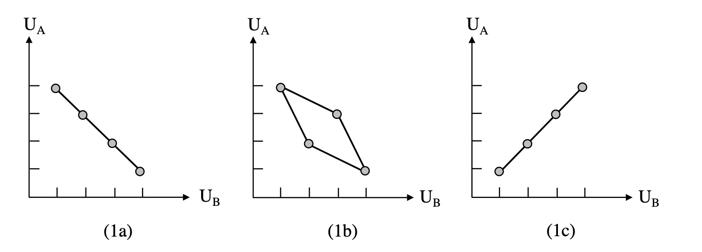
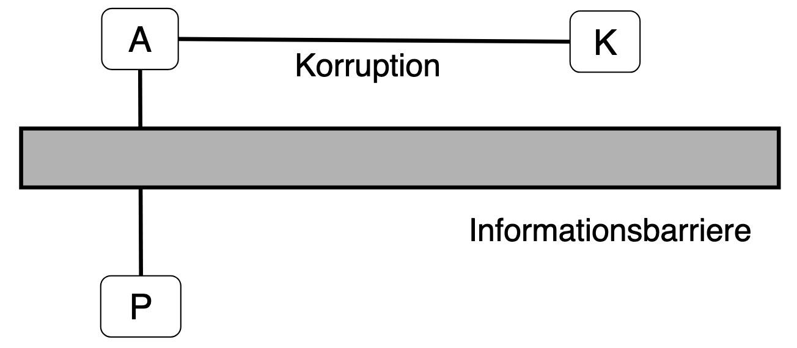

# Zusammenfassung Ethik der Sozialen Marktwirtschaft

- [Wirtschaftsethik](#wirtschaftsethik)
  * [Praktischer Syllologismus](#praktischer-syllologismus)
  * [Ordonomik](#ordonomik)
- [Ursprung der Sozialen Marktwirtschaft](#ursprung-der-sozialen-marktwirtschaft)
  * [Markt und Moral](#markt-und-moral)
  * [Wettbewerb](#wettbewerb)
- [Soziale Dilemmata](#soziale-dilemmata)
  * [Darstellung](#darstellung)
  * [Arten von Spielen](#arten-von-spielen)
  * [Markt aus spieltheoretischer Sicht](#markt-aus-spieltheoretischer-sicht)
- [Anwendungsfälle](#anwendungsfälle)
  * [Soziale Marktwirtschaft ](#soziale-marktwirtschaft)
  * [Umweltpolitik](#umweltpolitik)
  * [Marxismus](#marxismus)
  * [Nachhaltigkeit](#nachhaltigkeit)
  * [Bindungen](#bindungen)
  * [Arten von Bindungen](#arten-von-bindungen)
  * [Korruption](#korruption)
  * [Zivilgesellschaft](#zivilgesellschaft)
- [Nicht alles mit barer Münze nehmen](#nicht-alles-mit-barer-münze-nehmen)

## Wirtschaftsethik

> **Wirtschaftsethik:** WIssenschaft der Moral im Wirtschaftssystem

Wirtschaft meint hier die neoklassische!


- **Intentionalistischer Fehlschluss**: von nicht intendierten handlungsfolgen auf Ziele schließen (Verschwörung)
- **Moralistischer Fehlschluss**: Zieländerung statt Anreizänderung

### Praktischer Syllologismus

Wie argumentiere ich für Handeln?

| Schritt                  | Erklärung |
| ------------------------ | --------- |
| 1. Normative Prämisse    | Wollen    |
| 2. positive Prämisse     | Können    |
| *3. Normative Conclusio* | *Sollen*  |

mögliche Fehler:

- **Normativistischer** Fehlschluss: 1 ohne 2 
- **Naturalistischer** Fehlschluss: 2 ohne 1
- **Non-Sequitor** Fehlschluss: keine ausreichende Prämisse


### Ordonomik

Forschung von Ordnungsystemen und Moral, bestehend aus:

- Systemethik (*Warum Kapitalismus*)
- Organisationsethik (*Greenwashing*)
- Prozessethik (*Lobbyismus*)

Betrachtung von


| Semantik                   | Sozialstruktur                |
| -------------------------- | ----------------------------- |
| Normative Begriffe         | Institutionelle Rahmenordnung |
| Gesellschaftlicher Diskurs | Politik                       |
| Denkkategorien             | Anreizstrukturen              |

#### Drei Ebenen Spiel

1. Basisspiel: Handlungen
2. Meta-Spiel: Sozialstruktur
3. Meta-Meta-Spiel: Semantik


#### Orthogonale Positionierung (Semantik)

- Komplementarität von Eigeninteressen und Fremdinteressen / Moral
- gegenseitige Besserstellung

=> keine Zügelung der Interessen durch Appelle, sondern *Anreizänderung*


## Ursprung der Sozialen Marktwirtschaft

warum haben wir eigentlich diesen Kapitalismus

### Markt und Moral

Märkte = moralische Skepsis, da kein (helfer)-moralisches Handeln benötigt

| Helfermoral                                  | Marktmoral                        |
| -------------------------------------------- | --------------------------------- |
| persönliches Opfer                           | Befolgung allgemeiner Regeln      |
| identifizierbarer Addressat                  | nicht-identifizierbarer Addressat |
| = Kleingruppenmoral (Nullsummengesellschaft) | = Gesellschaftsmoral (Win-Win)    |

moderne Gesellschaft:

- zu groß für Helfermoral
- gesundes Maß Eigeninteresse
- Markt = braucht nur Ordnungsrahmen
    - bringt Frieden = keine zwangsläufige Übereinstimmung mit Handelspartnern
    - bringt Freiheit = statt Zwang, nur Regeln


### Wettbewerb

#### Wettbewerb nach Hayek

 = *Entdeckungsverfahren*

- Marktpreise = Informationen aller Individueen
- dezentrale Informationsverarbeitung

| *Systemvergleich*       | **Marktwirtschaft**                           | Planwirtschaft                                          |
| ----------------------- | --------------------------------------------- | ------------------------------------------------------- |
| **Wissensverarbeitung** | dezentrales Wissen, Marktpreise = Information | zentralisiert = unmöglich,                              |
| **Rechtsrahmen**        | allgemeine Spielregeln, Ordnungsrahmen        | Marktinterventionen,  Befehle = parteiischer Rechtstaat |
| **Moral**               | keine Moral benötigt                          | allumfassender Moralkodex, alle müssen unterstützen     |
| **Strukturwandel**      | anonym durch Preise, kein Schuldiger          | durch politischen Befehl = offen für Proteste           |
| **Demokratie**          | Beschränkung der D. auf lösbare Probleme      | D. muss alles entscheiden => Planungsbehörde = Diktatur |
| **Fehlerkorrektur**     | durch Demokratie                              | ist Systemangriff = Knast                               |
|                         | *"Planning for Freedom"*                      | *"Planning for Interference"*                           |


#### Wettbewerb nach Eucken 

*= Entmachtungsinstrument*

- Meritokratie = Auf- und Abstieg
    - keine gesellschaftlichen Schichten mehr
- Mittel zum Zweck
- Entmachtung von Staat und Reichen
    - mehr individuelle Freiheit


> **Soziale Marktwirtschaft:** Wirtschafts- und Sozialordnung zur Wohlstandserreichung durch Wettbewerb

staatliche Ordnung = möglich

- Betrachtung qualitativ statt quantitativ
- für Menschenwürde und Freiheit
    - weder Laissez Faire noch Planwirtschaft


Prinzipien Sozialer Marktwirtschaft: (Auswahl)

| Staatspolitische Prinzipien        | Konstituierende Prinzipien   | Reglierende Prinzipien  |
| ---------------------------------- | ---------------------------- | ----------------------- |
| Ordnungsrahmen                     | Preis + offene Märkte        | Wettbewerbspolitik      |
| gegen wirtschaftliche Machtgruppen | Wettbewerb = Leistungsanreiz | Einkommenspolitik       |
|                                    | Vertragsfreiheit             | Korrektur Marktversagen |


#### Vergleich Eucken Hayek

|                | Eucken                       | Hayek                        |
| -------------- | ---------------------------- | ---------------------------- |
| **Wettbewerb** | Entmachtungsverfahren        | Entdeckungsverfahren         |
| **Theorei**    | der Macht                    | des Wissens                  |
| **Normativ**   | Gerechtigkeit durch Freiheit | Freiheit durch Gerechtigkeit |

Aufgabe der Ökonomik:

- Rationalisierung von Politik
- Wissenschaft der Gesellschaft


## Soziale Dilemmata

aus der Spieltheorie und Institutionenökonomik

> **Dilemma**: Situation, in der rationale Akteure gemeinsames Ziel verfehlen und kollektiv unter Möglichkeiten bleiben


**einseitiges** Dilemma:

- Antizipation einer Ausbeutung verhindert Kooperation
- nur einer muss sich ändern

=> individuelle Selbstbindung

**zweiseitiges** Dilemma

- jeder verhält sich wie befürchtet
- alle nutzen alle aus (bsp. Gefangenendilemma)

=> kollektive Selbstbindung


### Darstellung

mit Payoff Matrix, hier am Beispiel Gefangendilemma

| Spieler 1 $\downarrow$ \ Spieler 2 $\rightarrow$ | gestehen | nicht gestehen |
| ------------------------------------------------ | :------: | :------------: |
| **gesstehen**                                    | `[2,2]`  |      4, 1      |
| **nicht** **gestehen**                           |   1, 4   |     `3,3`      |

- `[2,2]` = Nash Gleichgewicht
- `3,3` = Pareto Optimum

> **Nash-GG**: dominante Strategiekombination, von der niemand abweichen will

> **Pareto-Optimum:** Strategiekombination, in der niemand bessergestellt werden kann, ohne anderen schlechter zu stellen


### Arten von Spielen

nach Bowles



- Interessenharmonie (1a): 
    - alle haben *common-Interest*
    - kooperatives Spiel (Win-Win)
    - aber Anreizstruktur verhindert Beste Lösung
- Konfliktspiel (1c):
    - alle haben unterschiedliche Interessen
    - nicht kooperatives Spiel (Win-Lose)
- mixed motif (1b):
    - Zwischending


### Markt aus spieltheoretischer Sicht

Markt = wechselseitige Besserstellung durch drei Dilemma

1. zwischen Anbieter und Nachfrager individuell
    - unerwünschtes Dilemma = Vertragsrecht
2. innerhalb einer Gruppe
    - Kartelldilemma = erwünscht
3. zwischen den Gruppen
    - Monopoldilemma = unerwünscht = Wettbewerbsrecht


#### I. individueller Tauschakt

zwischen zwei anonymen Partnern

**Problem**:

- jeder kann anderen betürgen und mit Geld / Ware abhauen
- kein Tausch kommt zustande


| Tausch brechen? | ja    | nein    |
| --------------- | ----- | ------- |
| **ja**          | `3,3` | 1, 4    |
| **nein**        | 4, 1  | `[2,2]` |

**Lösung**:

- Vertragsrecht mit Sanktionen
- oder Wettbewerbsauschluss


| Tausch brechen? | ja       | nein     |
| --------------- | -------- | -------- |
| **ja**          | `[3,3]`  | 1, 4*-x* |
| **nein**        | 4*-x*, 1 | `2,2`    |

#### II. innerhalb einer Gruppe

Problem:

- Risiko einer Kartellbildung
- Firmen verabreden sich zur Schädigung der Wettbewerber

Lösung:

- individuelle Kartellteilnehmer haben Anreiz zu hintergehen
- instabiles Kartell bricht zusammen

Kartellversprechen einhalten?

| $U_1 / U_{rest}$ | ja     | nein     |
| ---------------- | ------ | -------- |
| **ja**           | `3, 3` | 1, 4     |
| **nein**         | 4, 1   | `[2, 2]` |

Kartelle sind instabil und erreichen ihr Ziel nicht, das ist gesellschaftlich erwünscht!

#### III. zwischen den Gruppen

**Problem:**

- Nachfrager / Anbieter können Monopol / Monopson sein
- auch durch Kartelle
- hier macht Abweichung dann keinen Sinn

Kartellieren?

| Anbieter / Nachfrager | ja                  | nein    |
| --------------------- | ------------------- | ------- |
| **nein**              | Monopson            | Polypol |
| **ja**                | Bilaterales Monopol | Monopol |

Payoffs dazu:

| A / N | j       | n      |
| ----- | ------- | ------ |
| **n** | 1, 4    | `3, 3` |
| **j** | `[2,2]` | 4, 1   |

**Lösung**

- Kartelle verbieten
- mit Strafen belegen

| Nachfrager / Anbieter | ja        | nein     |
| --------------------- | --------- | -------- |
| **nein**              | 1, 4-s    | `[3, 3]` |
| **ja**                | `2-s,2-s` | 4 - s, 1 |

=> wir verwehren Kartellen das Vertragsrecht!


## Anwendungsfälle

### Soziale Marktwirtschaft 

nach Müller Armack

- Staat = Bereitstellung öffentlicher Güter
- verstehen von Umverteilung als komplexer Tausch
    - Statt Win-Lose Tradeoff
    - Win-Win, wenn richtig ausgestaltet

Sozialpolitik = Überwindung sozialer Dilemmata


Kriterium: *Marktkonformität*, bspw.

- Förderung des Marktmechanismus (Kartellamt)
- Stabilisierung der Wirtschaft (Einkommenspolitik)
- Rahmenordnung setzen

Eingriffe also möglich, bspw. Einkommensumleitung

**=> zwischen Laissez Faire und Szialismus = effizienter**

Beispiele

| Versicherungssystem                    | Kreditsystem            |
| -------------------------------------- | ----------------------- |
| Arbeitslosengeld, Pflege etc           | Bildungssystem etc,     |
| => erlaubt Risiko = mehr Produktivität | => erhöht Produktivität |


### Umweltpolitik

Problem: Umweltschutz ist öffentliches Gut

- Unterversorgung damit
- und Übernutzung wie Allmende Gut (CO2 Speicher Atmosphäre)

| Güterkategorien        | rivalisierned | nicht rivalisierend |
| ---------------------- | ------------- | ------------------- |
| **exkludierbar**       | privates G.   | Club-Gut            |
| **nicht exkludierbar** | Allmende Gut  | Öffentliches G.     |

#### Regulierung

mithilfe eines *Umweltoptimums*

- nicht das Maximum an CO2 Einsparung bspw.
- sondern die Kosten und Nutzen in Einklang bringen


#### Coase Theorem

- Ronald Coase = Ökonom mit Nobelpreis

Auffassung von Umweltverschmutzung als *Nutzungskonflikt*

- bspw. Fischer und Fabrik an Fluss
- Nutzungskonflikt um suaberes Wasser
- nicht Täter-Opfer!
    - Fabrik = auch gesellschaftlichen Fortschritt und Wachstum

Lösung:

- Verhandlungen zwischen beiden

=> Problem sind nicht Unternehmen, sondern Politikversagen

#### Instrumente

Problem ist Externalisierung der Kosten!

- also Internalisierung der Kosten

Möglichkeiten der Internalisierung (GVK = Grenzvermeidungskosten)

|             | Auflage                                                   | Steuer                                                    | Zertifikatehandel                      |
| ----------- | --------------------------------------------------------- | --------------------------------------------------------- | -------------------------------------- |
| Darstellung |  |  |  |
| Festlegung  | gleiches für alle                                         | Schwierig, über Optimum                                   | nur die Zahl der Zertifikate           |

Probleme:

- Auflagen: nur Einsparung bis Grenze, nciht darüber hinweg
- Steuer: 
    - Festlegung ist schwierig
    - aber immerhin Innovationsvorteil gegenüber Auflage
- Zertifikate
    - Preisänderungen = weniger Planabrkeit
    - Aber einfache Festsetzung und effiziente Allokation


### Marxismus

Marx: unterläuft Fehler bei Analyse des Arbeitsmarktes

- Analogie von Gütermarkt
    - mit unbegrenztem Angebot in der langen Frist
    - Kosten Gut = Produktionskosten
- auf Arbeitsmarkt
    - mit angeblihc unbegrenzten Arbeitern (industrielle Reservearmee)
    - Kosten Arbeit = Reproduktionskosten

Schlussfolgerung Marx

- Arbeiter werden immer nur Existenzminimmum als Lohn erhalten 
- jeglicher Mehrwert ans Kapital

| Marx                                                      | Realität                                                  |
| --------------------------------------------------------- | --------------------------------------------------------- |
|  |  |

eigentlich werden Unternehmen ausgebeutet im Wettbewerb (**naja!**)


### Nachhaltigkeit

**Semantik** der modernen Gesellschaft

- Moral aus Nullsummengesellschaft
- Annahme: Wachstum = Umweltverschmutzung
- Annahme der "Grenzen des Wachstums"


**Sozialstruktur** der Gesellschaft:

- passt nicht zu Tradeoff, sondern Win-Win
- Wachstum kommt von Innovationen
- Innovationen machen uns erst umweltverträglich


Lösung: *Nachhaltigkeit*sbegriff

- semantische Innovation
- mehrere Sektoren umfassend (Ökonomie + Ökologie)
- globale Ebene mit Regelkonsens
- "Wachstum der Grenzen"

Konsensorientiert: gesellschaftlicher Umweltschutz + wirtschaftliche Wertschöpfung


=> durch semantische Innovation wird Konflikt zw. Wachstum und Umweltchutz befrieidigt


### Bindungen

werden in Unternehmensgovernance genutzt, um Dilemma zu überkommen

> **Governance**: Ordnung zur Konfliktlösung, für gegenseitige Besserstellung

Bindungen

- beugt Ausbeutungsangst vor
- erlaubt Risikoinvestments erst
- "Freiheit durch Bindung"


| *Arten von Bindungen*    | Selbstbindung              | Bindungsservice               |
| ------------------------ | -------------------------- | ----------------------------- |
| **Zweiseitiges Dilemma** | kollektive Selbstbindung   | Kollektiver Bindungsservice   |
| **Einseitiges Dilemma**  | individuelle Selbstbindung | individueller Bindungsservice |


#### Corporate Social Responsibility

unternehmerische Sozialverantwortung zum Beitrag für Gesellschaft

- in Form von Corporate Citizenship
- bspw. Unterstützung von lokalen Schulen für bessere Arbeitskräfte

=> CSR setzt Moral als Produktionsfaktor ein

Friedman und die CSR:

- einzige Verantwortung von Unternehmen = Gewinnorientierung
- nimmt Tradeoff Denken an zw. CSR und Gewinn


### Arten von Bindungen

Unternehmen haben gesellschaftliche Aufgaben

- Nachhaltigkeit
- Risikovorsorge
- Innovation

#### Nachhaltigkeitsmanagement

am Beispiel Lammsbräu

**Problem:**

- Lammsbräu will Öko-Hopfen von Bauern
- diese müsssen in Bio-Landwirtschaft investieren
    - machen sie nicht, da ausbeutbar


**Lösung:**

- individuelle Selbstbindung von Lammsbräu
    - garantierte Absatzmenge nach Investition
    - und Hilfe bei Umbau mit von L. bezahltem Manager
    - bei Bruch, also Investition *x* verloren

```mermaid
flowchart LR
Bauer --->|nicht Bio| a(0,0)
Bauer ==Bio==> L[Lammsbräu]
L --ausbeuten--> b("-1, 2-x")
L ==nicht ausbeuten===> c(1,1)
```

=> individuelle Selbstbindung erlaubt Pareto-Optimum und dadurch mehr Nachhaltigkeit

#### Risikomanagement 

am Beispiel Krupp

**Problem:**

- Seuchenlage in Fabriken
- katastrophale Gesundheitslage in Essen
- wenig Krankenhäuser
- Arbeiter hatten keinen Anreiz, in Krankenversicherung einzuzahlen
- gingen bei Krankheit in die Fabrik

Arbeiter: in Krankenkasse einzahlen?

| Arbeiter 1 / arbeiter 2 | ja    | nein    |
| ----------------------- | ----- | ------- |
| **ja**                  | `3,3` | 4, 1    |
| **nein**                | 1, 4  | `[2,2]` |

**Lösung:**

- Service für kollektive Selbstbindung
- verpflichtende Krankenkasse mit Zuzahlung

erlaubt Krupp bessere Planung = mehr Risiko = bessere Produkte


### Korruption

= Missbrauch anvertrauter Entscheidungsrechte

- ob privat bei Unternehmen
- oder staatlich


vielfältiger Schaden auf BIP, Gesundheit, Wachstum etc.

#### Problemanalyse

hier in einem privaten Unternehmen

- A = Agent in Unternehmen, vergibt Auftrag an Lieferant
- P = Prinzipal, Eigentümer des Unternehmens
- K = Lieferant, besticht A aus schwarzer Kasse

Folgen:

- Vertragsbruch gegenüber Eigentümer, ineffiziente Vergabe
- aber Tat und Täter unsichtbar (victimless Crime)
- da Informationsbarriere



da keine Information über Tat, niemand Anreiz Tat zu gestehen!

- Strafrecht konzentriert sich nur auf A und K

#### Lösung

auf bestechendes Unternehmen einwirken

- hier Informationsbarrierre geringer
- da K im Auftrag von Eigentümer


warum sollte E das machen?

- Korruptionswettbewerb erhöht Kosten für alle = Zweiseitiges Dilemma


Außerdem: Whistleblower zum Geständnis bewegen

- es gibt meist Mitwisser im Unternehmen
- haben Angst vor sozialer Ächtung (c)
-  => anonyme Berichte

Davor:


danach:


Alternativ: differenzierte Sanktionen = Kronzeugenregelung


### Zivilgesellschaft

NGOS

- auf Inputseite wie Unternehmen
    - Konkurrenz um Geld, Zeit, Einfluss
- aber keine Kontrolle auf Outputseite
    - da kein Wettbewerb


#### Thema Nahrungsmittelspekulation

NGOs sagen, Nahrungsmittelspekulation treibt Volatilität

- wo sie recht haben: [Weltbank](https://openknowledge.worldbank.org/bitstream/handle/10986/3855/WPS5371.pdf?sequence=1&isAllowed=y)
- aber naja, lets get started


Investment Fonds sind eigentlich gut, weil:

- wie Versicherungsanbieter
- Risikoübernahme
- Planung und Preisglättung

also Semantik muss geändert werden:


echte Ursachen von Nahrungsmittelknappheit in Krisen

- Exportbeschränkungen
- Biokraftstoffe
- Ausweitung der Nachfrage durch Subventionen


Ursachen für Ausweitung Angebot (langfristig)

- Innovation (Maschinen): vor allem seit 1990
- mehr Dünger
- mehr Bewässerung
- mehr Fläche

=> Marktwirtschaft ist toll und so


# Nicht alles mit barer Münze nehmen

manchmal muss man Pies kritisch gegenüber stehen!


