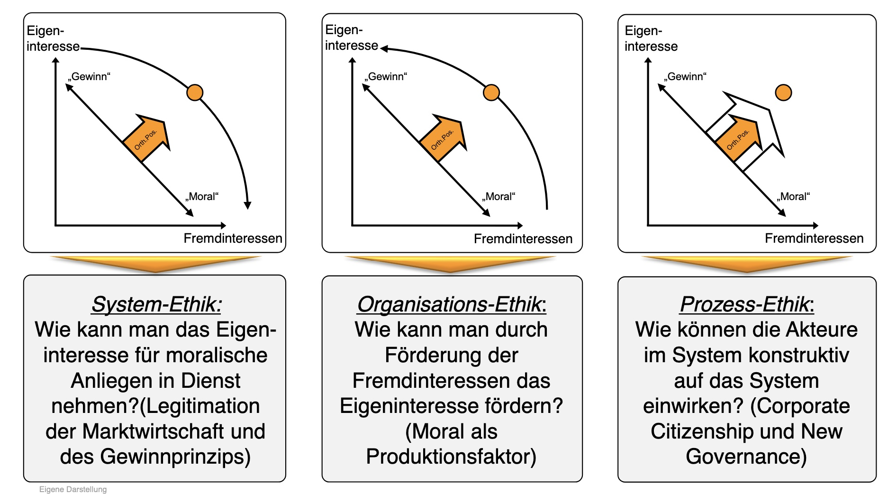

# 18.10.2022 Markt & Moral

in EdSM: *Steelmanning* statt Strawmanning

> **Steelmanning:** das Argument des Gegners in seiner stärksten Variante kritisieren 

## Ordonomik

Forschungsprogramm zwischen Ordnungsrahmen und Moral

Bestandteile: System-Ethik, Organisations-Ethik, Prozess-Ethik



Fragen:

- wie moraltauglich ist die Gesellschaft?
- wie gesellschaftstauglich ist die Moral?

Begriffe:

- **Semantik**: Moralvorstellungen
- **Sozialstruktur**: Institutionelle Rahmenordnung

3 Ebenen Spiel

1. **Basisspiel**: das Alltagsspiel (die eigenen Handlungen)
2. **Metaspiel**: Sozialstruktur (Spielregeln / Anreize)
3. **Meta-Metaspiel**: Semantik (orthogonale Positierinerung vs Win-Win)

eigene Handlungen also gesteuert von Moral (Semantik) und Regeln (Sozialstruktur)

## Text: Markt & Moral

```
Autoren: Ingo Pies
Datum: 07/2016
Titel: Der Markt und seine moralischen Grundlagen
```


Fragen

1. Warum stoßen Märkte auf moralische Skepsis?

2. Die Autoren differenzieren zwischen Helfermoral und Marktmoral. Was

    genau sind die Unterscheidungs-merkmale?

3. Warum kann eine moderne Gesellschaft nicht allein auf die Helfermoral

    gegründet sein?

4. Mit welchen Überlegungen begründen die Autoren ihr Argument, dass

    Märkte Freiheit und Frieden fördern?

------

1:

Märkte rufen wünschenswerte Ergebnisse hervor, ohne auf moralisches Handeln afuzubauen

------

**Helfermoral**: “Hilfe für andere” (S.5)

- beabsichtigt
- persönliches Opfer
- identifizierbarer Addressat
    - wie bei Hilfsorganisation (Patenschaft S.7)

je mehr Opfer = höhere moralische Qualität

Grund für Helfermoral

- leben in Kleingruppen (jeder kennt jeden)
- Wohlstand ist hier immer auf Kosten anderer

**Marktmoral:** Befolgung allgemein akzeptierter Regelungen

- nicht identifizierbarer addressat (Diffusionswirkung)
    - “breitgestreuten Vorteilsdiffusion” (Pies, 2016, p. 6)
- aus Eigeninteresse
- Einhalten von Versprechungen

------

in einer Gesellschaft hängen wir von großem Kreis von Menschen ab = nicht alle durch Moral kontrollierbar

=> jeder sollte in gesundem Maße seinem Eigeninteresse folgen (Smith unsichtbare Hand)

Kritik daran = man sieht moralischen Grundlagen des Marktes nicht

- bspw. Versicherungen = besser als Mitleid, da sie Garantien aussprechen (bessere Reziprozizät) und Geld bereitstellen

------

**Sozialer Frieden:** Unpersönlichkeit des Marktes = Marktteilnehmer müssen über Motive nicht übereinstimmen

- schützt uns vor Meinung anderer
- aber ist nicht Frieden, nur Apathie
    - Abwesenheit von Gewalt ja
    - aber nicht Lösung der Konfliktlienien (insbesondere ethische)

> “Es ist besser, wenn ein Mensch seinen Kontostand kujoniert – und nicht seine Mitmenschen.” nach Keynes (Pies, 2016, p. 26)

**Freiheit =**Freiheit von willkürlichem Zwang

- aber mit Verantwortung
- reine Moral = verleitet zu Trittbrettfahren
- Markt = hat Kosten des Handelns eingepreist

------

aber: gesellschaftliche Institutionen können zivilisierend wirken = nicht schlecht