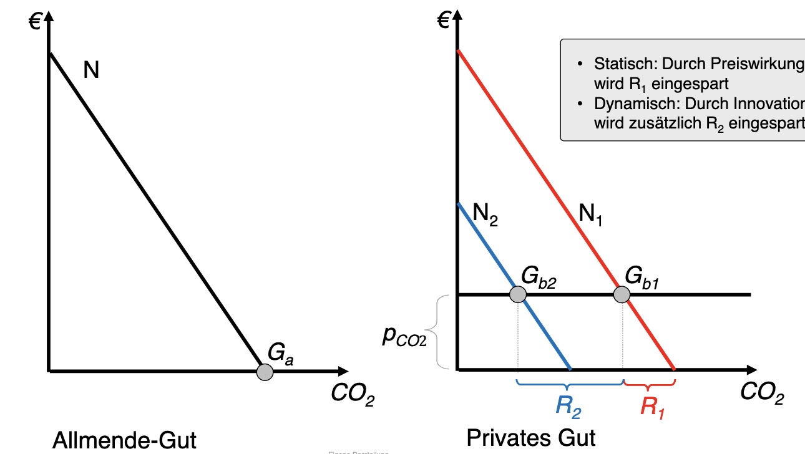

# 06.12.2022 Umweltpolitik und Vorsorgeprinzip

## Öffentliche Güter

Wie sollten öffentliche Güter privatisiert werden (CO2)?

- mit staatlicher Bepreisung

## Coase Theorem

Externalitäten = Knappheitskonflikt (reziprok!)

- Siedlung zuerst da, dann kommt Fabrik = böse!
- ist Fabrik da, und dann kommt Siedlung = Nutzungskonflikt
- Kritik des Verursacherprinzips!

=> Coase Theorem will **Instututionen** für Verhandlung haben

Diagnose: Politikversagen statt Marktversagen

Therapie: Eigentumsrechte an Verschmutzung

Argument:

1. Siedlung und Fabrik wollen knappes Gut = Anspruchskonkurrenz beider
    - keine Opfer und Täter (kein Verursacherprinzip)
2. durch Insitution (politisch, sozial, gesellschaftlich) handeln nutzungsrechte aus

=> Ökologische Probleme = Gesellschaftliche Probleme

