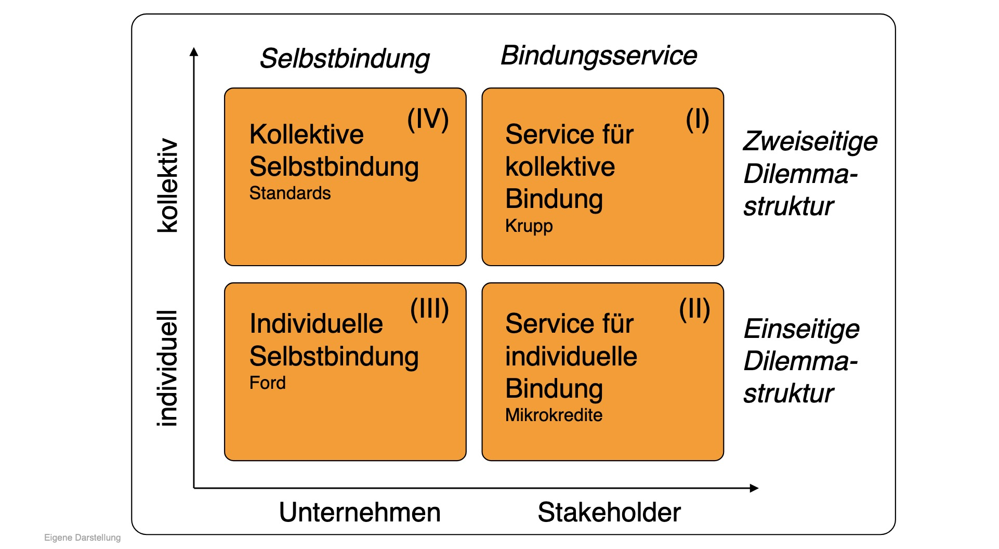

# 11.01.2023 Unternehmensbindung

## Milton Friedman als CSR

CSR = Corporate Social Responsibility

Friedman: Gewinnorientierung = gesellschaftliche Verantwortung

- nimmt Tradeoff Denken zw. Moral und Wirtschaft an
    - Shareholderinteressen werden nicht begründet als Stellenwert
    - CSR = Veruntreueung von Geld

- aber: sieht CSR als Business Case 
    - Corporate Citizenship


Friedman Argument: CEO veruntreuen mit CSR Geld von Shareholdern

## Ordonomik

> **Governance:** the means by which to infuse *order*, thereby to mitigate *conflict* and realize *mutual gain*

- Unternehmen zu *Corporate Citzienship*
    - wie Individueen in Tugendethik

- Überkommen von strukturellen Problemen


### erfolgreiche CSR 

**Ford Model T**: 1914 Einführung: 5$ Arbeitstag, 100% Lohnsteigerung

- Reaktion auf Fluktuationsrate der Arbeiter (370%)
    - Wanderarbeiterschaft (von Fabrik zu Fabrik)
    - nicht kompatibel mit Fließbandarbeit (eingespieltes Team)
- Erhöhung = Bleibeprämie
    - Investititon in Humankapital

=> Lohnerhöhung ist profitabel!


**Mikrokredite:** Grameenbank von Mohamed Yunus

- Problem: wenig Kreditvergabe an arme Schichten
    - ex-Ante: Kreditwürdigkeit
    - ex-Post: Liquiditationsrisiko = Rückholen von Sachwerten schwer
- Lösung: Genossenschaftliche Mikrokredite
    - Genossenschaften sanktionieren sozial 
    - Genossenschaftenschädigung = Schädigung des Dorfes
    - Kreditnehmer binden sich an soziale Ansicht im Dorf


**Verhaltenskodex:**

- wichtigste Instrumente für Management
- erlaubt soziale Kontrolle
- Selbstbindung = Investition in Produktivität (Odysseus)


**krupp:** freiwillige Krankenkasse mit AG-Zuschuss für Arbeiter


### Erfolglose CSR

**Schützenfest**: hoher Eintrittspreis und dann Freibier

- Problem: jeder verhält sich so, wie ers es von anderen befürchtet
    - Trinken bis zum Gehtnichtmehr
    - Preis für alle beim nächsten Mal steigt

**Klimawandel**

- gloabels Problem
- einseitige Lösung = Wettbewerbsnachteil


### Schemata

- Bindung an Regeln verhindert Ausbeutung durch Konkurrenten
- Freiheit durch Bindung



## Text

```
Titel: The Social Responsibility of Business is to increase its profits
Autor: Milton Friedman
Datum: 1962
```

Fragen

1. Worin besteht Friedman zufolge die Aufgabe von Unternehmen?

    - make money while conforming to rules of scoiety
    - performed by executives for the owners of the corporation

2. Welchen Stellenwert misst Friedman den unternehmerischen Gewinnen

    bei? Sind sie Ziel oder Mittel?

    - Ziel: Gewinne für Eigentümer

3. Welcher Begriff von Moral liegt Friedmans Argumentation zugrunde?

4. Welche Aufgabe weist Friedman dem Staat zu?


- corporate social responsibility = reduction of the firms money for societal values
- equal to taxes (on owners of consumers)
    - takes money
    - and spends it
- should be governmental function
- when exectuive, then he becomes civil servant
- basically socialism


aber:

- what if the owners of the company want the executive to be socially responsible
- goal: not maximize shareholder value, but stakeholder value
- Deutsche Aufsichtsräte: 50% Arbeitnehmer

aber II:

- Friedman: Consequences are uncertain, so no best option known
- but business always operate under unvertainty = Market Research etc…
    - best possible option =! optimal option
