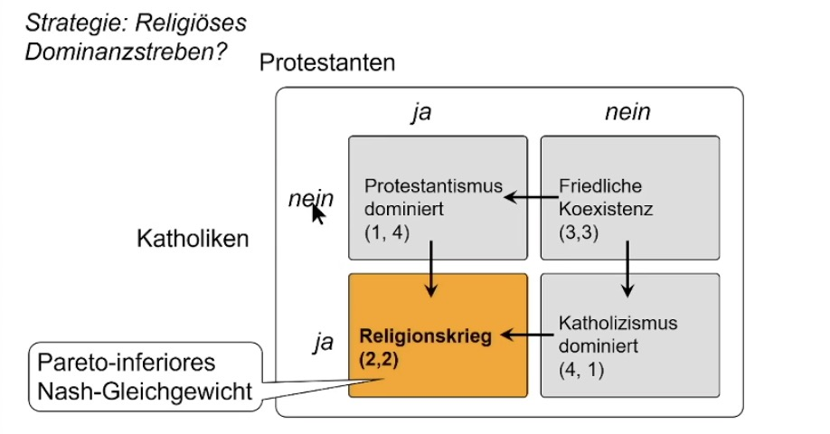
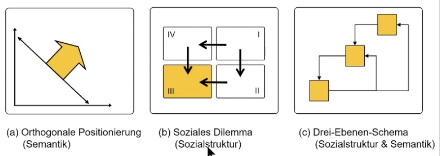
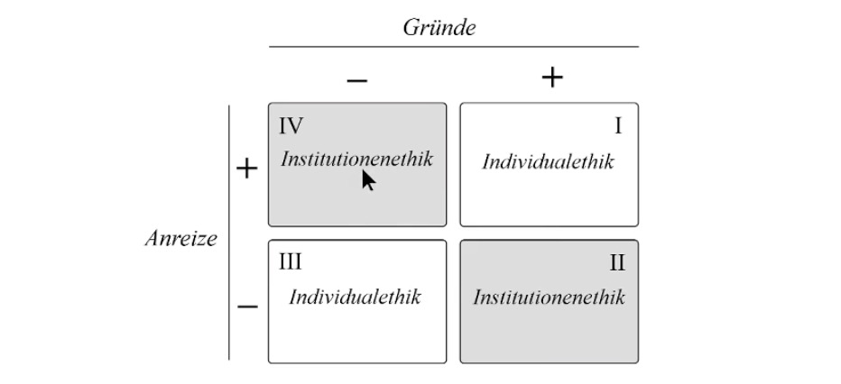

# 01.02.2023 Ordonomik

ordonomisches Forschungsprogramm am Beispiel der Reformation

**Problem**: alle Religionen (auch Protestanten) wollen Dominanz

**Lösung:** Win Win statt orthogonale Positionierung

- "Cui regio, cui religio" = jede Region darf eigene Konfession festlegen

## Ordonomik

Fragen:

- wie moraltauglich ist die Gesellschaft?
- wie gesellschaftstauglich ist die Moral?

Begriffe:

- **Semantik**: Moralvorstellungen
- **Sozialstruktur**: Institutionelle Rahmenordnung

3 Ebenen Spiel

1. **Basisspiel**: das Alltagsspiel (die eigenen Handlungen)
2. **Metaspiel**: Sozialstruktur (Spielregeln / Anreize)
3. **Meta-Metaspiel**: Semantik (orthogonale Positierinerung vs Win-Win)

eigene Handlungen also gesteuert von Moral (Semantik) und Regeln (Sozialstruktur)

Beispiel:

- wenn alle denken es gibt ein Tradeoff (Semantik)
- dann befindet man sich in einem Gefangenendilemma (Sozialstruktur)
- dann verhalten sich Menschen auch so

| Ebene          | in der Realität      |
| -------------- | -------------------- |
| Semantik       | Gesellschaftsdiskurs |
| Sozialstruktur | Politik              |
| Wirtschaft     | Wertschöpfung        |

### Ethiken

- Systemethik: Eigeninteresse für moralische Anliegen in Dienst nehmen (*Legitimation des Kapitalismus*)
- Organisationsethik: moralische Anliegen als Eigeninteresse fördern (*Moral als Produktionsfaktor*)
- Prozessethik: Akteure als kontruktive Partner (*Corporate Citizenship*)

### Probleme

- Probleme sind immer auf individueller Ebene (Basisspiel)
- aber Lösungen auf Regelebene (Metaspiel)

- aber Probleme auch auf Semantischer Ebene
- wird dann auf Regelebene durchgedrückt

> there are issues dividing a socieoty of clever people into two. parties of idiots

Merke:

- Vorgaben und Moral sollen aus der Bevölkerung kommen
- und dann mit sinnvoller Regelstruktur umgesetzt werden

Lösung:

- statt Fokus auf Intentionen (Win-Lose)
- Fokus auf Institutionen (Win-Win) : Veränderung der Anreize

> Systemkritik statt Individualkritik

Semantische Korrektur = horizontal

sozialstrukturelle Koreektur = vertikal

