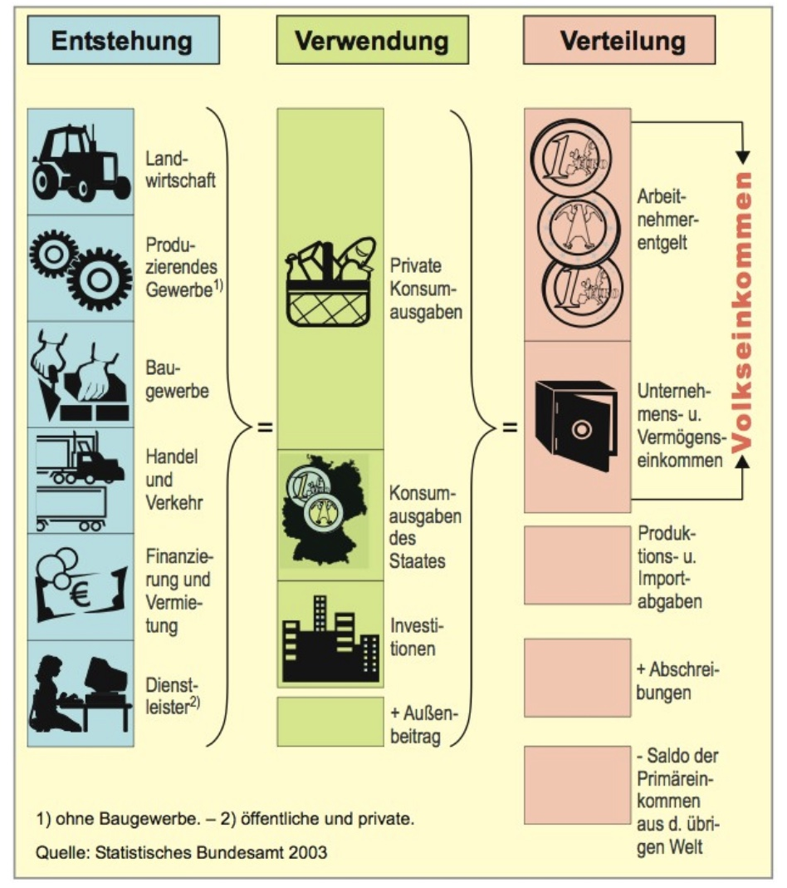
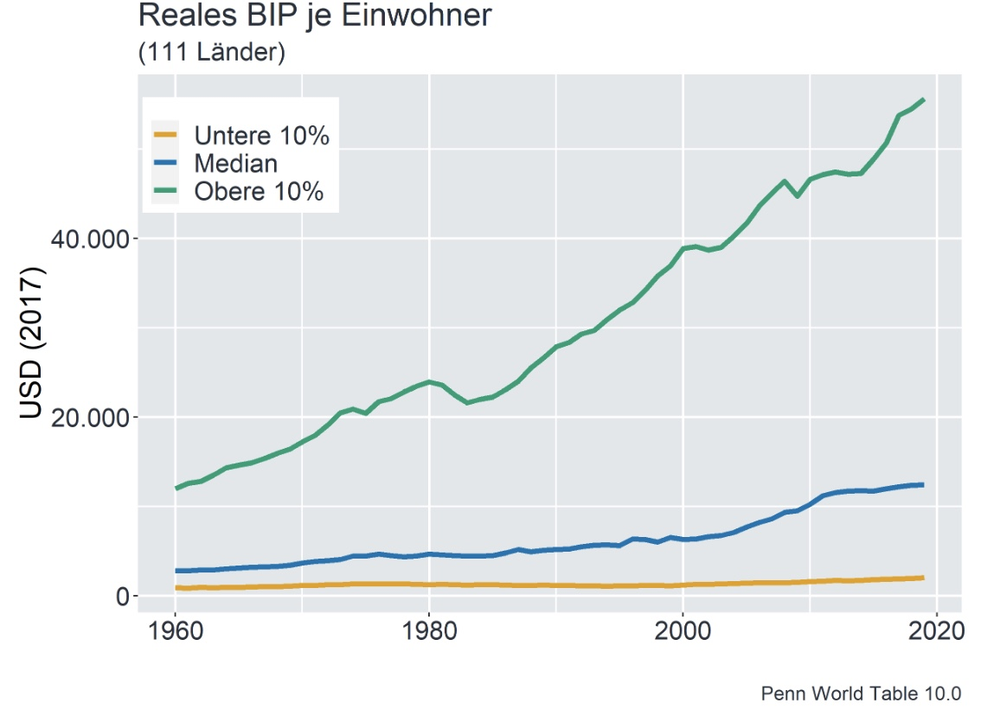
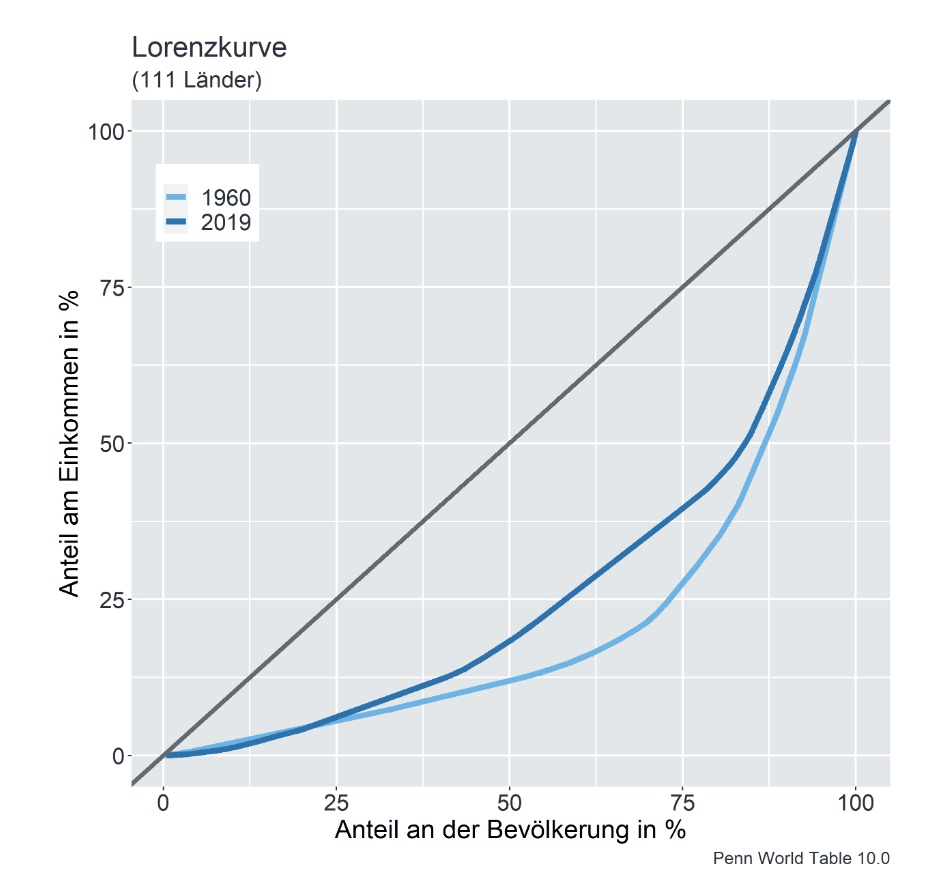
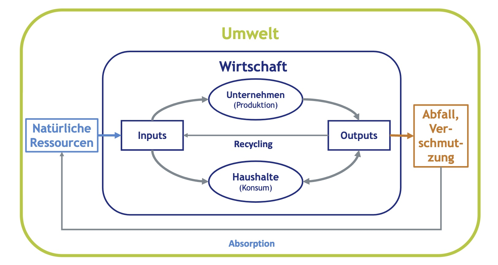

# 13.10.2022 Makroökonomik I

## Was ist Makroökonomik

> Makroökonomik ist die Lehre von Struktur und der Entwicklung gesamter Volkswirtschaften und von den **wirtschaftspolitischen** Einflussmöglichkeiten auf die **gesamtwirtschaftliche** Entwicklung

Bestandteile der Makroökonomik: ihre Flüsse

- Haushalte
- Unternehmen
- Staat

## Schritte in der Makro

1. Dokumentiere die **Fakten**
2. Entwickle ein **Modell**
3. Vergleiche **Vorhersagen** des Modells
4. Benutze das Modell zum Verständnis **Wirkungszusammenhänge**

## Volkswirtschaftliche Gesamtrechnungen

> **VGR:** ein umfassendes, übersichtliches, quantitatives Gesamtbild des wirtschaftlichen Geschehens

- insbesondere Bruttoinlandsproduktsberechnung (BIP)

> **BIP:** Wert der im Inland hergestellten Waren + Dienstleistungen (abzüglich Vorleistungen)

- laufende Preise (**nominal**) oder preisbereinigt (**real**)
    - **Entstehen**srechnung: Summe Wertschöpfung
    - **Verwendungs**rechnung: Summe Endverkäufe
    - **Verteilung**srechnung: Summe Einkommen

## Entwicklung des BIP

- seit 1800 Explosion des Wirtschaftswachstums (Great Escape)
- "The Great Divergence" im 19. Jhd.: Auseinanderentwicklung Europa | Rest
- seit 1950 Aufholen insbesondere in Asien

grafische Entwicklung:

## Ungleichheit der Einkommen

Gemessen mit Lorenzkurve / Gini-Koeffizient

- reiche/ kleine Länder haben zugenommen
- aber  Länder wie China haben Ungleichheit eliminiert (in der Mitte)
- 1960 Gini = 0.58 -> 2017 Gini = 0.48 :thumbsup:

## Modelle Makro

Standard-Makro Modelle: nur Flow-Diagram, ohne Beachtung der Umwelt

- Neuerdings: auch Beinhaltung der Inputs (Ressourcen) und Outputs (Emissionen)

