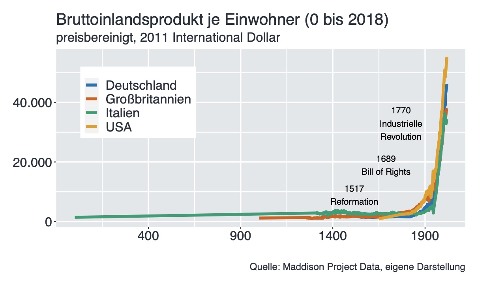
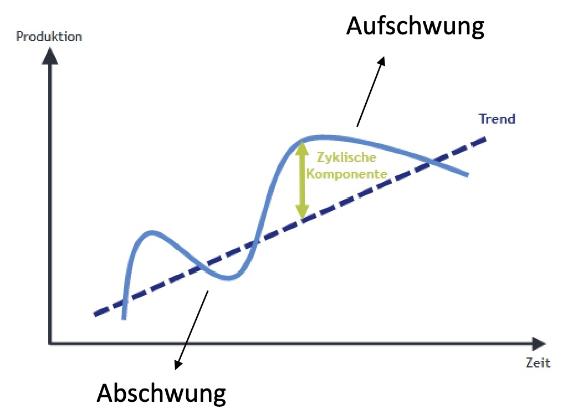

# 20.10.2022 Markt, Staat & Kapitalakkumulation

## volkswirtschaftliche Systeme

|                              | Zentralverwaltung                           | Marktverwaltung                 |
| ---------------------------- | ------------------------------------------- | ------------------------------- |
| **Eigentumsordnung**         | Staatseigentum (*Sozialismus*)              | Privateigentum (*Kapitalismus*) |
| **Koordination** der Akteure | zentraple Planung mit staatlicher Steuerung | Dezentrale Planung              |

## The Great Transformation

von Feudalismus zum Kapitalismus = große Transformation

**Feudalismus:** 

- landwirtschaftliches System 
- ohne Privateigentum, nur Lehen des Königs
- wenig Marktbeziehungen, autark

**englischer Merkantilismus**

- nach Bill of Rights = mehr Rechte des Parlaments
- Anreizkompatibel für Investitionen

**Kapitalismus**

- individuelle Eigentumsrechte = Kapital liegt in privater Hand

- Investititonen heute lohnen sich morgen

- intensiver Handel und Arbeitsteilung

- durch **industrielle Revolution**

    - Umwälzung der gesamten Wirtschaft in GB

    - Produktionstechnik: Maschinen für insdutrielle Anwendung

## Markt

> Institution, über die Kaufer und Verkäufer Mengen und Preise koordinieren

Preise = Signalfunktion

- Informationen über Angebot, Nachfrage, Alternativen

Smiths Idee der unsichtbaren Hand:

- durch individuelle Profitoptimierung = Gesellschaft gesteigerter Nutzen
- jedoch oft nicht reiner Markt!

| Marktversagen          | Instrument             | Beispiel             |
| ---------------------- | ---------------------- | -------------------- |
| Monopol                | Intervention           | Kartellgesetze       |
| Externe Effekte        | Intervention           | Umweltschutzgesetze  |
| Öffentliche Güter      | Bereitstellung         | Polizei              |
| Ungleichheit           | Umverteilung           | Progressive Steuer   |
| Konjunkturschwankungen | Stabilisierungspolitik | Geld / Fiskalpolitik |

 

## Makroökonomische Politik

**Ziele der Makro**: Produktion, Vollbeschäftigung, Preisstabilität, Außenwirtschaftliches Gleichgewicht

Instrumente der makroökonomischen Finanzpolitik:

```mermaid
graph TD
subgraph politische Instrumente
a(Finanzpolitik) & b(Geldpolitik) & c(Verteilungspolitik) 
end
a & b & c --> Ges((Gesamtwirtschaft))
subgraph externe Schocks
d(wetter) & e(Außenwirtschaft) &  f(Krisen)
end
d & e & f --> Ges

Ges --> Preise & g[Ex-und Importe] & Beschäftigung & Produktion
```

durch diese Instrumente soll ein **gesamtwirtschaftliches Gleichgewicht** erzeugt werden: Angebot = Nachfrage

- **Gesamtwirtschaftliche Nachfrage** beinflusst durch
    - Geld, Steuern, Staatsausgaben
- **Gesamtwirtschaftliches Angebot** beeinflusst durch
    - Kapital, Arbeit, Technologie

## Wohlstand und Wachstum

### BIP als Wohlstandsindikator

Kritik:

- keine Berückstichtigung Abschreibungen
- keine Information zu Verteilung
- nicht bepreiste Güter = nicht inkludiert

Alternativen:

- HDI: Human Development Indicator
- Jones Klow Wellbeing Indicator

Jones Klow and GDP Correlation:

### Wohlfahrt in Makro-Modellen

**Soziale Wohlfahrtsfunktion** gesellschaftliche Aggregation individueller Ziele
$$
W(x) = \frac{1}{1 - \theta} \sum_{i=1}^N \alpha_1 (u(x_i))^{1-\theta}
$$

- N = alle Einwohner
- $\alpha$ = Gewichtung der individuellen Nutzen
- $\theta$ = Diskontierung des zusätzlichen Nutzens für Reichere
    - je höher, desto mehr Umverteilung ist nützlich

Unterschiedliche Wohlfahrtsfunktionen:

!!**Makroökonomische Modelle maximieren nie das BIP, nur Wohlfahrt**!!

### Zeitpräferenz

Konsumenten präferieren Konsum heute = $c_t$
$$
W_0 = \sum_{t=0}^\infty \beta^t N_t u(c_t) \\
\text{mit }\beta = \frac{1}{1-p}
$$
Zeitpräferenzrate p

# Übung 1

## Hodrick Prescott Filter

Trennung einer Zeitreihe in **Trend** und **zyklische Komponente**

Probleme

- möglichst realgenauer Trend
- aber auch nicht an kurzfristige Schwankungen angepasst
- Tradeoff zwischen Genauigkeit und Zukuntsfähigkeit einer Vorhersage

$$
\underbrace{y_t}_{Zeitreihe} =  \underbrace{y_t^T}_{Trend} + \underbrace{y_t^C}_{Zyklus}
$$

Steuerung des Tradeoffs mit Hodrick-Prescott Filter und $\lambda$ **Glättungsparameter**

## Gini Koeffizient

Index für Einkommensungleichheit

- Wertebereich zwischen 0 und 1
- Beschreibung durch Lorenzkurve

