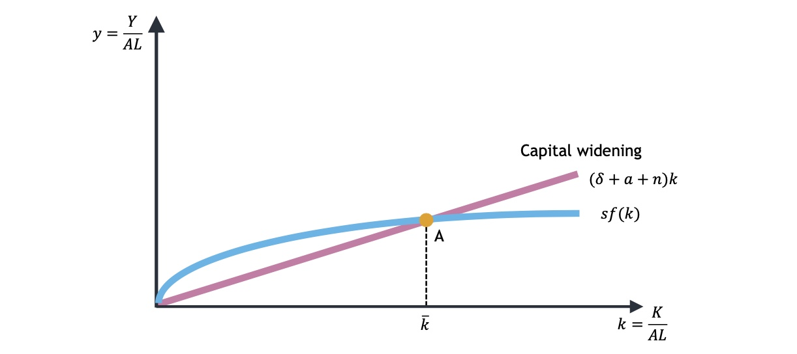
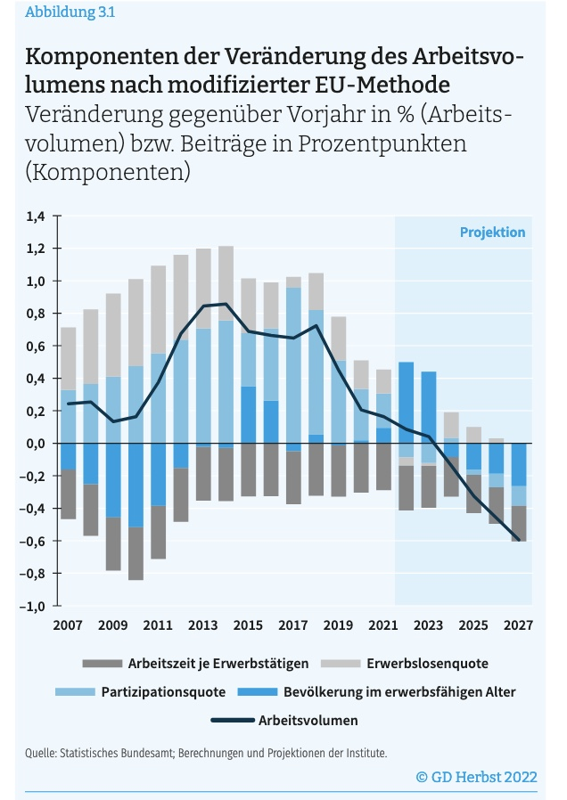
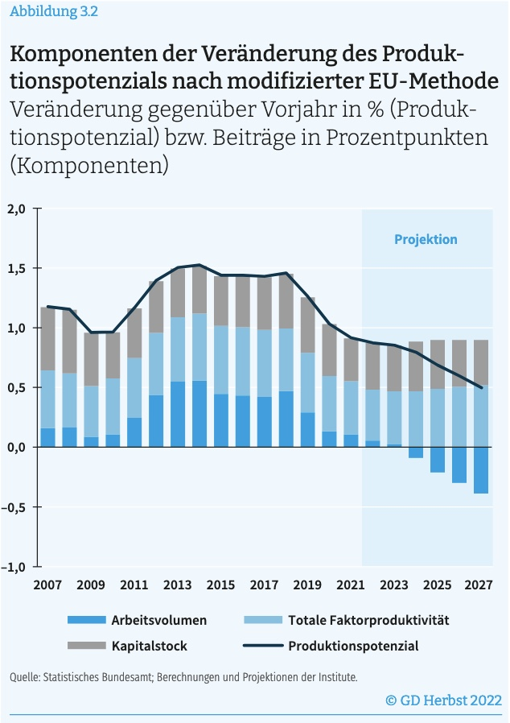
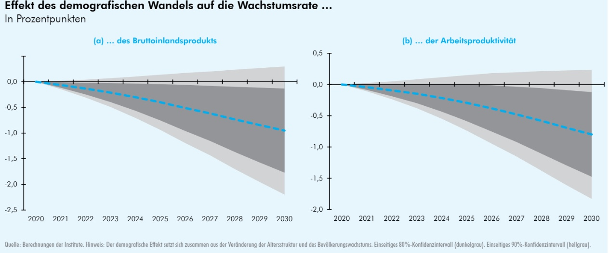
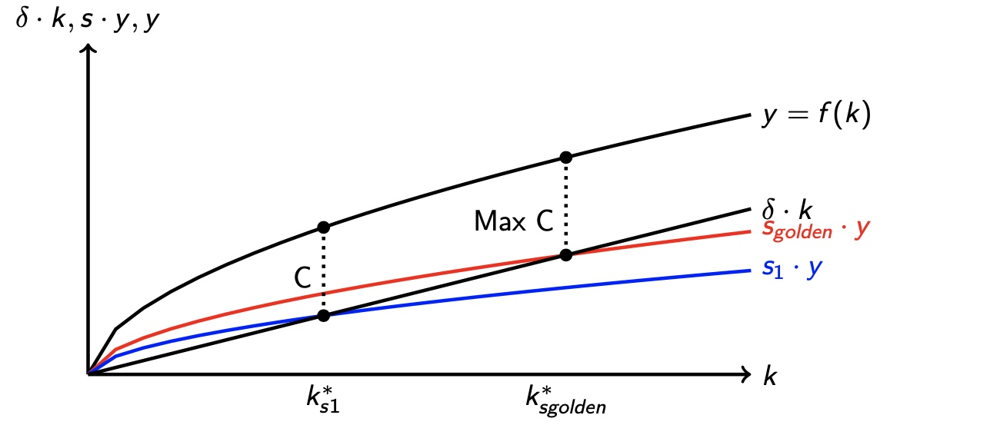

# 09.11.2022 Erweiterungen des Solow-Modells

## Bevölkerungswachstum

das Wachstum führt zu geringerem Kapitalstock pro Arbeiter (niedrigere $\bar{k}$)
$$
sf(k) = (\delta +n) k
$$
=> früherer Steady-State Punkt 

## Technologischer Fortschritt

= feste Menge Arbeit und Kapital mehr Output $Y = F(A,K,L)$

- von Interesse insbesondere arbeitssparender Fortschritt 
    - *labor augmenting technological progress*
    - Wachstumsrate von A = *a*
    - $Y = F(K, A \times L)$

dann Anpassung der Einheiten pro. P
$$
y = \frac{Y}{A \times L}\\ 
k = \frac{K}{A \times L} \\
\Delta k = s \times f(k)- (\delta+n+a) \times k
$$

- je höher Technologischer Fortschritt = schnellere Abschreibung alterer Maschinen (eigene Erklärung)
- deswegen $(\delta+n+a) \times k$

Wachstum im Steady State:

| Art        | Wachstum |
| ---------- | -------- |
| $y,k$      | 0        |
| $Y/L, K/L$ | a        |
| $Y, K$     | a+n      |

## Wachstumszerlegung

Technologieniveau **niemals bekannt**, aber rückwarts ausrechenbar

aus $Y = (A,K,L)$ da Y bekannt ist => **Solow Residuum / TFP** (Total Factor Productivity)

> **Solow Residuum:** der Faktor, der nicht durch Veränderung in Sparquote / Kapitalstock / Bevölkerungswachstum erklärt werden kann = "*measure of our ignorance*"

das was Solow nicht erklären kann (institutionelle Faktoren etc), wird in einem Indikator zusammengefasst

=> **macht Großteil des Wachstums aus => Solow Modell ist whack**

## Empirie

Faktoren bei Arbeitsvolumen:

- Arbeitszeit Durchschnitt
- Partizipationsquote
- Beölkerung erwerbsfähiges Alter
- Erwerbslosenquote

in EU: insbesondere TFP spielt starke Rolle

| Arbeitsvolumen                                            | Wachstum EU                                               |
| --------------------------------------------------------- | --------------------------------------------------------- |
|  |  |

Weitere Befunde zu Demographie:

# Übung

Solow mit Erweiterung:

- Bevölkerungswachstum: $L_{t+1} = (1+n)L_t$
- Technolgiewachstum: $A_{t+1} = (1+a)A_t$
- $Y= F(K,AL)$

dann Einheiten effektiver Arbeit: $\hat{y} = \frac{Y}{AL}$

kapitalintensität (effektiv) : $\hat{k} = \frac{K}{AL}$

Kapitalakkumulation: $\Delta k = sy- (\delta+n+a) k$

- warum n schlecht: höhere Bevölkerung -> niedrigere Kapital pro Kopf
- warum a  (technologischer Fortschritt) schlecht: jeder Arbeiter braucht mehr Kapital

neue Gleichgewichtsbedingung: $\underbrace{sy}_{Investitionen} = \underbrace{(\delta+n+a)k}_{Kapitalverbrauch}$

$\hat{y} = \frac{Y}{AL}$

- wenn $\hat{y}$ konstant
- dann muss Y, K mit technologischen Fortschritt (a) und Bevölkerungswachstum (n) wachsen 
- und pro-Kopf BIP nur mit technologischem Forschritt (a)

---

### Sparquote der goldenen Regel

Gleichgewicht, an dem **Konsum maximal** ist!

Annahmen

- Sparquote kann beinflusst werden (endogen)
- Indivuuen wollen Konsum => Nutzenmaximierung

**Warum**?:

-  zu hohe Sparen = hohe Investitionen 
    - steigender Kapitalstock
    - viele Abshreibungen, die ausgeglichen werden müssen
    - senkt Konsummöglichkeiten
- zu niedriges Sparen
    - zu geringes Wachstum
    - weniger Konsum

Mathematisch: $f'(k) = \delta \implies MPK$

- Steigung der Produktionsfunktion y gleich
- Steigung der Kapitalakkumulationsgeraden

Schritte:

1. f(k) zeichnen
2. dk verschieben bis f(k)
3. dann Schnittpunkt, an dem Steigungen tangential
4. senkrechten Strich nach unten = Punkt der goldenen Regel
5. daraus dann goldene Sparquote entnehmen

Situationen:

- $s > s_g$ = dynamisch ineffizienter Bereich
- $s < s_g$  = dynamisch effizienter Bereich

**Rechnung:**

- Produktiosnfunktion $Y = K^{0.5}L^{0.5}$
- s = 0.24
- d = 0.06

$$
y = \frac{Y}{L} = K^{0.5}L^{-0.5} = \Big(\underbrace{\frac{K}{L}}_k\Big)^{0.5}  = k^{0.5}
$$
Also: $y = k^{0.5}$
$$
sk^{0.5} = \delta k \to k^{0.5}=\frac{s}{\delta} \to k=(\frac{s}{\delta})^2
$$
einsetzen
$$
k = (\frac{s}{\delta})^2 = (\frac{0.24}{0.06})^2 = 16 \\
y = k^{0.5} = \sqrt{16} = 4
$$

andere Aufgabe:

- $y = k^{0.5}$
- s = 0.4
- $\delta$ = 0.1

ermittle k,C,I im GG
$$
\bar{k} = (\frac{s}{\delta})^2 = (\frac{0.4}{0.1})^2 = 16 \\
\bar{y} = 4 \\ 
\bar{c} = (1-s)y = 0.6 \times 4 = 2.4 \\
Y = C+I \to I = Y-C \\
\to 4-2.6 = 1.4
$$
Goldene Regel:
$$
f'(k) = \delta \\
0.5 k^{-0.5} = \delta \\
einsetzen: sk^{0.5} = \delta k\\
\to (0.5 k^{-0.5})k = sk^{0.5} \\
s = 0.5
$$

