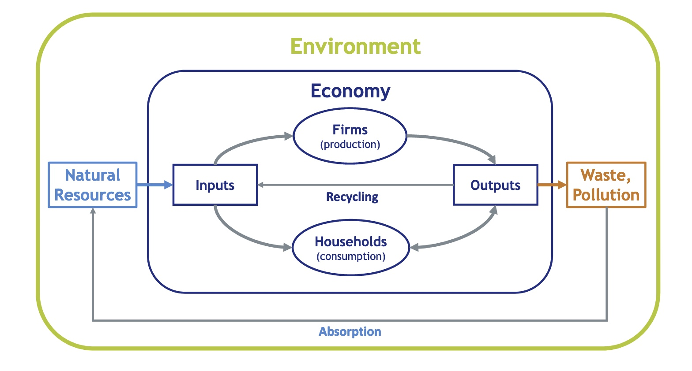
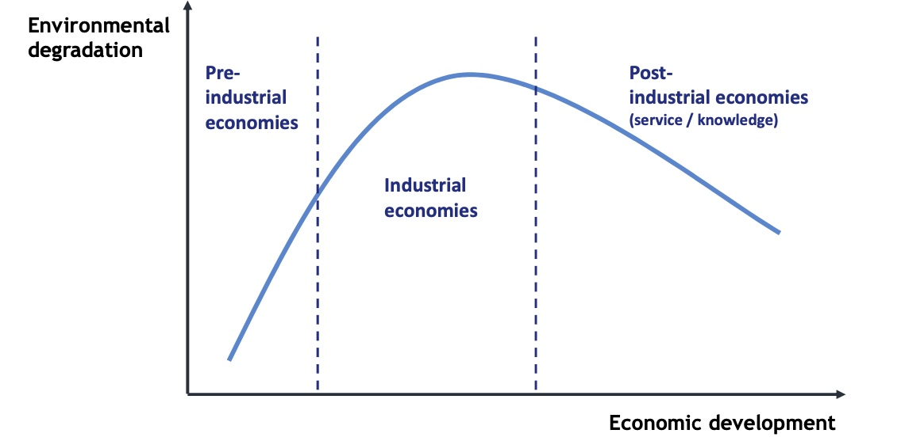
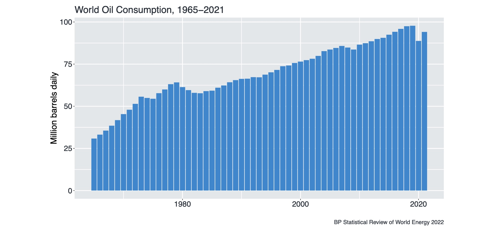
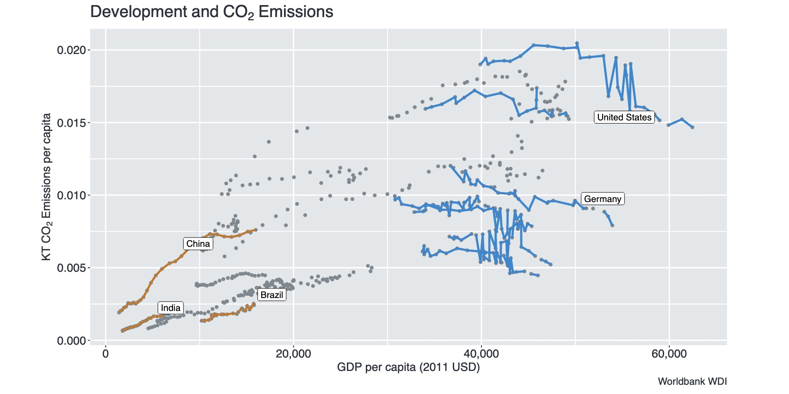
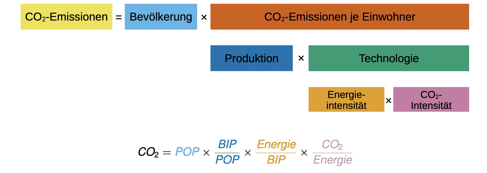

# 10.11.2022 Wirtschaft und Umwelt

das neoklassische Makromodell und die Einbettung in die Umwelt:

## Environmental Kuznets Curve

**schon oft widerlegt! insbesondere was CO2 angeht!**

und insbesondere im globalen Maßstab: ein Müllhaufen!

| Theorie                                   | Praxis                                    |
| ----------------------------------------- | ----------------------------------------- |
|  |  |

## Wachstum und endliche Ressourcen

**1972**: Veröffentlichung der *"Grenzen des Wachstums"* vom Club of Rome

**1974:** Joseph Stigliz (Nobelpreis): Solow und endliche Ressourcen

- Stiglitz machte Ressourcenverbrauch ein Term in der Solow Formel
- Wachstum hängt dann von technologischem Fortschritt ab
- => effizientre Verwendung von Ressourcen

## Integrated Assessment Models

CO2 und Wohlstand / Entwicklung: 

 Kaya-Identität: woher kommen Emissionen ?

