# 15.12.2022 Gesamtwirtschaftliches Gleichgewicht in der kurzen Frist


## Konjunkturphasen

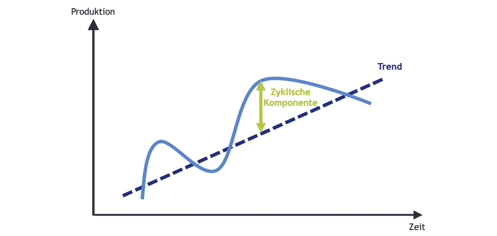

vorher: Trend, jetzt **Zyklus**

- 2 Phasenschema: Aufschwung (Boom); Abschwung (Rezession)
- 4 Phasenschema: 
    - steigende Auslastung / sinkende Auslastung
    - Überauslastung / Unterauslastung

|                  | Überauslastung | Unterauslastung |
| ---------------- | -------------- | --------------- |
| **steigende A.** | Boom           | Erholung        |
| **sinkende A.**  | Abkühlung      | Krise           |

stylisiertes Schema: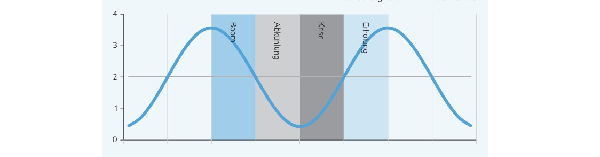


## Verwendungsrechnung

Methode der BIP-Berechnung

```
  Private Konsumausgaben   C
+ Staatsausgaben           G
------------------------
= Konsumausgaben
+ Bruttoinvestitionen      I
+ Exporte                  X
- Importe                  Z
========================
= BIP                      Y
```

*Y = C + G + I + X - Z*

### Wachstumsbeitrag

Anteil der Unterkategorien am Wachstum des BIPs

Berechnung:
$$
Y = \frac{\Delta Y}{Y_{t-1}} = 
\frac{\Delta y_1}{Y_{t-1}}  +\frac{\Delta y_2}{Y_{t-1}} 
$$
Beiträge in DE 

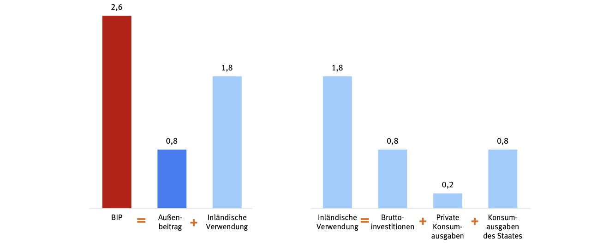

wichtige Gleichungen

1. Verwendungsidentität: $Y = C + G + I + X - Z$
2. Konsum: $Y = C+S+T$ (Consum, Savings, Taxes)


Gleichsetzen von 1 und 2 und Kürzen C:
$$
(S-I)+(T+G) = \underbrace{(X-Z)}_{\text{Handelsbilanz}}
$$

- geschlossene Wirtschaft: Staatliche Mehrausgaben = Ersparnissüberhang
- offene Wirtschaft: staatliche Mehrausgaben = Verschuldung Ausland erhöhen


## Keynesianisches Modell

**Keynes an sich ist so ein Banger, aber sein Modell nervt**

Annahme: Güterpreise kurzfristig starr

- Konsumfunktion: $C = C(\Omega, Y-T)$
    - Vermögen $\Omega$
    - BIP = Y
    - Steuern T
- Investitionsfunktion $I = I(\overset{-}{R},\overset{+}{A})$ 
    - R = Realzins
    - A = Produktivität
- Staatsausgaben = exogen, unabhängig von Konjunktur
- Importfunktion $Z=Z(\overset{+}{Y},\overset{+}{\sigma})$ (Wechselkurs) 
- Exportfunktion: $X = X(\overset{+}{Y},\overset{-}{\sigma})$
- Handelsbilanz: $TB = TB(\overset{-}{Y},\overset{+}{Y^*}, \overset{-}{\sigma})$

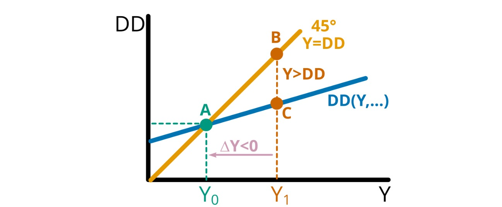

Keynesianisches Modell = nachfrageorientiert
$$
DD = C()+I()+\bar{G}+TB()
$$

- Unternehmen passen sich an Nachfrage an
- Ausgaben abhängig von Einkommen, aber unterproportional:
    - zusätzliches Einkommen teilweise *gespart* und 
    - für *Importe* ausgegen
- Gleichgewicht in A (immer mit 45% Linie)


komparative Statik: Anstieg der Staatsausgaben

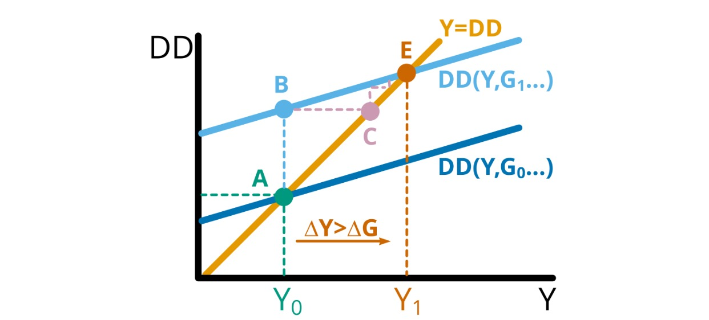 

- Kurve DD verschiebt nach oben
- Angebot passt sich an
- um mehr als Anstieg der Staatsausgaben, da diese zurückverwendet werden
    - Multiplikatoreffekt $\Delta Y > \Delta G$


## IS-LM Modell

analytische Modellierung von Keynes General Theory

- Anpassung von Modell an Inflationäre Wirkung
- Betrachtung von Geldmarkt und Gütermarkt
- bestimmt #klausurrelevant

### IS-Kurve = Geldmarkt

mögliche Kombinationen von Zinssätzen und realen Marktoutput

- Annahme: *I=S*, Investittionen = Ersparnisse
    - höhere Zinssätze = weniger Investitionen = weniger Nachfrage
- Ableitung der Nachfrage nach Zinssatz
    - IS-Kuve = abhängig von Zinsreagibilität der Nachfrage

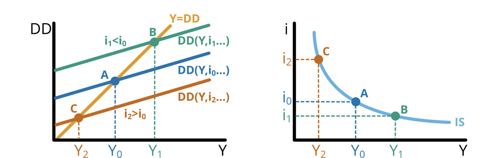


- Niedriger Zins = bessere Wirtschaft
- ohne Inflation: $\pi = 0 \to$ i=R


Alternativ: exogene Erhöhung der Nachfrage

= keine Zinswirkung! 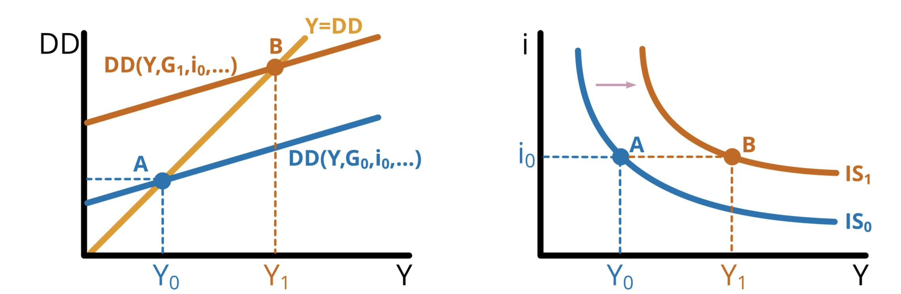

### MP = Monetary Policy

die Zentralbank setzt den Marktzins = Monetäre Politik

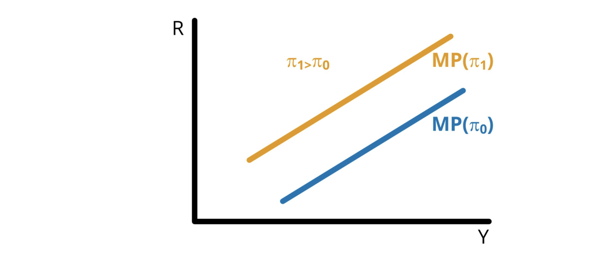

nach `John Taylor (1993)`

### IS-MP

Treffpunkt beider Kurven

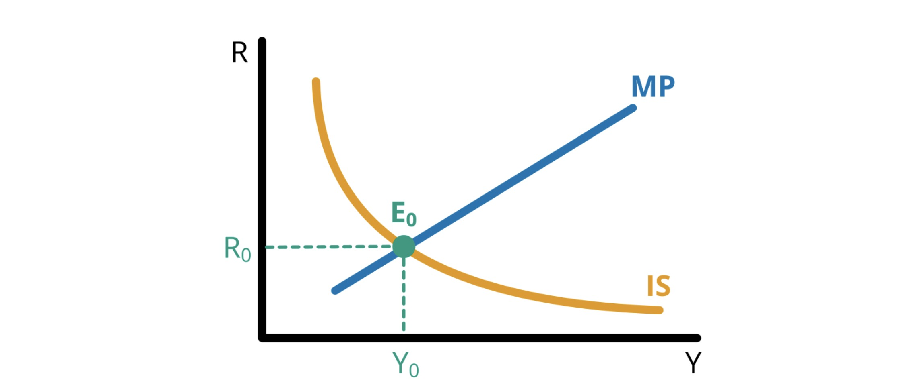

Instrumente des Staates:

- Fiskalpolitik (restriktiv / expansiv)
- Geldpolitik (retstrikitv / expansiv)

| expansive Fiskalpolitik                   | restritkive Geldpolitik                   |
| ----------------------------------------- | ----------------------------------------- |
| 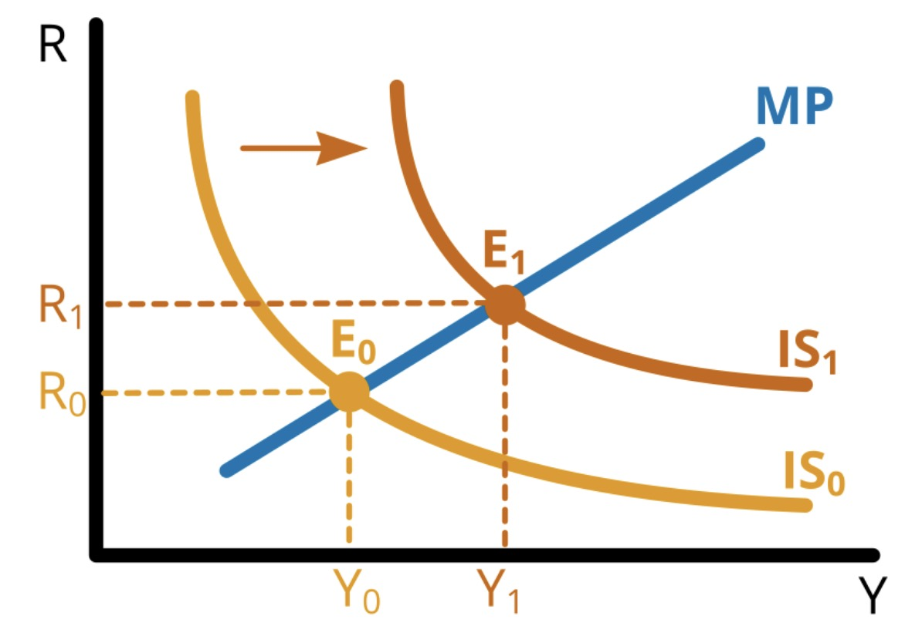 | 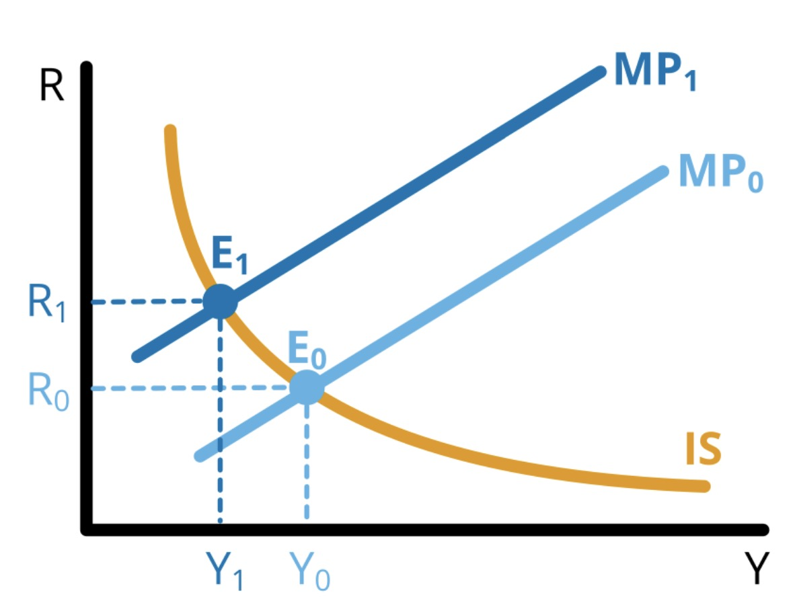 |

durch Zusammenspiel beider Politik lässt sich jeder Punkt in Graph erreichen!


## Geldmarkt & Zinspolitik


## Übung

Aufgabe Ausgabenmultiplikator

- Konsumfunktion: $C = \bar{C}+cY = \bar{C}+(1-s)Y$
- Agg. Nachfrage: $\bar{G} + \bar{I}+\bar{TB} + C= \bar{DD} +cY$

Angebot = Nachfrage

- Gütermarkt GG: $Y = \bar{DD}+cY$
- nach Y: $(1-c)Y = \bar{DD} \to Y_0 \frac{1}{(1-c)}\bar{DD} $
- Ausgabenmultipliaktor: $\Delta Y = \frac{1}{(1-c)}\Delta \bar{DD} = \frac{1}{s}\Delta \bar{DD}$
    - bei Sparquote von 0,2:
    - Anstieg Staatsausgaben um 1 Einheit
    - = Anstieg Y um 5


