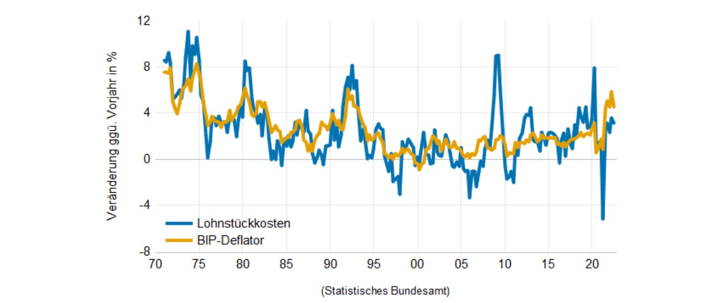
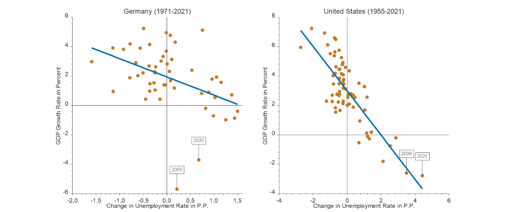
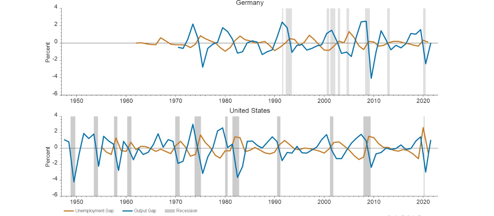
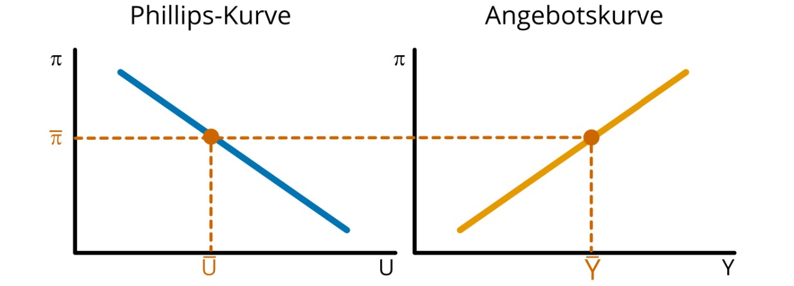
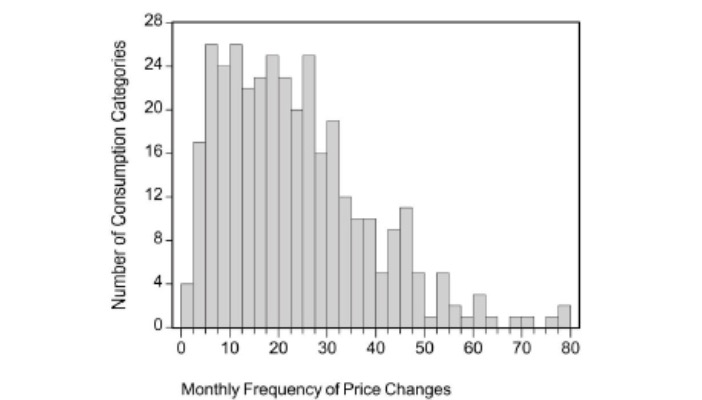
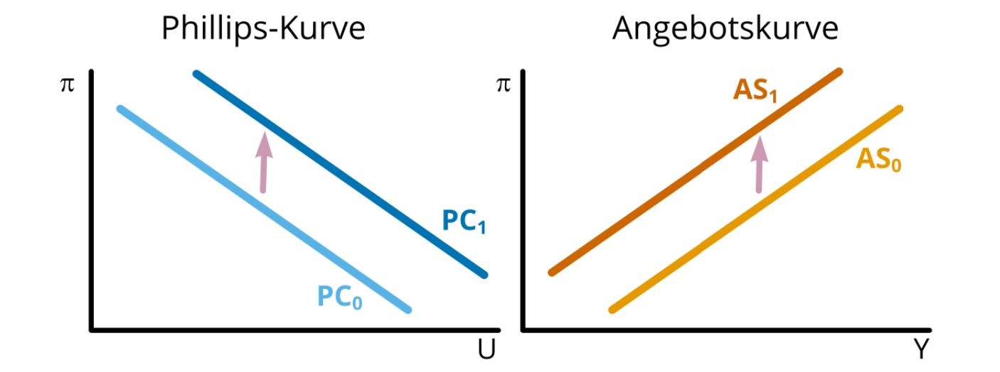
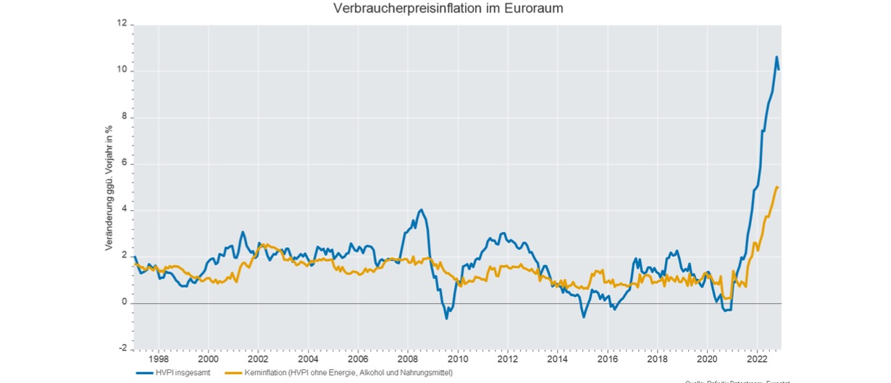

# 19.01.2022 Produktion, Beschäftigung & Inflation

Betrachtung in kurzer Frist, statt langer Frist wie bei Solow

## die kurze Frist

Annahme: Preise sind rigide

- Output endogen, Preise exogen

$$
M = \bar{k} \times \bar{P} \times y
$$

- expansive Geldpolitik dann

$$
M \uparrow \implies y \uparrow
$$

## Philipps Kurve

beschreibt Zusammenhang zw. Lohnzuwächse und Arbeitslosenquote

- von *Alban Philipps (1958)*

Theorie:

- Lohnsetzungsverhalten:  $W = P^e \cdot ...$ (beinhaltet Preiserwartungen)
- Preissetzungsverhalten: beinhaltet Lohnkosten
- beides wird also von Inflationserwartungen bestimmt

modifizierte Philipps Kurve:
$$
\pi = \frac{\Delta P}{P} = \frac{\Delta W}{W} = \pi^e - b(u-\bar{u})
$$

- Inflation = Preisveränderung = Arbeitskostenveränderung
- = erwartete Inflation - Funktion von Arbeitslosenquote und strukturelle ALQ

empirischer Zusammenhang: Lohn und Inflation

Also: Zielkonflikt **Inflation - Arbeitslosigkeit**

## Arbeitslosigkeit und Wachstum

nach `Okun 1962`: **Okuns Law**

- je höher die ALG, desto geringer das Wachstum

USA enger Zusammenhang, DE weniger (Sozialstaat, Kurzarbeitergeld ballert)

Theorie:

- **Arbeitslosenlücke**:
    - $\tilde{u} = u- \bar{u}$
    - Unterschied zw. tatsächlcihe und strukturelle ALQ
- **Produktionslücke**:
    - Abstand des realen BIP von Potenzialwert
    -  $\tilde{y} = (y- \bar{y})/\bar{y}$

Okuns Gesetz: $\tilde{u} = -h \times \tilde y, \ \ h>0$

- je höher ALQ, desto niedriger Produktionslücke

### Aggregierte Angebotskurve 

Aggregate Supply (AS)

- je höher die Auslastung der Wirtschaft, desto mehr Leute werden beschäftigt

## Inflation

Messungen:

- **BIP-Deflator** (impliziter Preisindex): Preisentwicklung inländischer Produkte
- **VPI:** Preisentwicklung eines durchschnittlichen Warenkorbs (auch ausländisch)
- **Inflationsrate:** Teuerung im vrgl. zum Monat des Vorjahres

Rigidität von Güterpreisen

- wie oft ändern sich Preise
- Analyse nach Konsumgruppen
- von `Bills and Klenow (2004)`

Veränderungen pro Monat: von Münzautomaten (selten) bis Benzin (oft)

### Preissetzung von Unternehmen

abhängig von:

- Wettbewerbssituation
- Nachfrage
- Kosten

Aber: nicht direkt PReisänderung, oft Verzögerung

- Informationskosten, Entscheidungskosten, "Menu Costs"
- kurzfristig Güterpreise starr
- mittelfristig wird angepasst (basierend auf Erwartungen)

also Kurfristig: Output = Nachfrage

- Nachfragefunktion für jedes Produkt
- Firmen erfüllen diese, solange unter Grenzkosten (Mikro 1)
- zusätzliche Nachfrage = zusätzliche Kosten = weniger Markup

Unternhemen passen langfristig Preise an, wenn Erwartungen über Nachfrage konstant

## Neu-keynesianische Phillips-Kurve (NKPC)

- Unternehmen = vorausschauend auf
    - Nachfrage
    - Auslastungsgrad der Wirtschaft

Inflation:

- also Auslastungsgrad und Erwartungen
- und dann Schocks (*cost-push-shocks*)

### Cost-Push-Shocks

- Inflation, die von Preissteigerungen internationaler Güter getrieben wird
- insbesondere Öl, Gas, Rohstoffe
    - Ölkrise 70er
    - Gaskrise 2020er

diese verschiebt Philippskurve nach oben

## Inflationsursachen

- Monetäre Inflationstheorie 
    - Expansive Geldpolitik $M \uparrow \to P \uparrow$
- Inflationserwartungen
- Nicht-monetäre Inflationstheorie
    - Nachfrageinfaltion (**Demand-Pull**)
    - Kostendruckinflation (**Cost-Push**)
    - Marktmacht (Monopole)

in Europa derzeit: **Cost-Push-Inflation!**

- Kerninflation niedriger
- insbesondere Energie verteuert

