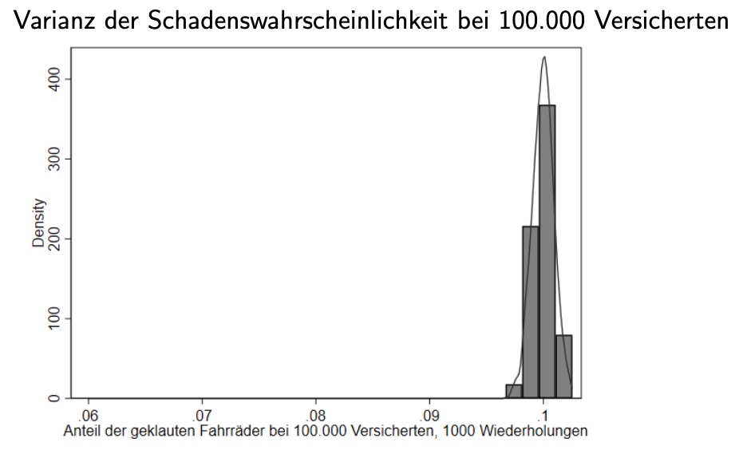

# 02.12.2022 Versicherungen

Versicherung als Anwendung auf Risikoentscheidungen (Lotteriebeispiel)

## Nachfrage nach Versicherungen

Annahme: Individuum kennt:

- Ausgangsvermögen $w_0$
- Schdenswahrscheinlichkeiot *p*
- Vermögensverlust *L*

Prämie = Schadenswahrscheinlichkeit * Schadenssumme => $ p \times A$

| Situation                  | Kein Unfall      | Unfall         |
| -------------------------- | ---------------- | -------------- |
| **Vermögen (mit Vers.)**   | $w_0$            | $w_0 - L$      |
| **Vermögen (ohne Vers.) ** | $w_0- p \cdot A$ | $w_0 - pA-L+A$ |

für risikoaverses I.: im Optimum A = L (Vollversicherung)

Annahem: aktuarisch faire Prämie: kostenlose Bewegung von Vermögen zwischen den Zuständen

## Versicherungsmärkte

wie funktionieren Versicherungsmärkte

### Risk-Pooling

- Zusammenfassung von individuellen Risiken zu Gruppen
- Gesetz der großen Zahlen minimiert das Risiko zu Eintreten mit bekannter Sicherheit
- Risiko wird beherrschbar

Beispiel:

- Schaden eines Fahrraddiebstahls Bernoulli Verteilung mit *p* Wahrscheinlihckeit
- *n* unabhängige Diebstähle = Binomialverteilung $(n,p)$
- Erwartungswert = $n \times p$

| ohne  Versicherung                                        | Versicherung                              |
| --------------------------------------------------------- | ----------------------------------------- |
|  |  |

### Risk Spreading

bei zusammenhängenden Risiken wie Erdbeben etc. funktioniert Pooling nicht!

- Einspringen von Staat
- Verteilung von einzelnen auf viele (Steuerzahler)

### Risk Transfer

Transferierung von Risiken zwischen Indivudeen aufgrund unterschiedlicher Aversität

- bisher nur Art der Risikoaversion (konvex, konkav, linear)
- jetzt Maß der Aversion 

Arrow Pratt Maß: **absolute Risikoaversion**

$$
r_A(x) = \frac{u''(x)}{u'(x)}
$$

**relative Risikoaversion:**
$$
r_R(x) = \frac{xu''(x)}{u'(x)}
$$
Beispiel:

- 2 Indivuen mit Nutznefunktion: $u(w) = ln(w)$
- Individuum 1: $w=200.000$, 50% Risiko von Verlust 100.000
- Individuum 2: $w=2.000.000$

**Risikoprämie für Person 1:**

- Erwartungswert: $EV = 150000$
- Erwartungsnutzen: $0,5 \ln(200.000)+0,5\ln(100.000) = 11,859$
- Sicherheitsäquivalent: 
    - $U(CE) = EU \to ln(CE) = 11,859$
    - $CE = e^{11,859} = 141.350,8$
- Risikoprämie: $R = EV-CE = 150.000- 141.350= 8649$

**Wann würde Person 2 das Risiko übernehmen wollen?**

- $EV = 1.950.000$
- $EU = 0,5 \ln(2.000.000)+0,5 \ln(1.950.000) = 14,483$
- $CE = e^{14,483} = 1,949.337,2$
- $R = 1.950.000 - 1,949.337,2 = 662,75$

**Vergleich der Risikoprämien**

- Risikoprämie 1: 8649€ (Bereitschaft Risiko abzugeben)
- Risikoprämie 2: 662,75€ (Bereitschaft Risiko aufzunehmen)

## Asymmetrische Informationsverteilung

Verschiedene Indivdueen haben andere Risiken:

- eine Person  hat 3 Schlösser am Rad
- die andere schließt nicht an

Problem:

1. Versicherung kennt nicht Einzelrisikos
2. sie nimmt also Prämie im Mittelwert
3. Lohnt nicht für geringrisijo-Personen
4. steigende Preise -> Teufelskreis

### Moral Hazard

Verhaltensänderung der Versicherten

- Ex-Ante: vor Eintritt des Schadens mehr Risiko
- Ex-post: nach Eintritt des Schadens teurere Behandlung

erhöht Kosten für Versicherung 
