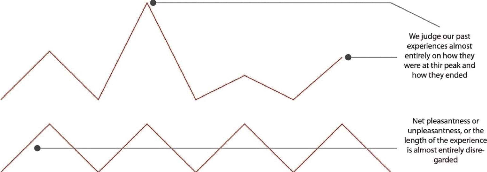

# 22.12.2022 Verhalten III: Zeitinkosistenz

bisher: Exponentielles Diskontieren

- Rationale Entscheidungen
- Diskontfaktor (aber unterschiedlich bei Indiv.)
- Zeitkonsistenz

- egal welcher Zeitraum, bleiben bei Entscheidung (a oder b)

**Realität** = komplizierter (bspw. Neujahrsvorsätze)

- bei *t-1* wählen a
- bei *t* wählen b

## Modellierung

in exponentielles Diskontieren mit *beta*-Faktor
$$
U(\bold{u}) = u_o + \beta \delta u_1 + \beta \delta^2 u_2 + \beta \delta^3 u_3 +... \\
= u_0 + \sum_i^\infty \beta \delta^i u_i
$$

- weiterhin exponentiell ansteigender *delta*
- aber konstanter *beta*

= *quasi-hyperbolisches Diskontieren*

- $\beta < 1$: stärkere Abzinsung der Zukunft = *present-bias*

Beta-Delta-Funktion:

- gedludig / ungeduldig = Delta
- Impulsiv = Beta

### Beispiel

Diät und Kuchen (soll ich auf einer Party Kuchen essen?)

- $\beta = 1/2$
- $\delta = 2/3$

**Nutzen am Tag davor:**
$$
U(Kuchen) = \overbrace{\frac{1}{2}}^{\beta} \cdot \overbrace{ \frac{2}{3}}^{\delta} \cdot 4 
+  \frac{1}{2} \cdot \frac{2}{3}^2 \cdot 0 = 4/3\\
U(\bar{Kuchen}) = \frac{1}{2} \cdot \frac{2}{3} \cdot1 +  \frac{1}{2} \cdot \frac{2}{3}^2 \cdot 6 = 5/3
$$
= Entscheidung für kein Kuchen essen

**Nutzen am Partytag:**
$$
U(Kuchen) = 4+ \frac{1}{2} \cdot \frac{2}{3} \cdot 0 = 4\\
U(\bar{Kuchen}) = 1 + \frac{1}{2} \cdot \frac{2}{3} \cdot 6 = 3
$$
= Entscheidung für Kuchen essen

## Selbstkontrolle

Arten von Individuuen

- **naive** I.: wissen nicht über ihre Zeitinkonsistenz
- **sophisticated** I.: wissen über Inkosistenz
    - können bindende Entscheidungen für morgen heute treffen

Experimente von `Ariely & Wertenbroch (2002)`  über Fristsetzung bei mehreren Abgaben

Optionen:

- keine Fristen (Free Choice) = Ende des Semesters
- selbstgesetzte Fristen (Own Choice)
- externe Fristen (No Choice) = gleichmäßg verteilte Fristen

Nutzen: *No Choice > Own Choice > Free Choice* 

- Studierende wollen sich selber kontrollieren
- ihre Methoden sind aber nicht optimal
- also lieber externe Fristen setzen

## Struktur und Präferenzen

bisherige Annahme: 

- nur Barwert des Nutzens relevant, nicht Profil/ Verteilung / Reihenfolge
- aber empirisch: "Beste zum Schluss"

Modellierung: Spitzen-End-Regel (nach Kahnemann)

> **peak-end-rule:** Menschen bewerten Abfolge von Ereignissen, wie sich Moment extremsten Nutzens vs Ende der Abfolge angefühlt hat

= wenn das Ende angenehmer ist, dann wird gesamte Reihenfolge als angenehm wahrgenommen (unabhängig von Länge)

- nutzbar für medizinische Prozeduren: 
    - länger und am Ende angenehmer als 
    - Ende mit abruptem Nachlassen des Schmerzes

## Vorhersagen

für intertemporale Entscheidungen = brauchen Präferenzen

verhaltensökonomische Effekte:

- Unterschätzung Anpassungseffekte
- Projektionsverzerrung
    - Tendenz, heutige Präferenz auf Zukunft projezieren (wer heute hungrig ist, ist es morgen wahrscheinlich nicht)
- Überschätzung Nutzen Diversifikation
    - Unterschätzen Gewöhnungseffekt

