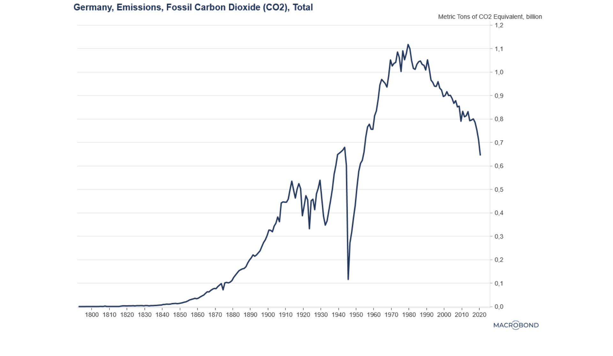
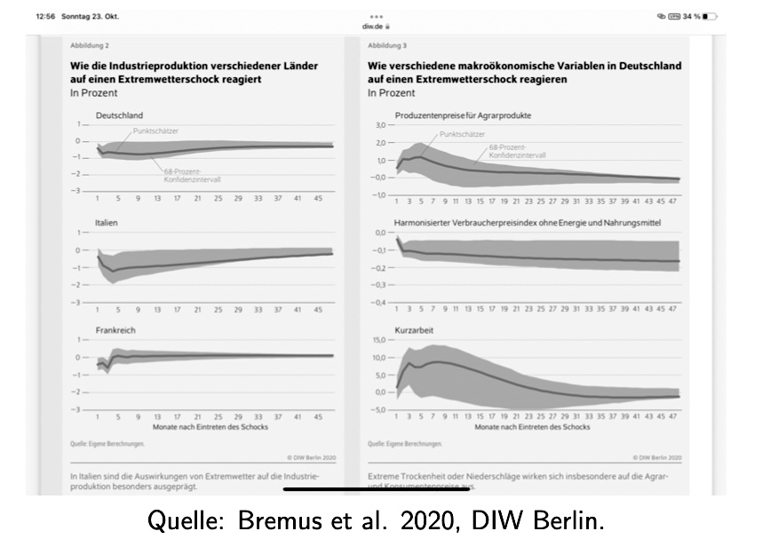

# 08.11.2022 Klimawandel und Geldpolitik

EU-Ziele

- Senkung um 55% bis 2030
- Emissionsneutralität bis 2050

## Klimarisiken

Unterscheidung EZB

- **physische** Risiken: Wetter, Schäden, ...
- **Transitorische** Risiken: Marktreaktionen, Vorgaben, ...

im Finanzsystem

- Finanzsektor hat 1. Bill. € im fossilen Sektor Risiken
- bspw. Kredite in Regionen mit Extrmewetter
- drohen 300-400 Mrd. € Verluste

Arten von Risiken im Finanzsektor

1. Kredit Risiko
2. Markt R.
3. Operationelles R.
4. andere (Liquidität)

Beispiele

|                           | physische R                                | Transitorische                                          |
| ------------------------- | ------------------------------------------ | ------------------------------------------------------- |
| **Kreditrisiko**          | Kreditischerheit (Immobilie) sinkt im Wert | Energieeffienzstandards senken Profit :crying_cat_face: |
| **Marktrisiko**           | Katastrophen erhöhen Volatilität           | Preisänderungen in fossilen Aktien                      |
| **operationelles Riskio** | Zersöderung Infrastruktur                  | Reputationsrisiko für Unternehmen                       |

## Klima und Preisstabilität

Ziel der EZB: 2% mittelfristiges Inflationsniveau

- Messung: allgemeines Preisniveau VPI
- Inflationsziel beinflusst Inflationserwartungen

und Klimakatastrophen beinflussen die Preise (bspw. Lebensmittel)

EZB Reaktion:

- Strategierevision 2020/21: Klimawandel beinflusst Preisstabilität
- Anpassung des Mandats
- Unterstützung EU-Politik

## Klima und Finanzstabilität

- EZB ist verantwortlich für Banken und Finanzaufsicht
- bewertet Vulnerabilität einzelner Banken im Klimablick
    - Offenlegungspflichten
    - Stresstests
    - Forschung

Instrumente der EZB:

- Maßnahmen zur Verteuerung fossiler Anleihen
    - durch Sicherheitsanforderungen 
    - im Refinanzierungsgeschäft mit EZB

