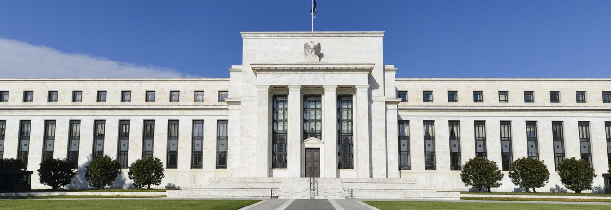
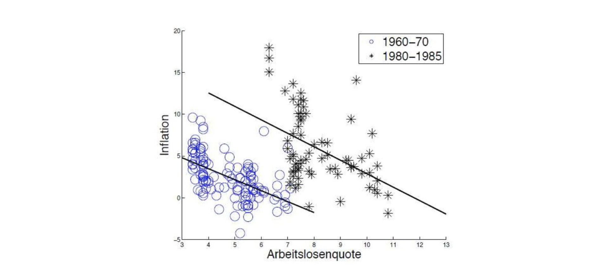

# 11.12.2022 Zentralbanken II

## Federal Reserve System

gegründet 1913 nach **vielen** Krisen

- Lender of Last Resort
- besteht aus 12 regionalen Federal Banks
    - wie bei *Catch me if you can* (mit Leo di Caprio)
- mega kompliziert...
- aber wenigstens bissl unabhängig von Staat

**Board of Governors (BoG)**

- 7 Mitglieder à 14 Jahre Amtszeit
- 1 Chairman (*Jerome Powell*) à 4 Jahre Amtszeit

**Federal Open Market Commitee (FOMC)**

- 7 Governor + 5 weitere
- Entscheidung über Offenmarktgeschäfte, Mindestreservesatz, Diskontsatz

## EZB

- EZB-Rat (**Governing Council**)
- Direktorium (**Exekutive Council**)
    - Durchführung der Entscheidungen des Direktoriums
    - Vorbereitung
- 19 Nationalbanken des Euro-Raums

**EZB-Rat**:

- 6 Mitglieder des Direktoriums, 1 Vorsitzende (*Christine Lagarde*)
- plus 19 Zentralbankchefs (DE: *Joachim Nagel*)
- treffen Entscheidungen

## Ziele

1. Preisstabilität
2. Vollbeschäftigung (nur Fed)

FED

> The BoG shall mantain long-run grwoth of the monetary and credit aggregates (...)
>
> so as to promote effectively the goals of **maximum employment**, **stable prices** and moderate long-term investment rates

- duales Ziel

EZB

> Das vorrangige Ziel des Europäischen Systems der Zentralbanken ist es, die Preisstabilität zu gewährleisten.
>
> Soweit dies ihne Beinträchtigung des Zieles der Preisstabilität möglich ist, (...) Verwirklichung der in Artikel 3 EUV festgelegten Ziele
>
> ~ Art. 127 AEUV

- Neuerdings auch Umweltschutz (als sekundäres Ziel) 
- vorrangig aber Preisstabilität
- "sufficiently close, but below 2 per cent" 

> **Preisstabilität:** niedrige & konstante Inflationsrate in *mittlerer Frist*

Gründe für Preisziel:

- Informationen der Preise
- geringere Unsicherheit
- verhindert Umverteilung von Leihenden zu Schuldnern
- Stabilität für Investments
- Vorteile von niedrige Zinsen = gut für Wirtschaft
- kalte Progression stoppen

Übung: Vorteile von Preisstabilität

1. Umverteilung von Bargeld zu inflatiosnindizierten GÜtern verhindert
2. niedrige Zinsen & geringe Opportk. Bargeld 
3. geringe Verzerrungen in Vermögensverteilung

## Unabhängigkeit

- Inflation = Erwartungsmanagement
- Erwartungen bestimmen Lohn- und Preisbildung

wie beinflusst ZB Erwartungen?

- glaubhafte Ankündigungen
- nicht unabhängig = nicht glaubwürdig!

## Philipps Kurve

Annahmen:

1. ALQ = Maß für Spannung am Arbeitsmarkt
2. Preise der Firmen  = Aufschlag auf Lohnkosten

Idee: hohe Arbeitslosigkeit = keine Durchsetzung von Lohnforderungen

> Lieber 5% Inflation als 5% Arbeitslosigkeit
>
> ~ Helmut Schmidt

Aber: rückwärts nicht möglich!

=> über Geldpolitik kann man nicht ALQ beinflussen! (zumindest nicht senken)

Fragen: Mehrheitswahlrecht im Rat???

 

=> **Geldpolitik mittel/langfristig neutral**: keine Realwirkung (Löhne), nur Inflation
