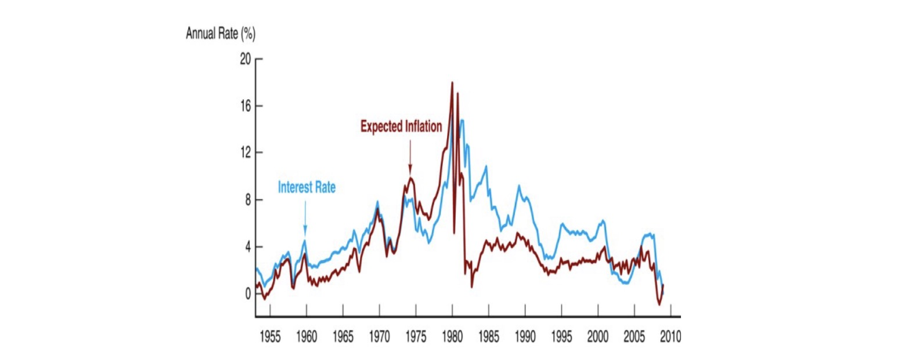
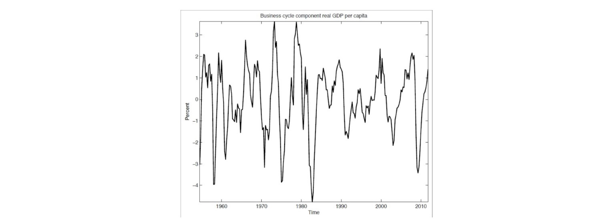
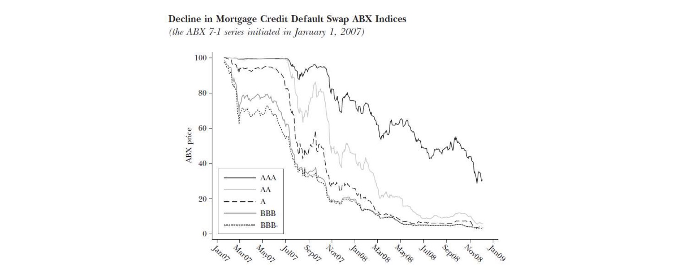
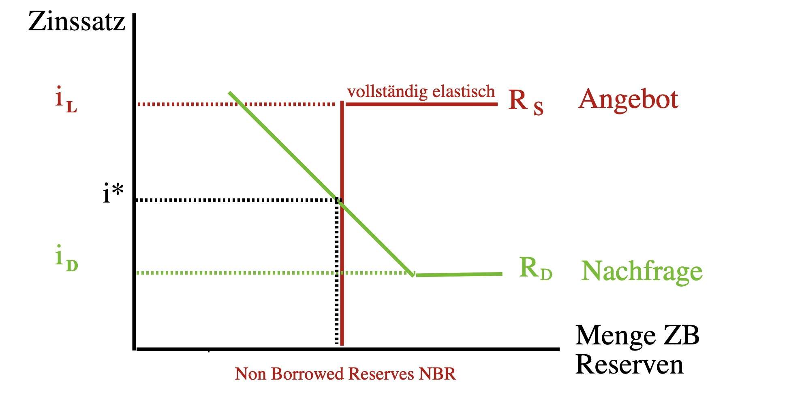

# 20.12.2022 Finanzkrisen

## Geldpolitik

- Unabhängigkeit wichtig
    - sonst Kauf von Staatsanleihen durch ZB
    - = Inflation (wenn falsch gemacht)
- nicht für dauerhaft/systematisch Finanzierung von Staatsdefiziten!

> Überziehungs- oder andere Kreditfazilitäten sind [..] ebenso verboten wie der *unmittelbare* Erwerb von Schuldtiteln
>
> **~ Maastricht Vertrag der EU**

Historisch: nicht immer vertrauenswürdiges Handeln

- in 70/80ern extreme Inflation
- Federal Reserve hebt Zinsen extrem an = *Volcker-Schock* (nach Chairman)

führte zu massivem Produktionseinbruch und tiefer Rezession

- größte Rezession von eigener ZB
- für die Glaubwürdigkeit
- extreme Folgen

**=> Glaubwürdigkeit schwer zu erlangen, einfach zu verspielen**

## Krise 2007-2009

- 2000er: Ausgabe vieler Hauskredite von Banken
- diese Hauskredite wurden gesammelt, verbrieft und verkauft
- dann Rating von Ratingagenturen (S&P, Moody, Fitch)

Problem: Downturn in den 2007ern

- Hauskredite werden nicht mehr bedient = Kollabiert

- keine Informationen über Lkquidität = Panik
- Zusammenbruch von Lehman Brothers = großes Institut
- Folgend: teilweise Verstaatlichungen in ganzer Welt

## Zentralbanken in Krisen

**Ideen**:

- *Lender of Last Resort* bis zum Schluss
- Liquiditätsprobleme lösen
- nur für solide Banken

**Maßnahmen**:

- Kreditfazilitäten für alle
    - ohne Stigmatisierung
- Zinsreaktionen
    - Quantitative Tightening, Verhindern von Deflation
- Offenmarktgeschäfte

**EZB vs. FED**:

- FED: schnelle Reaktion mit unkonventionellen Maßnahmen
- EZB: verlangsamte Reaktion zu spät
    - Bremsen von konservativen ZB (Bundesbank)
    - dadurch keine richtige Überwindung der Krise

## Übung

### 1: Zinssätze

- *i* = **overnight interbank interest rate** = Zinsatz zwischen Geschäftsbanken
    - Fed: Federal Funds Rate
    - EZB: ESTER (European Short Term Rate)
- $i_d$ = **deposit interest rate** = Zinsatz auf Zentralbankeinlagen
- $i_l$ = **lending interest rate** = Spitzenrefinanzierungssatz aus Fazilitäten

i = Basis für Zinsen der gesamten Volkswirtschaft

### 2: Reserven

Markt für Zentralbankreserven abhängig von *i*

**Angebot:** 

`Frage: will ich von ZB leihen oder auf Interbankenmarkt?`

- *vertikal*: **Non Borrowed Reserves** NBR: Offenmarktgeschäfte der ZB
  - wenn $i < i_L$: Niemand leiht bei ZB, BR=0, NBR > 0
- *horizontal*:  **Borrowed Reserves**
    - wenn $i \ge i_l$: Geschäftsbanken leihen bei Zentralbank, BR > 0, mehr ZB-Reserven im Markt

**Nachfrage**

`Frage: will ich auf Interbankenmarkt verleihen oder an ZB?` 

- sinkende Nachfrage abhängig von Zins = logisch
- sobald Depositzins den GB kriegt höher als i = unendliche Nachfrage

wenn $i-i_d$ steigt: Interbankenmarkt attraktiv, ABzug von ZB

wenn $i-i_d$ sinkt: ZB-Geld attraktiver

**=> ZB will $i_d < i^* < i_l$**, sodass Interbankenmarkt funktioniert

### 3: Marktreaktionen

- **Offenmarktkauf**: mehr Geld -> Angebot nach Rechts, mehr Non-Borrowed Reserves -> niedrigerer Zins *i*

> **Wichtige Zitate:**
>
> "Deine Zentralbank Reserven sind ganz schön attraktiv"
>
> "Zeig mir deine Angebotskurven"
