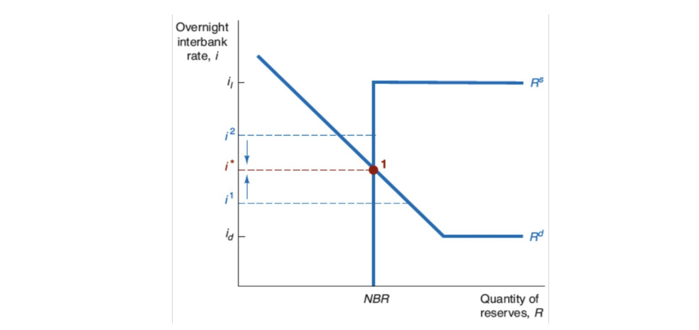
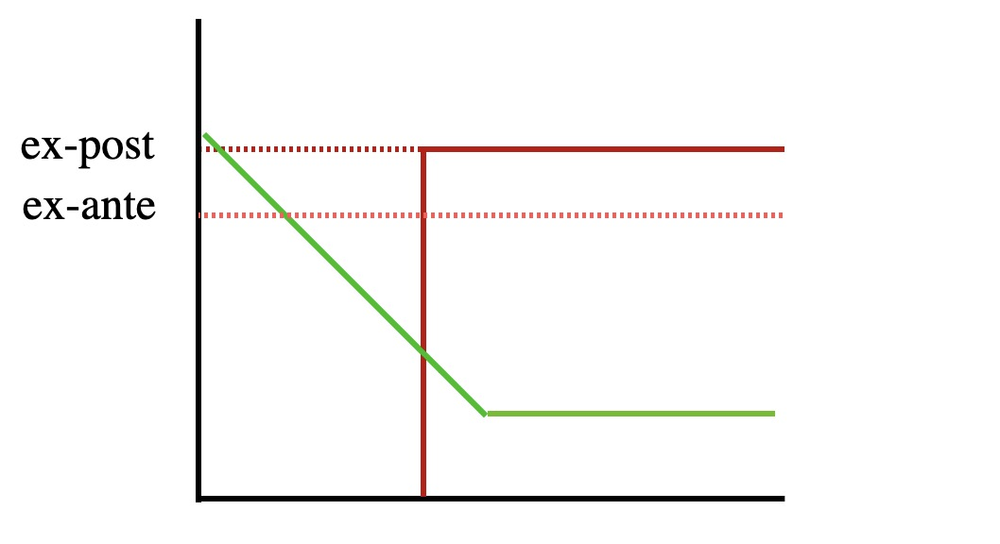
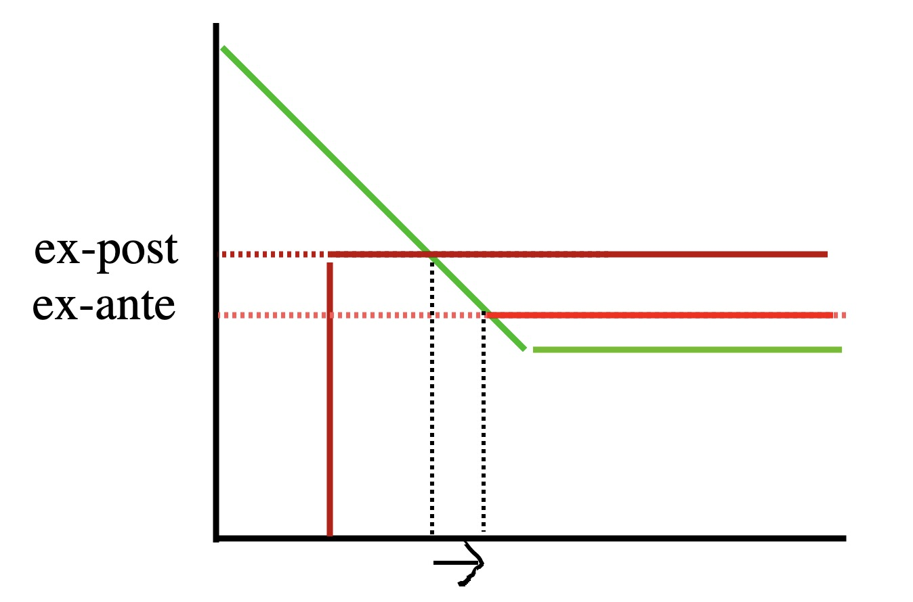
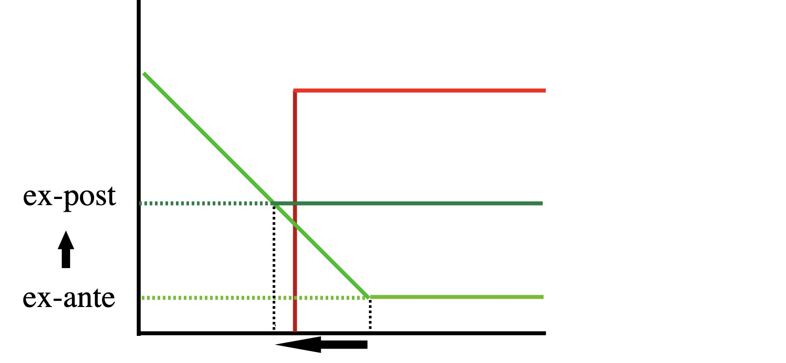

# 10.01.2022 Zinssatz

- Markt wird durch Zentralbankzins (*vernight interest rate*) bestimmt

## Markt für ZB-Reserven

Zentralbankreserven = Guthaben der Geschäftsbanken bei ZB

- Mindestreserveanforderungen
- Überschussanforderungen

### Nachfrage

- GB halten ZB-Guthaben über Mindestanforderungen für Liquidität
- über Mindest. verzinst mit $i_d$
    - Opportunitätsk. = auf dem Markt für Interbankenreservern erhaltener Zins

je höher der Zins auf IB-Markt, desto mehr wird da angeboten = weniger Reservern

je höher Zins $i_d$, desto schlechter IB-Markt = mehr Reserven

### Angebot

- Offenmarktgeschäfte (Non Banking Reserves NBR)
- direkt verliehene Reserven mit Zins $i_l$ (Banking Reserves BR)

Wenn Interbankenzins unter $i_l$, kein Angebot

wenn IB-Zins über $i_l$, dann nehmen alle ZB-Geld = hohe Reserven

### Gleichgewicht

Merke: y-Achse = Zinssatz auf IB-Markt! (also Opportunitätskosten)

Zinssätze:

- $i_d$ = Einlagenzins
- $i_l$ = Zinssatz für Fazilitäten
- $i$ = overnight interbank interest rate 

## Werkzeuge

### Offenmarktgeschäfte

ZB kauft auf Sekundärmarkt Anleihen. = **Veränderung des Angebots an ZB-Reserven**

- Veränderung der vorhandenen Reserven
- über Repos

EZB: Longer Term Transcations für längere Laufzeiten

FED: FOMC

Effekt von mehr Offenmarktgeschäften: 

- Angebotslinie verschiebt sich nach Rechts
- Angebot trifft auf Nachfrage bei niedrigerem IB-Zins

=> niedrigerer gesamtwirtschaftlicher Zins

- außer wenn IB-Zins schon bei $i_d$, dann effektlos

### Ständige Fazilität

ZB-Zinssätze:

- **Spitzenrefinanzierungssatz**: $i_l$
    - Reserven von ZB an Banken über Nacht 
    - $i_l=i_d$ +1%
- **Einlagesatz**: deposit Facility $i_d$
    - Einlagen von Banken bei ZB über Nacht

diese Fazilität setzt Zinskorridor für IB-Zins

### Mindestreserveanforderungen

- regulatorische Vorgabe zu Reserven bei Zentralbank
- EZB: 1%
- FED: zwischen 0% und 10% (abhängig von Größe)

 

## Übung

Senkung des Spitzenrefinanzierungssatzes $i_l \downarrow$

1. Normalsituation: Zinssatz bildet sich zwischen $i_l + i_d$, Gleichgewicht im Markt
    - im Markt passiert normalerweise nichts, solange nicht zu krass gesenkt
    - im Bild davor (ex-ante) und danach (ex-post) verwechselt!
2. Sitaution dass $i_l = i^* $, d.h. dass IB-Zins bereits sehr hoch
    - Senkung = Ausweiten der Reserven
    - im Bild davor (ex-ante) und danach (ex-post) verwechselt!
    - 

Erhöhung $i_d$ in Normalsituation:

- nichts passiert, bis $i_d$ auf *i* trifft
- wenn $i_d$ höher als *i* = Ungleichgewicht
- weniger Reserven
- 

 