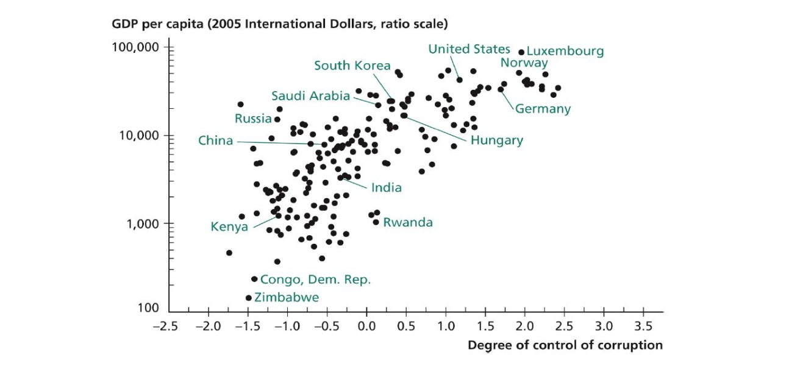
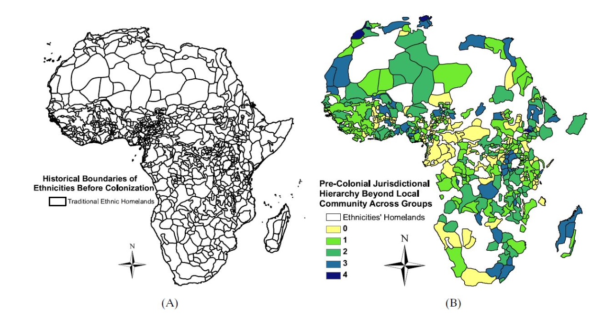

# 08.11.2022 Ideen und Effizienz

## Romer und Endogenous Growth

wie entsteht technologischer Fortschritt?

- im Solow Modell exogen gegeben
- mit Wachstumsrate *g*

Romers Vorschlag: durch **Ideen**

### Eigenschaften von Ideen

- nicht rivalisierend
- hohe Fixkosten
- geringe Grenzkosten
- steigende Skalenerträge

Aber: Free Rider Problem!

### Patente

= Einschränkung des freien Wettbewerbs

- für Ausgleich der Investitionskosten
- mit Gewinn werden Fixkosten ausgeglichen

=> Technologischer Fortschritt = Einschränkung des Wettbewerbs

> die beginnende Institutionalisierung des Schutzes geistigen Eigentums war einer der Treiber der industriellen Revolution

Bevölkerung und Patente:

- große Bevölkerung = besser
- mehr kreative Köpfe
- größerer Absatzmarkt

### Akkumulation der Ideen

- Bevölkerung besteht aus $L_A$ (Forscher) und $L_Y$ (Arbeiter)
- *A* = Technologieniveau
- $\bar{\theta}$ = Rate der neuen Ideen eines Forschenden
- für Gesamtwirtschaft: $\theta$ abhänhig von
    - Anzahl Forscher
    - Technologieniveau

$$
\bar{\theta} = \theta L_A^{\lambda - 1} A^{\phi}
$$

- $\lambda$ = Effektivitätsfaktor eines nächsten Forschers:
    - ob sinkendende ($0 < \lambda < 1$) 
    - oder steigende Skalenerträge ($\lambda > 1$) fraglich

- $\phi$ = Effektivitätsfaktor einer Erhöhung des Technologieniveaus
    - ist es bei niedrigem oder hohem Technologieniveau einfacher
    - Entweder: "standing in the shoulders of giants": $\phi > 0$
    - "the easy inventions already made": $\phi < 0$
    - beides gleicht sich aus: $\phi = 0$

Aufdröseln des Wachstums der Technologie *g*
$$
\lambda \cdot n = (1- \phi) g \\
g = \frac{\lambda \cdot n}{1- \phi}
$$

### Erhöhung des Anteils der Forscher

bei einfachen Annahmen: Forscherzahl wächst mit Bevölkerungswachstum

- plötzlicher Anstieg der Forschenden = geringe Effizienz der Ideen
- diese müssen von den Arbeitern jedoch alimentiert werden

## Effizienz

die Nutzung der **T**echnologie hängt ab von **E**ffizienz: $A = T \cdot E$

- Bsp.: Sowjetunion hat ähnliche Technoligie und Kapitalstock wie USA
- Aber 1/3 des BIP p.P 
- wegen Effizienzunterschied E

E wird beinflusst von vielen

### Politische Institutionen

- setzen Spielregeln für wirtschaftliche Aktivitäten
    - Eigentunsrechte
    - Vollstreckbarkeit Ansprüche
- Cost of Doing Business (Dauer und Kosten der Unternehmensgründung)
- Korruption / Rent-Seeking / Ineffizienzen

6 Dimensionen der Weltbank

1. Accountability of Politicians
2. Political Stablity
3. Government Effectiveness
4. Regulatory Quality
5. Rule of Law
6. Control of corruption

insbesondere Krruption ist Entwicklungshemmer!

#### Institutionen und Kolonialismus

wie entstehen Institutionen?

- viele der schlechtesten regierten Länder = frühere Kolonien
- nur extraktive Institutionen = keine regionale Wirtschaft
- willkürliche Grenzen = divide and Rule 
- schwache Institutionen = danach von kleptokratischen Eliten übernommen

Andere Erklärung: Siedler Mortalität -> keine wollen sich niederlassen -> niemand kann Inst. Fordern -> keine regionale Entwicklung

#### Institutionen und Prä-koloniale Ursprünge

in früheren Zeiten komplexe hierarchische Institutionen = höheres Einkommensniveau heute

- auch innerhalb des gleichen Staates
- messen anhand von Licht

### Weitere Faktoren

**Geographische Faktoren**

- klimatische Bedingungen (Temperatur...)
- geographische Erreichbarkeit (Land, Wasserwege)

Wirken geogr. Faktoren direkt oder indirekt auf inst. Faktoren

- *Geography Hypothesis*: beinflusst direkt
    - landwirtschaftliche Erträge
    - weniger Handelsmöglichkeiten für Binnenländer
- *Institutions Hypothesis*: geogr. beinflusst nicht wirklich

Auch: Ruggedness hat Einfluss auf Handel

**kulturelle Faktoren**

- Arbeitsethik
- Vertrauen
- soziale Interaktion

**Heterogenität**

- linguistisch
- ethnisch
- kann mehr Kreativität
- aber auch mehr Konflikte
- Insgesamt vermutlich schlechter

## Fazit: Wachstum

- auf ausgewogener Wachstumspfad = Wachstum p.P Einkommen mit technologischer Fortschritt
- nicht uaf ausgewogeneme Wachstumspfad = Wachstum durch Kapitalakkumulation
- höheres Humankapital = höheres Niveau Wachstumspfad
- technologischer Fortschritt = neue Ideen 
- Technologieniveau abhängig von Effizienz
- Andere Faktoren spielen viel größere Rolle

