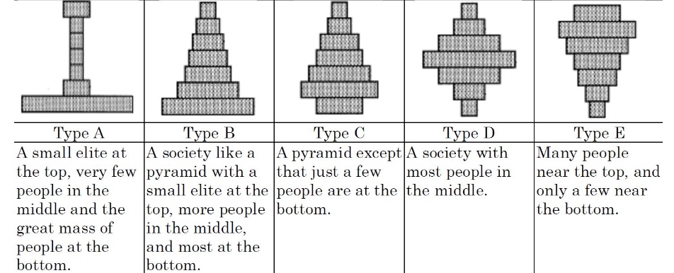
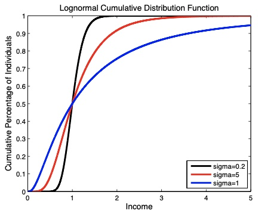
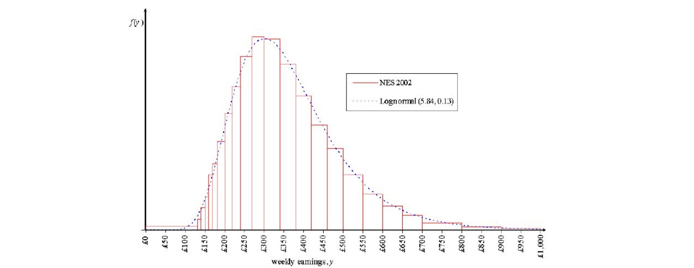
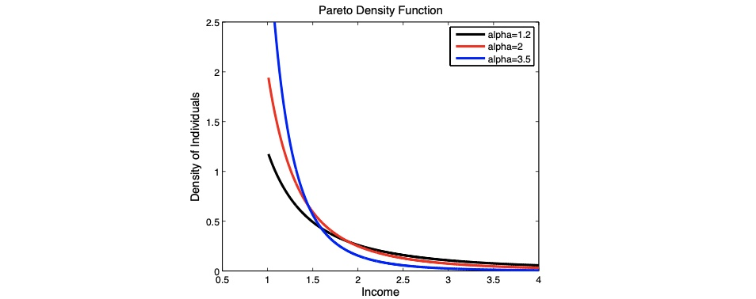
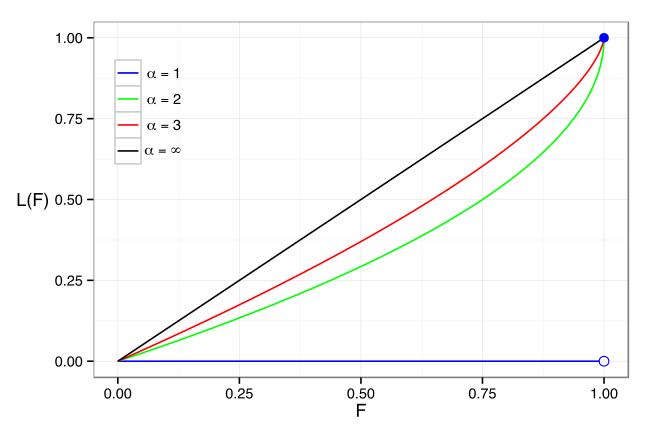
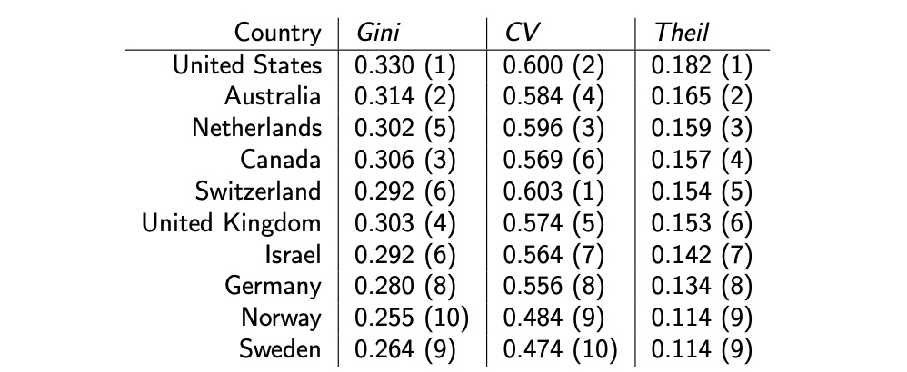

# 22.11.2022 Verteilungen von Einkommen

## Einkommenspyramiden

Einkommenspyramiden: *nach Niehues*

Deutschland: Ansicht vs Realität

## Parametrische Verteilungen

weil Einkommen zu unsymmetrisch: **parametrische, kontinuierliche Verteilungen**, bspw. Lognormal

- stetig differenzierbar
- Ableitung der Funktion = Dichtefunktion: $F'(x) = f(x)$
- gesamte Verteilung darstellbar

### Lognormalverteilung

Parameter: 

- $\mu$ = Lage
- $\sigma$ = Skalierung (höher = ungleicher)

$$
F(x) = \Phi \Bigg(\frac{ln(x)-\mu}{\sigma}\Bigg)
$$

$\Phi$ = Standardnormalverteilung (SNV)

- Definitionsbereich $x > 0$
- Mittelwert: $\bar{u} = e^{u+\frac{1}{2}\sigma^2}$
- Median: $m = e^\mu$
- Modus = $e^{\mu-\sigma^2}$

Modus < Median < Mittelwert !

| Verteilungsfunktion                       | Dichtefunktion                            |
| ----------------------------------------- | ----------------------------------------- |
|  |  |

- empirisch gut darstellbar
- teilweise Mängel an Enden

Beispiel: UK-Wochenlohn Vollzeit, Männer

### Paretoverteilung

für reiche Bürger in einem Land / ungleiche Länder

$$
F(x) = 1- \bigg( \frac{x_{min}}{x}\bigg)^{\alpha}
$$

- immer fallend
- $\alpha > 0$ = Parameter für die Form (höher = gleicher)
- $x_{min}$ = Einkommensuntergrenze

Warum höheres Alpha = besser? weil weniger extrem Reiche = kleinere Ungleichheit

## Ungleichheitsmaße

für Vergleiche über Länder hinweg

Eigenschaften Ungleichheitsmaße

- Unabhängigkeit Mittelwert
- unabhängig Bevölkerungsgröße
- Symmetrie
- Pigou Prinzip: Transfer senkt Ungleichheit
- *wünschenswert:* Zerlegbarkeit

### Variationskoeffizient *CV*

Verhältnis Standardabweichung Einkommen und Durchschnittseinkommen
$$
CV = \frac{\sqrt{Var}}{\bar{u}}
$$
je höher, desto ungleicher

wenn Lognormalverteilung:
$$
CV = \sqrt{(e^{{\sigma}^2}-1)}
$$
Nachteile:

- Schiefe außer Acht
- Oberer Bereich sensitiver als unten

### Gini 

Fläche zwischen Lorenzkurve und Gleichverteilung durch Gesamt

- zwischen 0 und 1
- Sensitiv in Mitte

| Berechnung               | Formel                               |
| ------------------------ | ------------------------------------ |
| Lognormal                | $2 \Phi (\frac{\sigma}{\sqrt{2}})-1$ |
| Pareto                   | $\frac{1}{2 \alpha-1}$               |
| Individueen (alternativ) | $\frac{E|x_i-x_j|}{2 \bar{u}}$       |

Alternative = erwartete Differenz zwischen zwei Individuuen

Berechnungstabelle

| Einkommen y | Anzahl Individueen x | rel. Anteil x | kum. x | Rel. Anteil y | kum . Anteil y |
| ----------- | -------------------- | ------------- | ------ | ------------- | -------------- |
|             |                      |               |        |               |                |

### Theil Index

$$
Theil = \frac{1}{N} \cdot \sum_{i=1}^N \frac{y_i}{\mu} \cdot ln(\frac{y_i}{\bar{u}})
$$

- zwischen 0 und $ln(N)$
- sensitiv in MItte und Verteilung

auch aufteilbar zwischen Gruppen

## Empirie

Gini auf der Welt

Verglech zw. Koeffiiznenten

=> CV ist stark unterschiedlich, weil obersensitiv

Faktoren der Ungleichheit:

- Sektore Struktur der Wirtschaft
- Steuer / Transfersystem
- staatliche Ineffizienzen
- Toleranzgrenzen Ungleichheit

