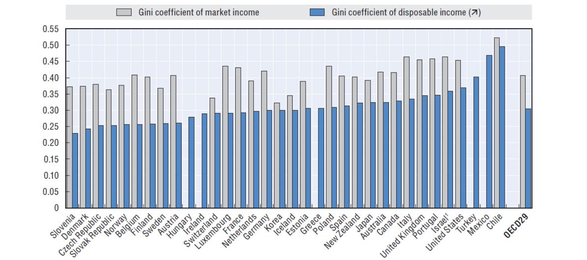
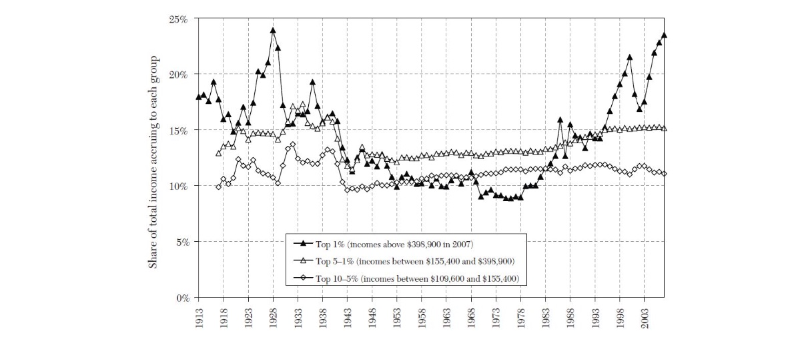
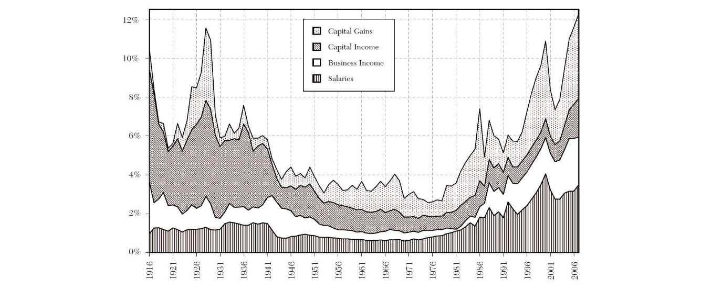
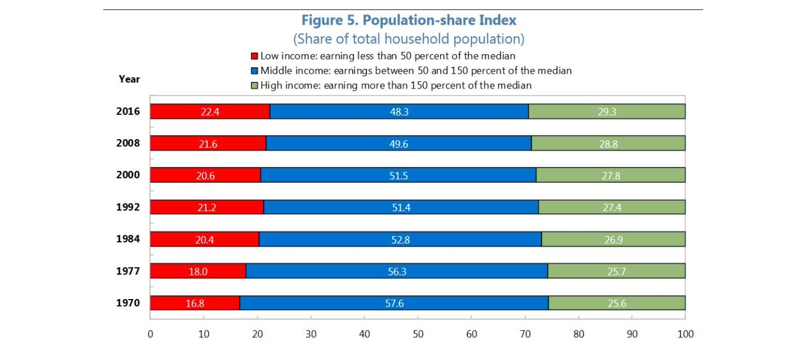

# 29.11.2022 Ungleichheit

## Umverteilung

Martkeinkommen = sehr ungleich, der Staat verteilt durch Besteuerung neu

= Nettieinkommen hat niedrigeren Gini

### Lebenszyklus-Ungleichheit

`Mierau und Rockey (2015)` argumentieren:

- unterschiedliche Verdienste im Leben (Max. bei 50 Jahren)
- Alterskohorten sind nicht universell

=> auch gerechte Gesellschaft hat Ungleichheit ("*Inequalitiy in an Equal Society*")

Faktor: ungefähr 0.11

### Historische U.

seit 80er Jahren: Anstieg der Ungleichheit 

Gründe:

- **Neoliberale Politik** (bspw. niedrige Steuersätze)
- **Globalisierung** (Outsourcing)
- **Skill-biased Technological Change** (prod. Arbeiter profitieren mehr)
- **Strukturwandel** hin zu Dienstleistungen
- **Superstar Dynamics** (CEO-Society)

### Die Top-1% 

`Piketty und Saez (2003)` anhand vomn Daten aus Steuerregistern

- hohe Bedeutung für Finanzierung
- Politische Einflussnahme

Entwicklung: 

Zusammensetzung: 

- Der Anteil der 1% steigt historisch
- einerseits Löhne (CEOs)
- aber auch Kapitalpreise steigen (Vermögenspreisanstieg)

## Polarisation

Zuwächse an Enden der Verteilung (statt in Mitte)

- *"The Vanishing Middle Class"*

Polarisation nach Wolfson:

$$
Pola = 2 \frac{\bar{\mu}}{m} (1-2\cdot LC(0.5)-Gini)
$$

- zw. 0 (extrem gleich) und 1 (eine Hälfte Einkommen von 0, andere von $2 \mu$)
- korreliert mit Ungleichheit
- aber kann steigen, wenn U. sinkt

Empirische Ergebnisse:

- Verlust der Mittelklasse (Jobs mit mittleren Anforderungen)
- Verlust der Produktionsjobs durch Automatisierung
- aber im niedrigen Segment nicht (weil meist Dienstleistung *am Menschen*)

## Übung

