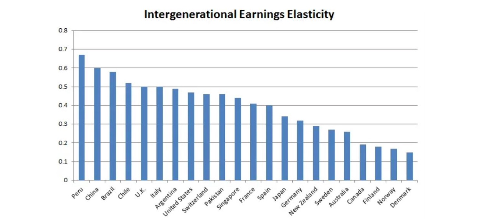
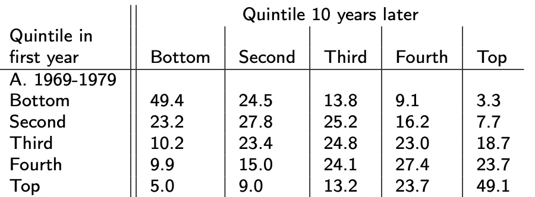
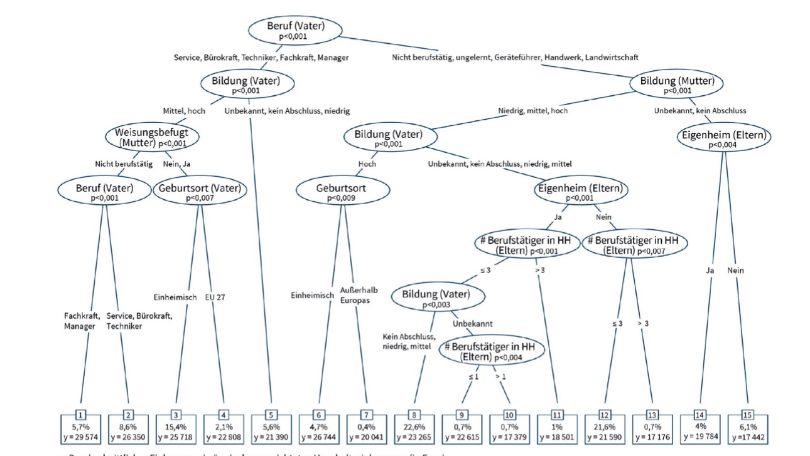
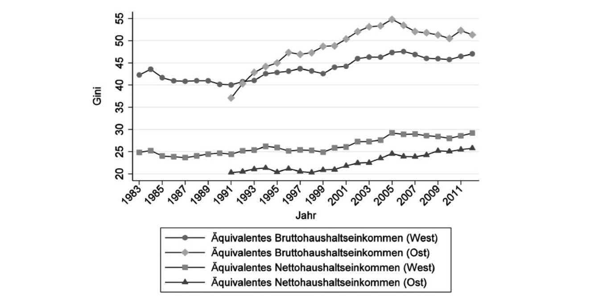
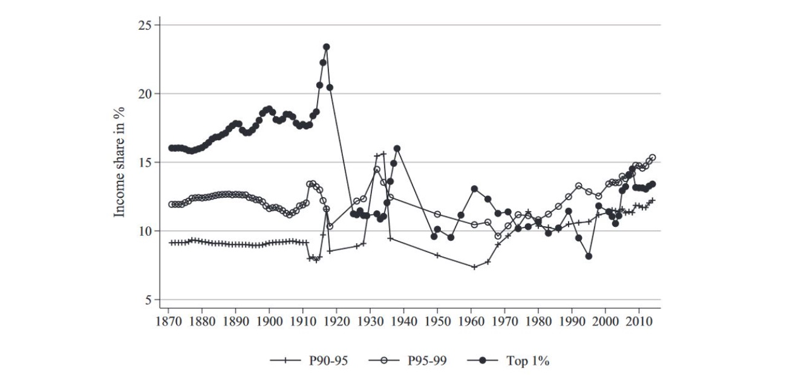
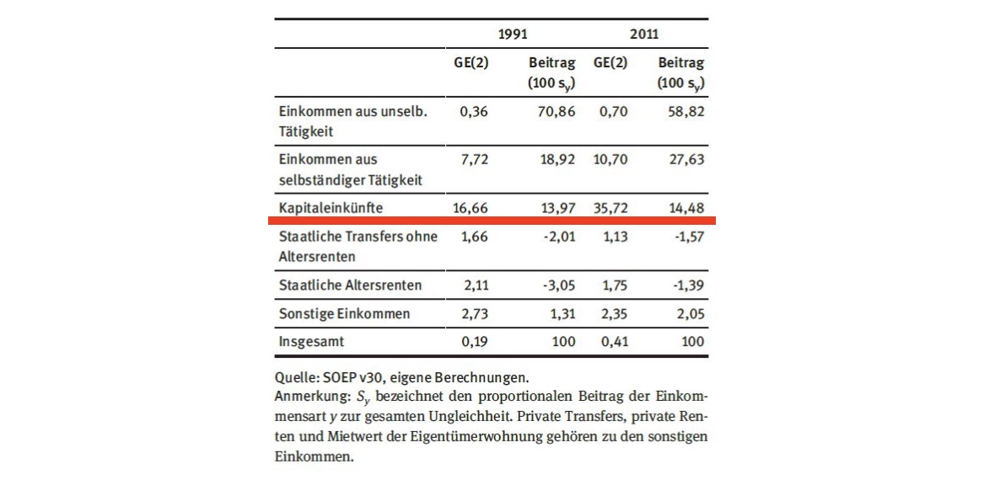
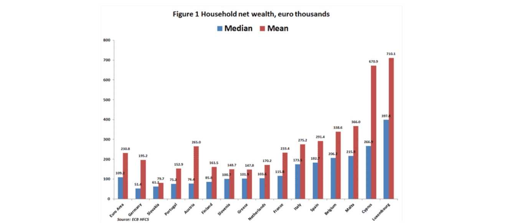
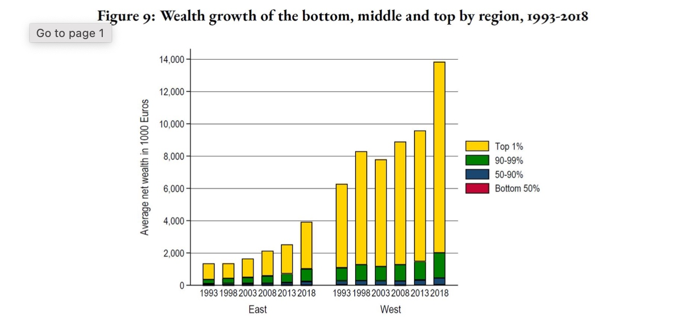
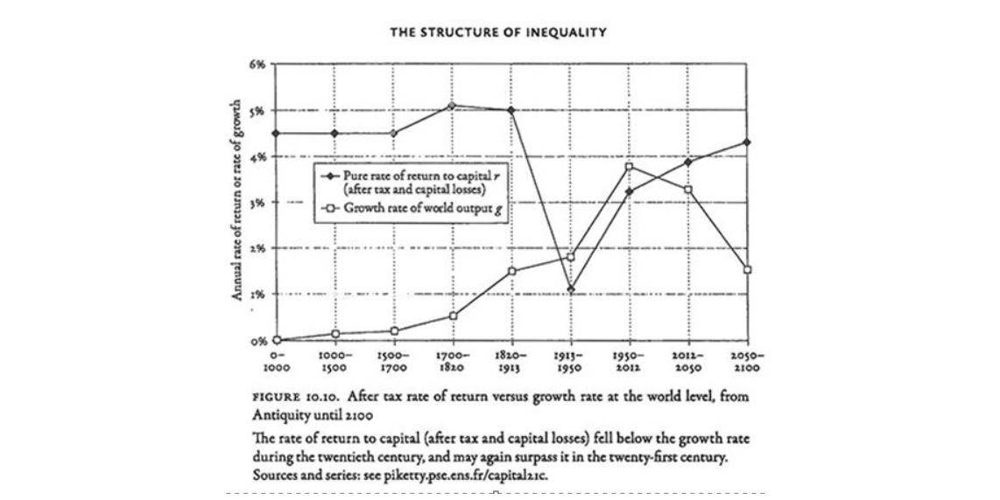

# 06.12.2022 Mobilität

## Intergenerational Mobility

Mobilität zwischen Generationen

$$
log(y_{child}) - log(\bar{y}) = \beta \cdot(log(y_{parent})-log(\bar{y}))+\epsilon
$$

- $\beta = 0$: komplette Mobilität, Elternhaus hat keinen Einfluss
- $\beta = 1:$ Einkommen Eltern = Einkommen Kind

= *Intergenerational Income Elasticity*

INtergenerational Correlation Coefficient: 

$$
\rho = \beta \frac{LogVar_{Parent}}{LogVar_{Child}}
$$

- Anpassung von $\beta$ um Veränderungen in Ungleichheit beider Generationen
- Idee: Ungleichheit sinkt-> Kind nah an Elterneinkommen = höherer Wert

## Lifetime Mobility

`Wie hat sich Position eines Individuums in der Einkommensverteilung über Zeit verändert?`

- Korrelation der Ränge in Einkommensverteilung
- mithilfe von Spearman Rangkorrelationskoeffizient
- Kovarianz der Ränge und Standardabweichungen
- geringe Sensitivität für Ausreißer

$$
\rho = \frac{Cov\Big[r(y_1), r(y_2) \Big]}{s_r(y_1) \cdot s_r(y_2)}
$$

- $p = -1$: Inverser Zusammenhang: arme werden reich
- $p = 1$: keine Veränderung
- $p = 0$: perfekte Mobilität = kein Zusammenhang

## Übergangsmatrizen

Wahrscheinlichkeit, dass Individuum Klasse wechselt

hier Beispiel mit Median *m*: 

- $p_{ba}$: in Periode 1 unter Median m, in Periode 2 über (=Aufstieg)
- Hauptdiagonale = Stayers = keine Bewegung
- je höher Werte auf Hautpdiagonale (**Spur/Trace**) = geringere Mobilität

*Shorrocks Transition Matrix Mobility Index* einer Matrix **P**

$$
S = \frac{N_{class}-\text{trace}(P)}{N_{class}-1}
$$

- Fehlende Mobilität: S=0
- Komplette Mobilität: $S=\frac{N_c}{N_c-1}$

Matrix USA: 

## Machine Learning

nach Brunori et al (2018): Mustererkennung mit ML

Daten aus EU Survey of of Income and Living Conditions:

- Geburtsort
- Bildung Eltern
- Berufe Eltern
- Eigenheim Eltern
- => nur nicht selbst beeinflussbare Faktoren!

mit *Regressionsbaum*

- Bildung/Beruf des Vaters wichtigste Variable
- dann Bildung Mutter und Rest

Gini der durch Umstände bestimmte Einkommen = 0.07 (in Deutschland)

macht etwa 25% des Ginis in DE aus = **Inequality of Opportunity**

## Einkommensungleichheit in Deutschland

im OECD-Vergleich:

- hohe U. bei Bruttoeinkommmen
- niedrige U. bie Nettoeinkommen

Historisch:

- Westd. bis 1990 gleich
- Dynamik seit Wiedervereinigung
- Anstieg seit 00er Jahre
- Ostd. höhere U. als West Brutto, aber nciht Netto

Anteile der oberen Gruppen: 

Anteile der Einkommen und ihr GE = Generalized Inequality Index:

- größte Ungleichheit = Kapitaleinkünfte
- größter Anteil: Selsbtständige Arbeit

Gründe für Ansteig seit 90ern:

- Niedriglohnsektor (Hartz IV)
- Outsourcing
- Gewerkschaftsschwund

**Lebenszeiteinkommen** mit Daten aus Rentenversicherung

- steigende U.: 1930-Gen = 0.16, 1950er = 0.21
- inter-generative Lastenverteilung?

## Vermögensungleichheit

Deutschland Median und Mittelwert unter anderen EU-Ländern (EZB 2013)

Aber: Daten ungenau, und DE vom Durchschnitt auch weit oben

Ost vs. West:

- kein Wachstum untere 50%
- starkes Wachstum bei oberen 1% in beiden
- West 450.000€, Ost 200.000€

Beachte bei Vermögen: Altersprofil:

- Höhepunkt. ei 60/70 Jahren
- Beginn negativ (Verschulden bei Berufseinstieg)
- aber erklärt nicht Top 1%

### Piketty

 Aurot von:  *"Capital in 21st. Century"*

Zentrale These zu Vermögenskonzentration: $r > g$

- Kapitalrendite r übersteigt
- Wirtschaftswachstum g

Historisch:

- bis 1900: Rendite=5% (Landrente) und kein Wachstum
- 1900-1970: Wachstum hoch (Wirtschaftswunder) und Regulierung
- seit 1970: Wachstum schwächer und weniger Regulierung

Kritik: Acemoglu und Robinson (2015)

Forderungen:

- progressive Vermögensteuer (von 0.1 - 2%)
- Einkommensteuerspitzensätze bis 80%

