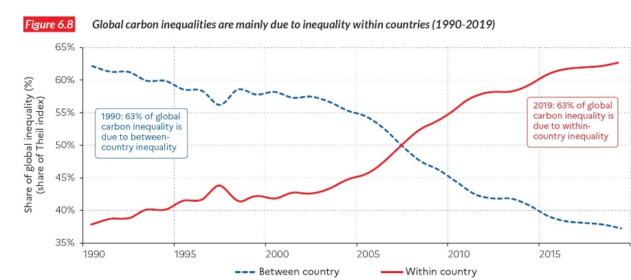

# 24.01.2023 Umweltpolitik

Prinzipien der Umweltpolitik:

- **Verursacherprinzip** 
- **Gemeinlastprinzip:** wenn Verursacher nicht auffindbar, dann Gemeinheit
- **Vorsorgeprinzip**
- **Kooperationsprinzip**

## Umweltpolitische Instrumente

1. Grenzwerte
    - verständlich und transparent
    - gut für wissenschaftliche Grenzwerte (bspw. bei klarer Grenze ab der schädlich)
    - keine Differenzierung, wenn stark / schwach unter Grenze
2. Steuern
    - klarer Lenkungseffekt
    - Einnahmen für Staat
    - Höhe der Steuer schwer bestimmbar
3. Zertifikatehandel
    - Marktmechanismus mit Angebot & Nachfrage
    - Anreiz zur Reduktion
    - Problem: Wirtschaftszweige mit untersch. Emissionsintensitäten

 

#### EU-Emissionshandel

- seit 2005
- CO2 Ausstoß von 10000 Anlagen
- Problem: zu Beginn Übernagebot weil hoher Cap

- 2013: Phase 3 mit neuen Regelungen
- 2019: Marktstabilitätsreserve
- 2022: mehr Sektoren
- inzwischen Handelsobjekt für Investmentfonds etc.

## Nachhaltigkeit und Verteilung

### Auswirkungen des Klimawandels

der Klimawandel trifft Weltregionen unterschiedlich

- insbesondere in Äquatornähe
- trifft Landwirtschaft dort stärker
- ebenso wie Extremereignisse 

Tage pro Jahr, die tödlich enden können (1-365 Tage pro Jahr)

### Anpassung an Klimawandel

*Adaptation* erfordert Geld, welches ärmere Länder nicht haben

- Resiliente Transportsysteme
- erneuerbare Energiesysteme
- Wasserinfrastruktur etc.

= :dollar: :dollar:

=> Verschärfung ohnehin ungleicher Auswirkungen

### Verteilung nach Ländern

ungleich zwischen Weltregionen (nach `Piketty, Saez, Zucman (2020)`)

aber: *territoriale Emissionen* vs *Carbon Footprint*

- Auswanderung von emissionsintensiven Industrien
- und Konsum von Ö, das in anderen Ländern raffiniert wurde

territoriale Emissionen pro Kopf:

und die Abweichung aufgrund von Produktion und Handel

### Verteilung nach Klassen

wie ist die Ungleichheit der Emissionen innerhalb der Länder?

- Unterscheidung der Emissionen nach Einkommensperzentil nach `Chancel (2021)`
- Unterscheidung aller Emissionen nach Sektoren: Haushalt, Unternehmen, Regierung

Ergebnisse:

- Elastizität Einkommen und Konsum: 0.5-0.7
    - erhöht sich Einkommen um 1%, dann Emissionsansteig um 0.5%

Ergebnisse nach Regionen: 

Ergebnisse weltweit:

- die obersten 10% / 1% tragen vor allem zu Emissionen bei
- übersteigt die der Mittelschicht stets

Welche Ungleicheit ist schuld an Emissionen?

- Zwischen Ländern 
- oder innerhalb von Ländern

seit 1990 zunehmend die neoliberale Ungleichheit innerhalb von Ländern

Umweltpolitik:

- Vermögensteuer, Kapitalsteuer etc. = doppelt nützlich
- Zugang zu grüner Energie = hilft vor allem Unter- und Mittelschicht
- ÖPNV / Sozialwohnungssanierung ist hilfreich

## Zusammenfassung Block III

- **IPAT Gleichung**: Multipliaktiv aus Bevölkerung, Wohlstand
- **Umwelt-Kuznets Kurve**: erst steigend, dann fallend
- **Klima-Solow-Modell**: Integration Temp, Emissionen, Einkommen
- CO2 Emissionen **ungleich verteilt**

