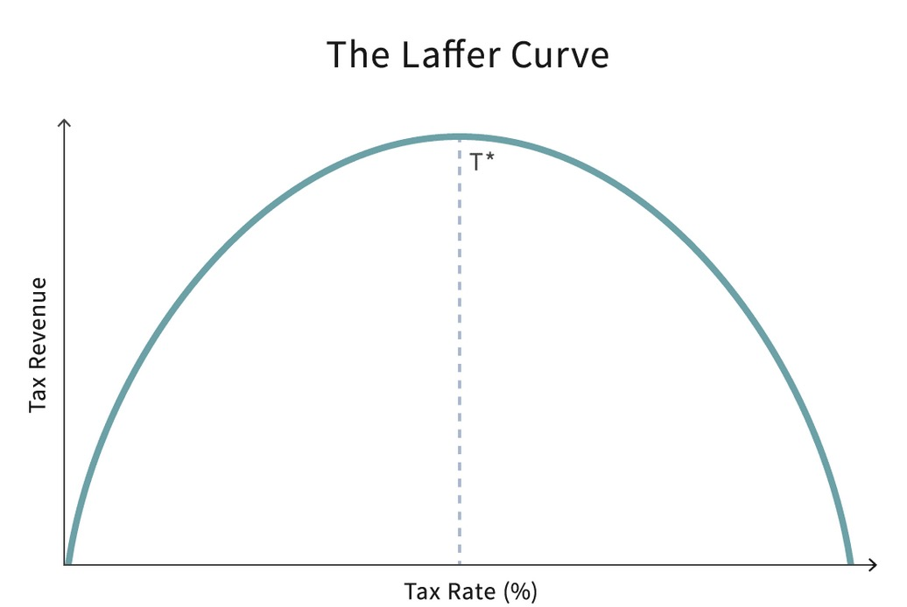
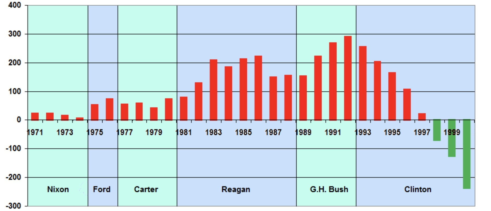

# 31.05.2023 Demokratie

## Laffer Curve

=> maximales Steueraufkommen = Steuern nicht 100%

**KRITIK:** Empirisch bringen Steuersenkungen nur Haushaltsdefizite (siehe Reagan)

## Regierungsformen

- Demokratie: Wiederwahlanreize
- Stabile Autokratie: Steuereinnahmen maximieren (langfristig)
- Unstabile Autokratie: kurzfrsitig Einnahmen 

Stabile Autokratie

- Reziprokregel: Steuereinahmen bis BIP = $1/t$
- Interesse an langfristigen Investitionen, wenn auch geringer als Demokratie

Demokratie: Rent Seeking

