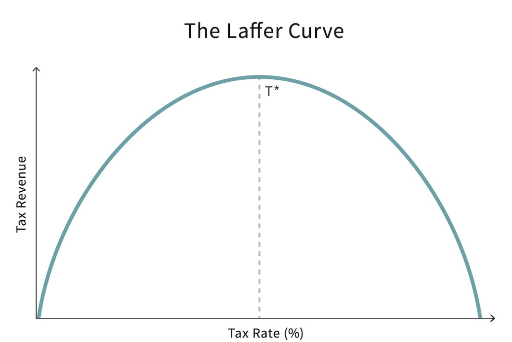
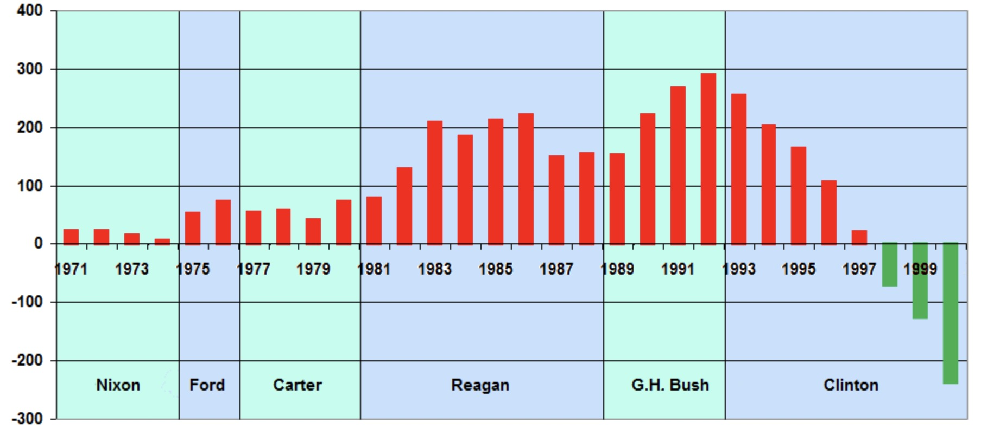
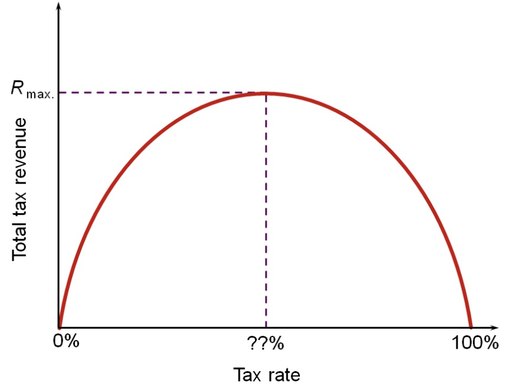

# 31.05.2023 Steuern

## Laffer Curve

=> maximales Steueraufkommen = Steuern nicht 100%

**KRITIK:** Empirisch bringen Steuersenkungen nur Haushaltsdefizite (siehe Reagan)

## Regierungsformen

- Demokratie: Wiederwahlanreize
- Stabile Autokratie: Steuereinnahmen maximieren (langfristig)
- Unstabile Autokratie: kurzfrsitig Einnahmen 

Stabile Autokratie

- Reziprokregel: Steuereinahmen bis BIP = $1/t$
- Interesse an langfristigen Investitionen, wenn auch geringer als Demokratie

Demokratie: Rent Seeking

## Mathematik dazu

optimiere: 
$$
C = t * Y(t,A)- A
$$

- *t* = Steuersatz
- *A* = Affluence

$$
\frac{ dC }{dA} = t * \frac{ dY }{dA}- 1 = 0 \\
\frac{ dC }{dt} = y- t \frac{ dy }{dt} = 0
$$

- marginaler Effekt 
- und inframarginaler Effekt

=> Demokraite: Bürger hat bei Wahl eigenes Bewusstsein, dass er Steuern zahlen muss...

