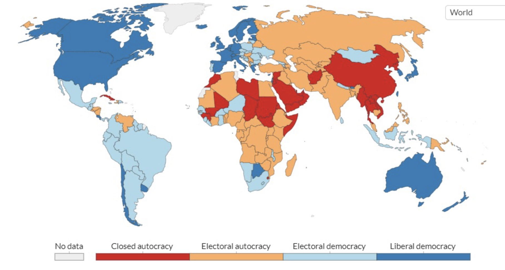
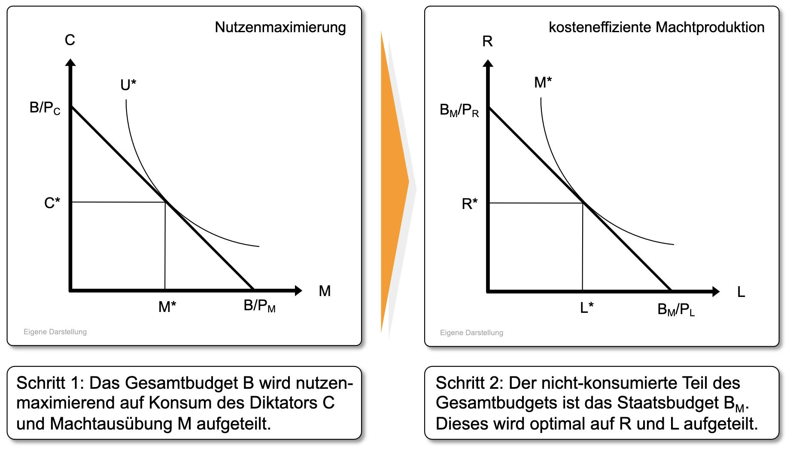
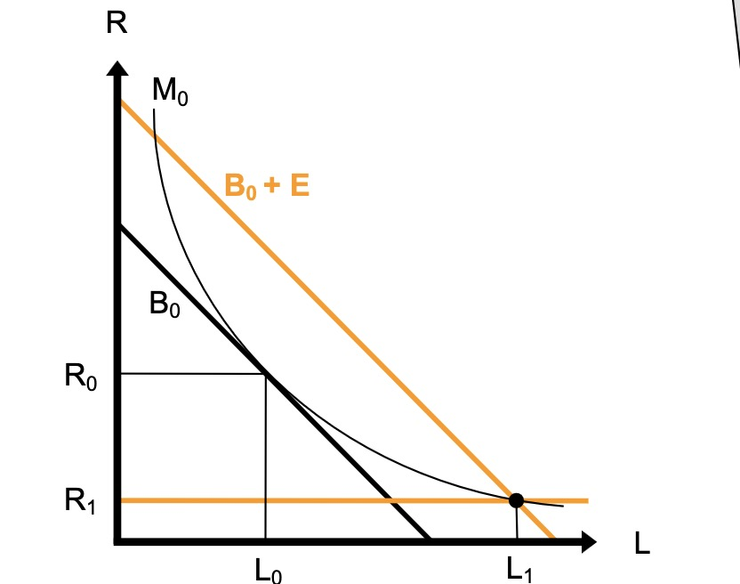

# 14.06.2023 Demokratie und Diktatur

Fakten:

- Demokratien in globalen Norden und Südamerika
- aber weniger als Hälfte der Weltbevölkerung lebt in Demokratie
- Frieden und Demokratie hängt stark zusammen

## Wintrobes reaktionsökonomisches Modell

politökonomisches Modell der Diktatur

Annahmen:

- Diktatoren wollen Machterhalt *M*
- und hohen Konsum *C*
- Produktionsfaktoren: Repression *R* und Loyalitätskauf *L*

### Entwicklungshilfe

mehr Ressourcen für *L*

- aber Regime Stabilisierung, 
- da höheres Machtniveau

=> positive Armutsbekämpfung

### Sanktionen

- Niedrigeres Repressionsniveau
- weniger Macht = instabileres Regime

=> negative Armutsbekämpfung

### Orthogonale Positionierung

Gibt es einen Tradeoff zwischen Armutsbekämpfung und Demokratieförderung?

Nein: konditionierte Hilfe

