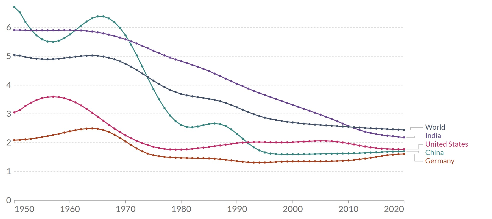
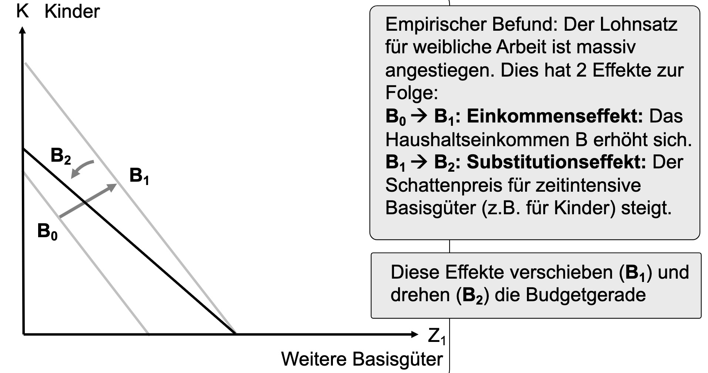
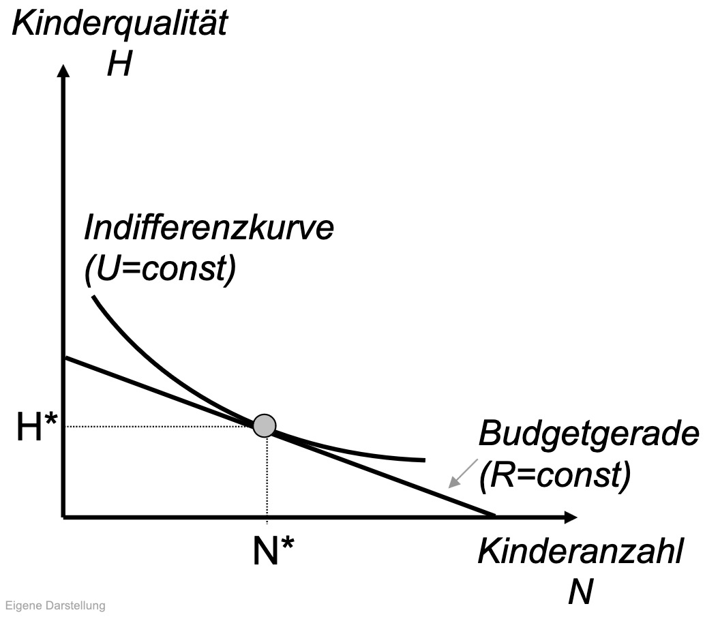
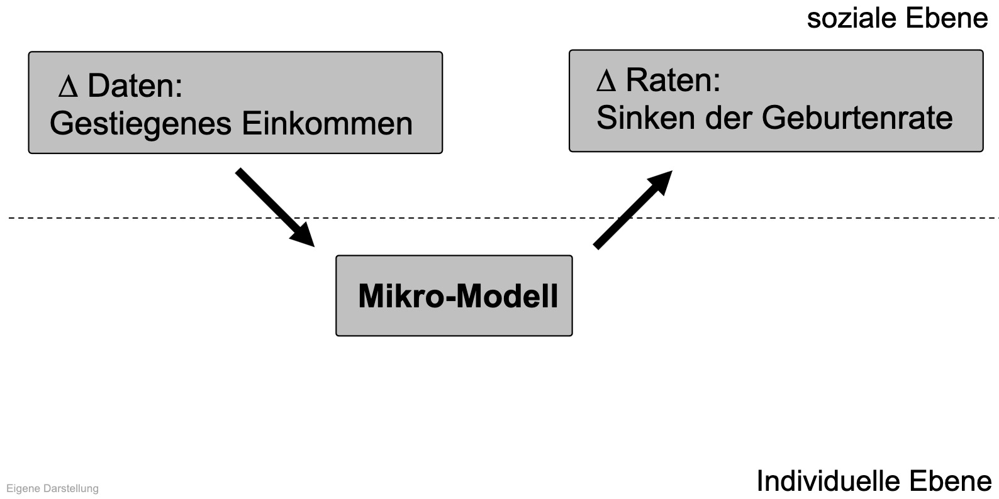
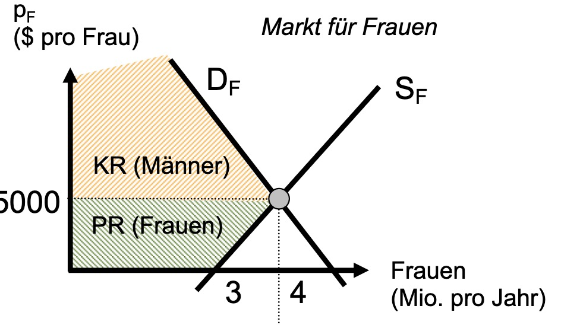

# 21.06.2023 Familienökonomik nach Becker

Becker: *Familie als Fabrik - Kinder als Kosten-Nutzen-Berechnung*

Früher: 

- viele Kinder
- als Versicherung im Krankheitsfall
- und Arbeitskräfte im Subsitenzbauernhof

Heute:

- wenig Kinder
- (Fast) keinen direkten ökonomischen Nutzen



## Opportunitätskosten

Moderne:

- Lohnsatz für Frauen steigt an
- Opportunitätskosten für Kinder steigen an

=> Kinder als langlebige Konsumgüter

- Nutzen: Affektiver Ntuzen (Liebe, Emotionen)
- Kosten: Ausgaben für Kinder und OK




wenn Substitionseffekt > Einkommenseffekt => HH nimmt Kinder

## Qualität von Kindern

Entscheidung: viele Kinder oder wenige mit hohem Humankapital?

- Budgetgerade: maximale Anzahl Kinder, die "hergestellt" werden können
- IDK: Kombination mit gleichem Nutzen



Sozialstaat:

- kostenlose Bildung = einfachere Qualitätsteigerung
- dadurch Anreizverschiebung


Modell von Becker:



**ACHTUNG!!:**

- Becker kann modernen Pillenknick nicht erklären?
    - was soll sich innerhalb weniger Jahre an den ökon. Umständen so verändert haben??!!
    - das 1,4 Mio auf 800k Geburten zurückgegangen ist
- außerdem: Kinderplanung ist oft nicht rational!
- Mikromodelle mit repr. Akteur für Makroerklärungen = **Müll**
    - kann offensichtliche Zusammenhänge nicht erklären


## Polygamie

= Vielehe (sowohl männlich als auch weiblich)

Betrachtung: vielen Gesellschaften = Aussteuer / Brautpreis etc.

Heiratsmarkt:



Krieg:

- weniger Männder
- überlebende = geringerer Preis für Frauen
- weniger PR für Frauen


Warum ist Polygamie dann in sexistischen Gesellschaften Standard?

- Rente der Frau geht an Familie (Patriarch / Vater)
- Frau profitiert nicht von Polygamie


## Text

```
title: Der familienökonomische Ansatz von Gary S. Becker
author: Notburga Ott 
date: 2008
```


Ausweitung der ökonomischen Theorie auf Bereiche außerhalb der Wirtschaft => Familie, Emotionen, Kinder

Vorwurf: ökonomischer Imperialismus

- Emotionen nicht rivalisierend
- Kosten Nutzen Analysen entzaubern die Familie

Konzept:

- Haushalt als Produzent von Produktionsfaktoren (statt Anbieter)
- “kleine Fabrik”

Ressourcen:

- Zeit
- Humankapital

=> Haushaltsproduktionskurve udn Optimum zw. Arbeit und Erziehung

Heirat:

- Suchprozess am Markt
- Partner mit optimalen Eigenschaften finden (teils komplementär, teils anti)
- Preis = Anteil am Ehegewinn
- Scheidung = Folge von Fehlkalkulation
    - wenn besseres Niveau erreichbar

Kinder:

- Zeitallokationsmodell
- Kinder = dauerhafte Konsumgüter
    - Nutzen = immateriell (Emotionen)
    - Kosten = Zeit (statt Arbeit)
- steigender Lohn = steigende OK von Kindern
    - bessere Kinder statt Vieler
- Nutzen außerdem: Arbeitskraft, Altersvorsorge

Haushalt:

- durch Innovation: Hausarbeit wird einfacher
- Marktarbeit wird attraktiver
- Kindererziehung bleibt preisintensiv
- Ehe heute = weniger profitabl als früher

Probleme:

- inkonsistente Modellverwendung
- statisch statt dynamisch
- Erklärung von Tendenz zur Arbeitsteilung in Familie statt Spezialisierung

Alternative:

- verhaltenstheoretisch
- Koopeartion langfristig preiswerter
