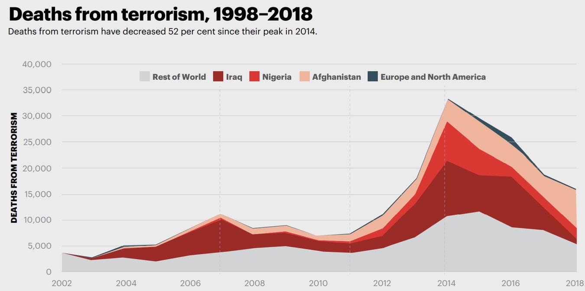
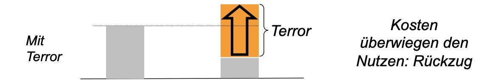
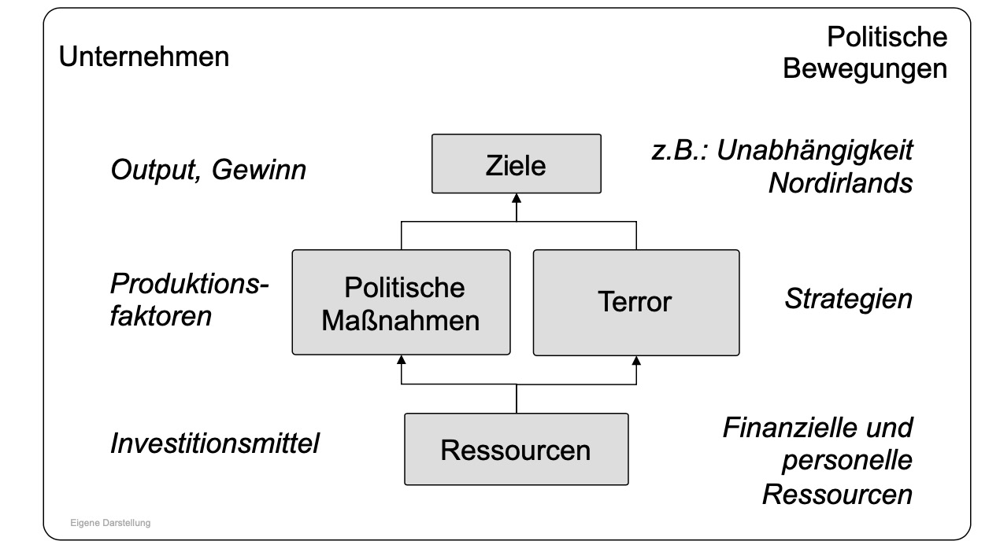
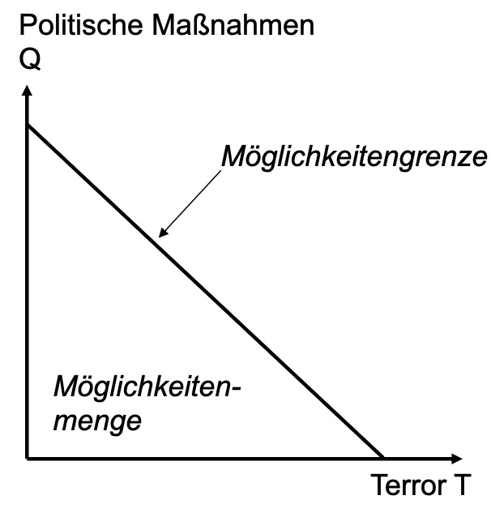
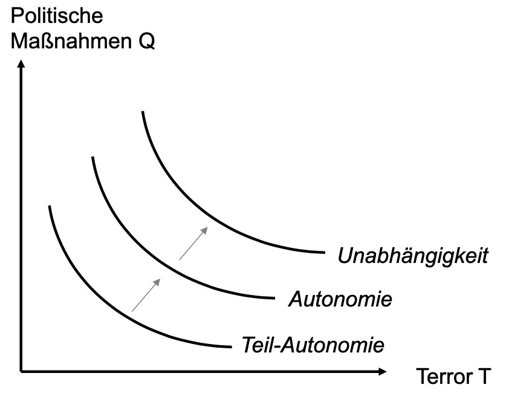
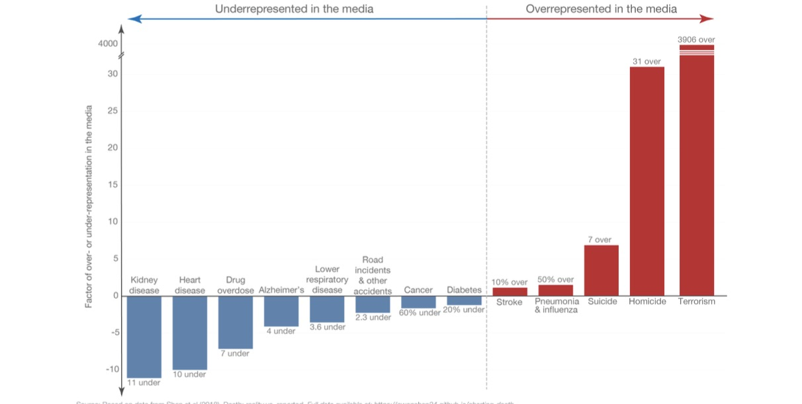

# 28.06.2023 Terrorismus

hier nur individueller Terrorismus

> **terrorism:** use of illegal force by non-state actor to attain political, economical goal trough fear

Tote durch Terrorismus

## Ziele

Kosten von Gegenseite hochtreiben

- damit Besetzung / Repression etc. aufhört
- durch Schwächung militarischer Kapaizität
- und zivile Opfer = moralische Kosten

meist im Miteinander mit politischem Arm (IRA, ETA, PA, ...)

## Kalküle

politische Bewegung = wie Unternehmen ?!?!?!?!?!?!? (gewagte These)

| Mittel                                                    | Ziele                                                     |
| --------------------------------------------------------- | --------------------------------------------------------- |
|  |  |

=> Bewegung entscheidet, wie sie Ressourcen verteilt

## Bekämpfung

- Steigerung der Kosten von Terrorismus
- bessere politische Partizipation der Bewegung

Problem: oft nicht gewählte Strategie

- eher politische Bekämpfung
- und dann wird Terrorismus "billiger"

## Selbstmordattentäter

Sind sie rational? **Nein**

Irgendwo hörts aber auch mal auf

## Medien und Terror

Überrepresäntierung von Erreignissen, die nicht häufig passieren

Warum: Dilemma

| *Reißerisch berichten?* | Berichten | nicht Berichten |
| ----------------------- | --------- | --------------- |
| **Berichten**           | [2,2]     | 1,4             |
| **Nicht Berichten**     | 4,1       | 3,3             |

