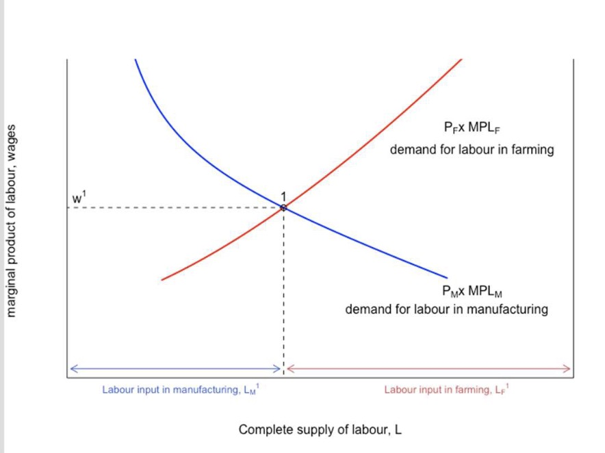
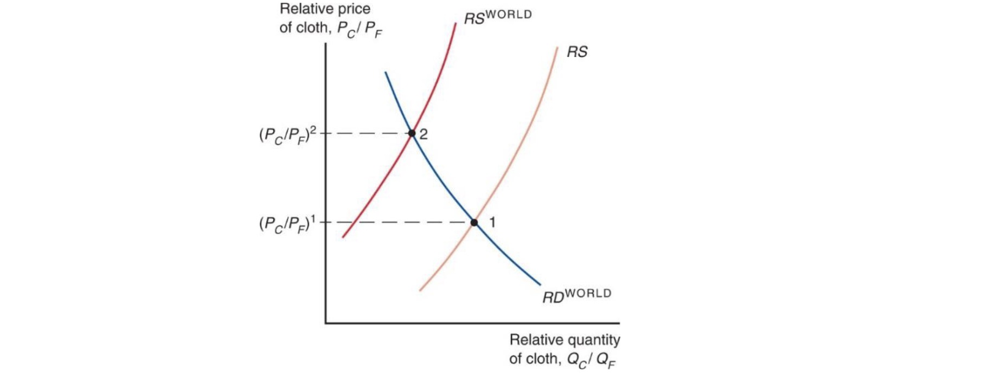
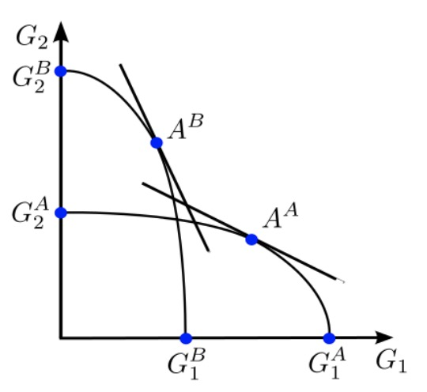
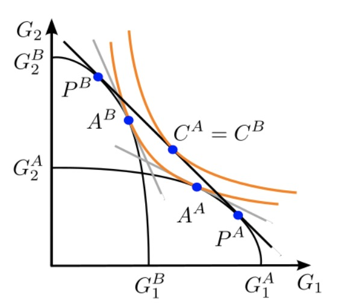
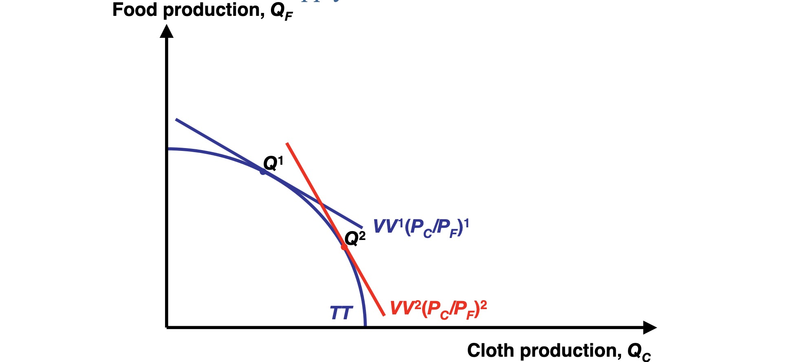
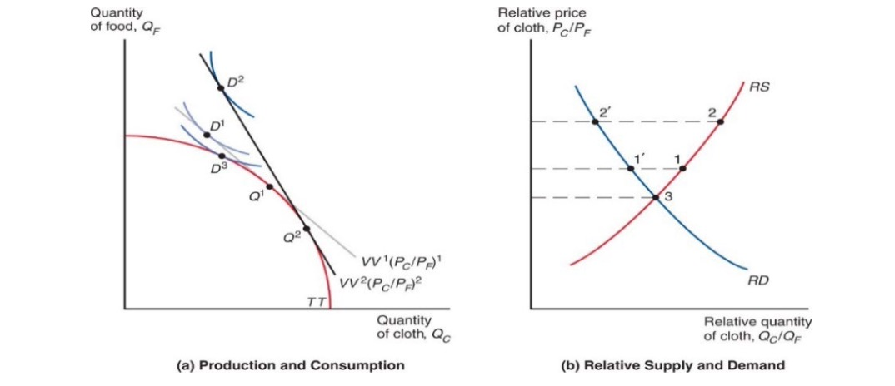

# International Economics Zusammenfassung

## Definitions

> **Global Trade:** Sum of trade activities both within and between countries

Types of Trade:
| intraregional Trade                                          | interregional Trade               |
| ------------------------------------------------------------ | --------------------------------- |
| between members of economic integration space (EU, USA, country) | between different economic spaces |

> **Foreign Trade:** trade relations across borders

> **Foreign Trade Theory:** explanation of occurence / impacts of foreign trade

Reasons for trade:

- cost benefits
- expansion of range
- More availibility of goods

## Gravity Model

Amount of Trade between two countries
$$
T_{ij} = A \frac{ Y_i Y_j }{D_{ij}}
$$
other Factors

- Geography 
- cultural affinity
- borders
- multinational corp

## Ricardo Model

### Assumptions

- one factor: labor
- differing productivity across countries
- supply = constant
- two goods (e.g cheese and wine)
- wage = price of output

### Definitions

- amount of labor to produce a good: $a_{LGood}$
- wage = $\frac{ P_C }{a_{LC}}$
- Production Possibility Frontier = line
    -  maximum amount of goods, producible by fixed input of factors
    - $a_{LC}Q_C + a_{LW}Q_W$
- opportunity costs: $\frac{ a_{LC} }{a_{LW}}$ = O.C of cheese
- relative price: $\frac{ P_C }{P_W}$ of cheese

### Trade

> **absolute advantage:** country produces good with lower factor inputs

> **comparative advantage:** country produces good with lower opportunity cost

Trade = possible when country has comp. advantage, not just absolute advantage!

| O.C and Relative prices                                      | who produces cheese?                  |
| ------------------------------------------------------------ | ------------------------------------- |
| $\frac{ P_C }{P_W} < \frac{ a_{LC} }{a_{LW}}< \frac{ a_{LC}^* }{a_{LW}}^*$ | Nobody                                |
| $\frac{ a_{LC} }{a_{LW}} \le \frac{ P_C }{P_W}< \frac{ a_{LC}^* }{a_{LW}}^*$ | Home Country                          |
| $\frac{ a_{LC} }{a_{LW}}\le \frac{ P_C }{P_W}= \frac{ a_{LC}^* }{a_{LW}}^*$ | Home Country + partly foreign country |
| $\frac{ a_{LC} }{a_{LW}}< \frac{ a_{LC}^* }{a_{LW}}^* < \frac{ P_C }{P_W}$ | both countries completely             |

### Results of Trade

| Misconception                                         | Reality (in this Model)                                  |
| ----------------------------------------------------- | -------------------------------------------------------- |
| Trade only good for productive countries              | unproductive countries = lower wage = advantage          |
| Trade exploits less productive countries              | better than without, cheaper goods                       |
| trade only good for low wage countries, not high wage | increase wage in efficient industry in high wage country |

## Specific Factors Model

### Assumptions

- 3 factors (land, capital, labor)
    - labor = mobile
    - capital / land = specific to good
- two goods / industries 
    - Food = labor + land
    - Cloth = labor + capital
- perfect competition + full employment
- countries differ by many things (productivity, endowments etc.)

### Definitions

- PPF = curve
    - diminishing returns when concentration in one industry
- Marginal Product of Labor $MPL$ = diminishing
- Marginal value = wage = $P_F \times MPL_F$

| PPF                                                       | Allocation of Labor                       |
| --------------------------------------------------------- | ----------------------------------------- |
|  |  |

### Trade

Amount of Goods traded depends on relative Supply supplied: $RS = \frac{ Q_C * Q_C^* }{Q_F* Q_F^*}$

Situations:

| relative quantities      | Result                              |
| ------------------------ | ----------------------------------- |
| $RS_{home} < RS_{world}$ | $\implies P \uparrow, Q \downarrow$ |
| $RS_{home} > RS_{world}$ | $\implies P \downarrow, Q\uparrow$  |

### Results of Trade

Example: Price rises of Cloth

- Output rises
- capital owners profit
- labor shifts from food to cloth
    - wage does not rise as much as price (%)
- worker profit = depends on preferences

- Results depend on if sector is export or import sector
- Budget Constraint above PPF = achievable 

## Heckscher-Ohlin Model

### Assumptions

- two goods (food and clothing)
- two factors = mixed across goods
- free capital / labor mobility
- countries only differ by endowments

### Definitions

- Production of Good depends on Production Function $Q_C = f(K,L)$
- Capital-intensive industry (cloth): $\frac{ a_{KC} }{a_{LC}} > \frac{ a_{KF} }{a_{LF}}$
- PPF
    - $V = P_C*Q_C+P_F*Q_F$
    - $K \ge a_{LF} Q_{LF}+a_{LC}Q_{LC}$ (Capital allocation across sectors)
    - smooth curve!
- Producers: choose factors based on wage and r (interest)
- higher wage = offset by more capital input

### Trade

- Countries produce goods intensive with their abundant factor
    - e.g USA = capital abundant = produce computer
    - Bangladesh = labor abundant = produce clothes
- moves Relative Supply (like in Specific Factor)
- same preferences = same consumption after trade

| Autarky                                                   | Trade                                     |
| --------------------------------------------------------- | ----------------------------------------- |
|  |  |

shows two different countries (A & B) with factors ($G_1$ & $G_2$)

### Results of Trade

- prices converge
- countries specialise 
- Owners of abundant factor profit (capitalists in US, workers in Bangladesh)
- other factors = less produced = diminishing returns
- redistribution across owners, not industries!

## Standard Model

generalizes all models (with others as special cases)

### Assumptions

- two goods
- each country individual PFF, differences between
    - factor endowment
    - technology / productivity

### Definitions

- PFF = smooth curve
- production depends on relative price $\frac{ P_F }{P_C}$ and
- Indifference Curve of Consumers

different isovalue lines and PPF

### Trade

- depends on relative prices
- and *Terms of Trade* $= \frac{ Price_{exports} }{Price_{imports}}$
    - rise = good for welfare of country
- Allows higher IDK than without

### Results of Trade

- grows economy (mostly biased growth)
- depends if growth in export or import sector
    - export biased growth = higher ToT = welfare gain
    - import biased growth = lower ToT = welfare loss

## Model Comparison

| Model           | Assumptions         | differences between countries | Time perspective |      | winners of trade                    |
| --------------- | ------------------- | ----------------------------- | ---------------- | ---- | ----------------------------------- |
| Ricardo         | one factor, 2 goods | labor productivity            | short run        |      | everybody                           |
| Specific Factor | 3 factor, 2 goods   | Productivity / factors        | medium run       |      | export industries and their factors |
| Heckscher Ohlin | 2 factor, 2 goods   | Endowment of Factors          | long run         |      | owners of abundant factors          |
| Standard        | 2 factor, 2 goods   | Everything                    |                  |      | Depends                             |

- 3 models = 3 time frames of factor mobility
    - ricardo = immobile = short run
    - specific factor = partly mobile = medium run
    - heckscher = very mobile = long run
- shock is dynamic over time frame

## Theorems

all in the Heckscher Ohlin Model

> **Heckscher-Ohlin Theorem**: countries specialize in goods that use its abundant factor intensively

e.g Bangladesh labor-abundant = clothes production

> **Stolper-Samuelson Theorem:**  Rise in relative price of good => higher return to factor used intensively & lower returns for factors of other good

e.g higher price for clothes => higher wages for clothes workers & lower returns for land owners in food production

> **Rybczynski-Theorem:** if prices constant and amount of one factor rises => Quantity of good using factor intensively increases & other goods quantity decreases

e.g population rise in Bangladesh => more clothes produced & even less food production

## Instruments

