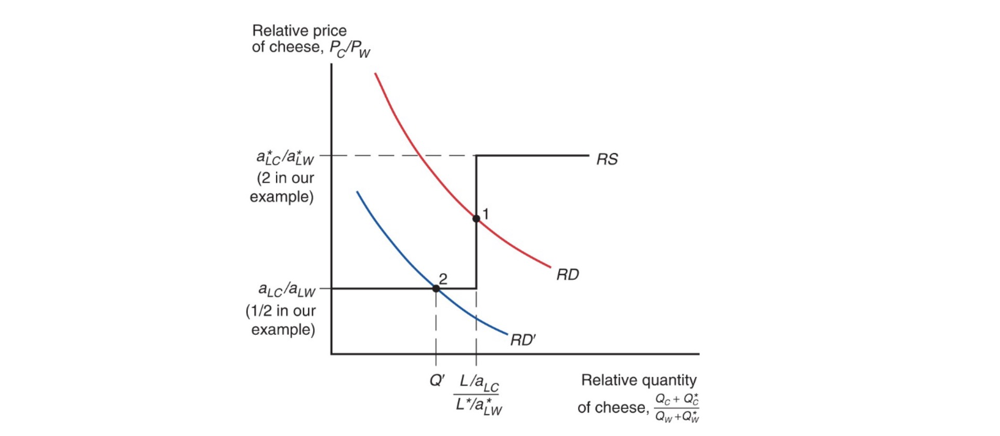
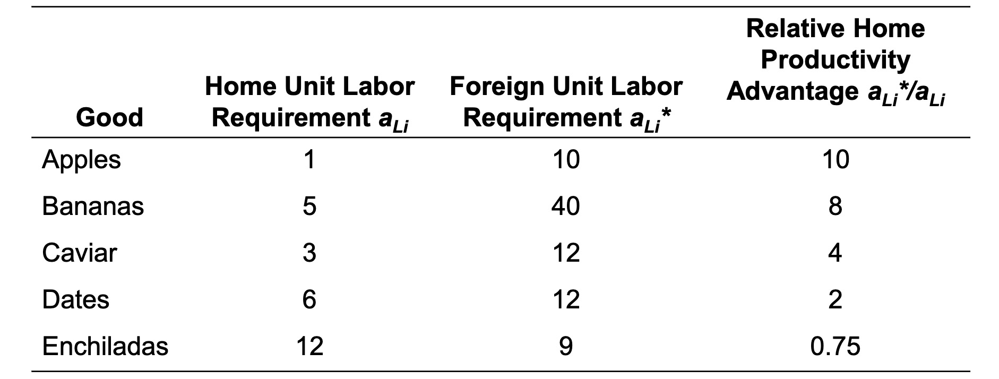
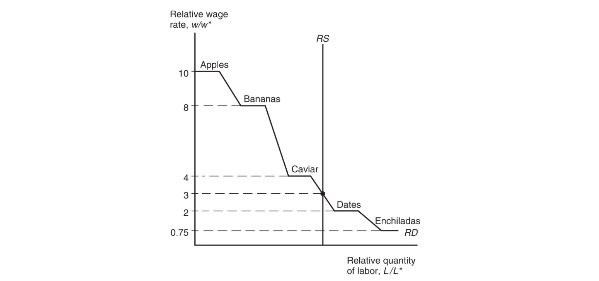

# 04.05.2023 Ricardo Model

Continuation from Last Week

## Gains of Trade Example

trough specialization

- higher wages (at least one side)
- higher income (for other goods)

### without Trade

| Unit labor requirements | Cheese           | Wine                 |
| ----------------------- | ---------------- | -------------------- |
| **Home**                | **1** hour / lb  | **2** hours / gallon |
| **Foreign**             | **6** hours / lb | **3** hours / gallon |

| Results without Trade (L=3000) | Cheese | Wine |
| ------------------------------ | ------ | ---- |
| **Home**                       | 1500   | 750  |
| **Foreign**                    | 250    | 500  |

### Opportunity Costs

- Home: $\frac{a_{LC}}{a_{LW}} = \frac{1}{2}$ (one cheese = one half gallon of wine)
- Foreign: $\frac{a_{LC}^*}{a_{LW}^*} = 2$

Comparative Advantage

- Home: $\frac{a_{LC}}{a_{LW}} < \frac{a_{LC}^*}{a_{LW}^*}$ => cheese advantage
- Foreign: $\frac{3}{6} =  \frac{a_{LC}^*}{a_{LW}^*} < \frac{a_{LC}}{a_{LW}} = 2$ => wine advantage

| Opportunity Costs | Cheese  | Wine      |
| ----------------- | ------- | --------- |
| **Home**          | 1/2     | 2         |
| **Foreign**       | 6/3 = 2 | 3/6 = 1/2 |

### Trade

Prices

- somewhere in between for both goods
- maybe $\frac{P_C}{P_W}= 1$, so one cheese for one wine

Result

- Home Price of Cheese rises
    - before: 2 cheese for 1 wine
    - after: 1 cheese for 1 wine

Absolute Result (L = 3000)

- Production Home: 3000 cheese
    - Trade as much as possible for wine
- Production foreign: 1000 wine
    - trades half of it for cheese

| Results after Trade | Cheese | Wine |
| ------------------- | ------ | ---- |
| **Home**            | 2500   | 500  |
| **Foreign**         | 500    | 500  |

### Wages

with $P_C = 12\$, P_W = 12\$$

- home wages: $\frac{P_C}{a_{LC}}=\frac{12}{1}=12\$ / hour $
- foreign wages: $\frac{P_W}{a_{LW}}=\frac{12}{3}=4\$/ hour$
- relative Wage home workers: $\frac{12}{4}= 3$

both countries have cost advantage in Production:

- home: high productivity + high wages
- foreign: low prod. + low wages

=> rich countries can attain advantage in international trade

### Many Goods

- *w* = wage reat home country
- $a_{Li}$ = labor req. for good *i*
- relative home prod.´: $\frac{a_{Li}}{a_{Li}^*}$

Assumption: $\frac{w}{w^*}= 3$

- Apples, Bananas, Caviar = Home Production
- Dates, Enchiladas = Foreign Production

### relative Wage Determination

relative Supply of and derived demand for labor

Intersection of *RD* and *RS*

## Problems with Trade

### Reality: Wage and Productivity

Wages and Productivity do not go Hand in Hand (*Thanks Reagan*)

### Workers in Rich Countries

- Trade reduces wages for some workers in rich home countries
- affects distribution of income
- consumers benefit

### Ricardion Model Shortcomings

- More than one Factor (Capital)
- protectionism
- Transportation Costs reduce trade

