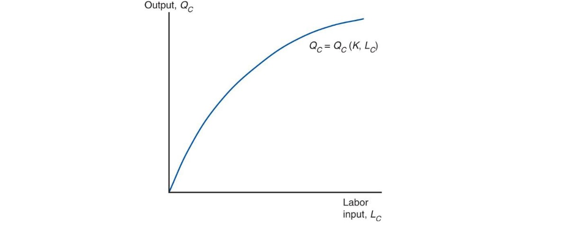
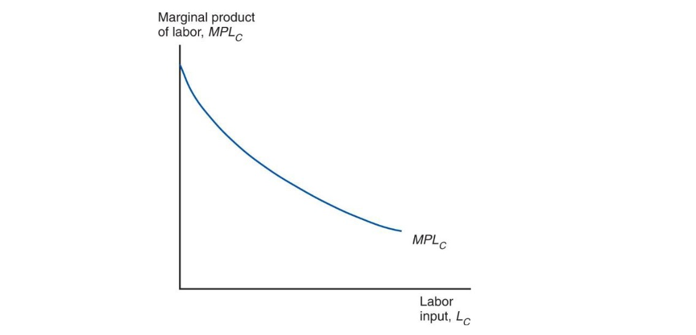
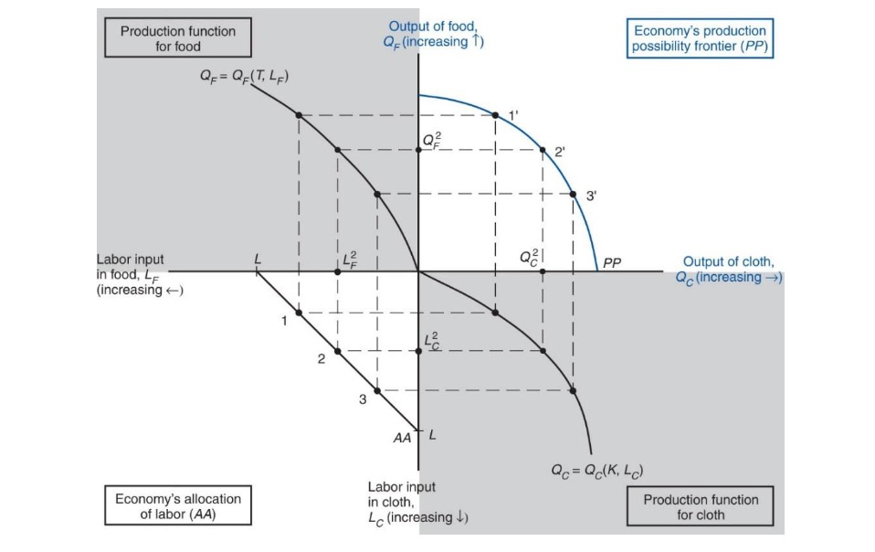
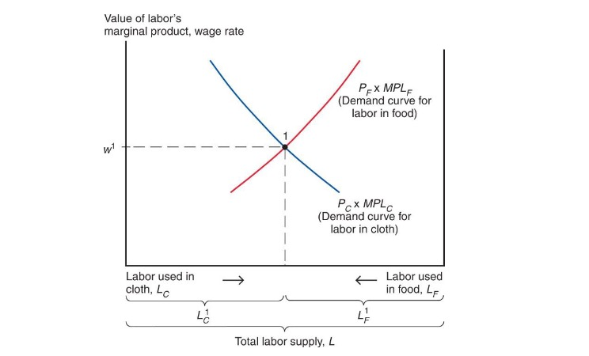
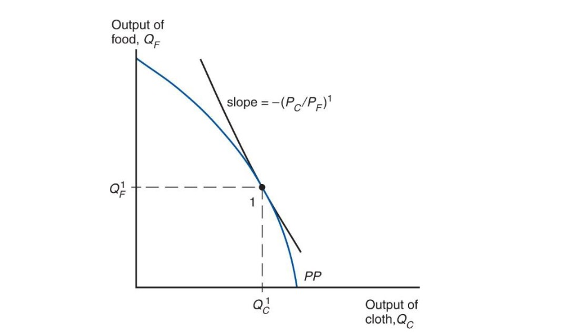
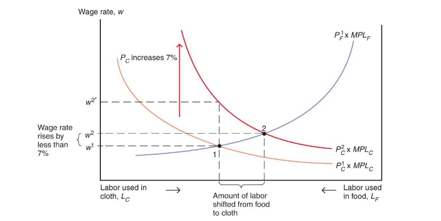
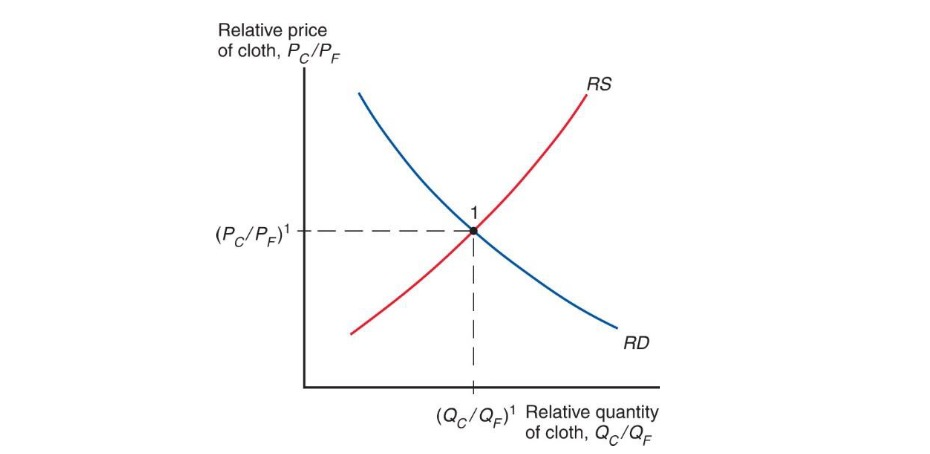
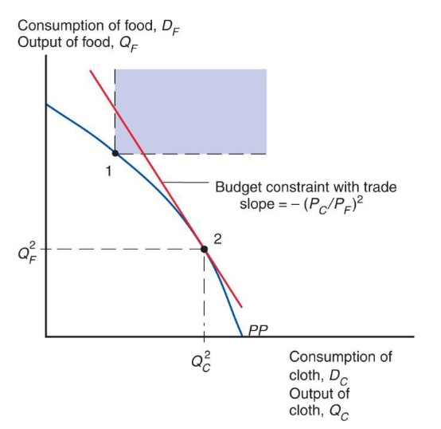

# 11.05.2023 Specific Factor Model

Model that allows income to be a part

## Assumptions

- two goods: cloth and food
- tree factors of production: *L, K, T* (land)
- perfect competition

## Definition

- Cloth Inputs: Capital + Labor (not Land)
- Food Inputs: Land + Labor
- Labor = mobile factor 

$$
Q_C = Q_C(K,L_C) \\
Q_F = Q_F(T, L_F)
$$

- more people employed in one production = more output
- but diminishing returns

Marginal Product of Labor: 

## Production Possibilites

- Labor split between Sectors
- $L = L_C+L_F$

Four-Quadrant Diagram for PPF

Quadrants:

- lower left: Allocation of Labor
- lower right: Production Cloth
- upper left: Production Food
- upper right: combinations of both

PPF sloped because of diminishing returns

opprtunity Costs of one more cloth

- is $\frac{MPL_F}{MPL_C}$ pounds of food
- need $\frac{1}{MPL_C}$ hours of labor
- to free up one hour: reduce food by $MPL_F$ units
- Result:
    - $MPL$ in Food rises (less workers there)
    - MPL in Cloth falls (more workers there = each less productive)
    - $\frac{MPL_F}{MPL_C}$ rises

## Labor Allocation

How much labor in each sector?

Demand: where MPL of one hour = Marginal Cost of one hour
$$
W = MPL_C \times P_C \\
W = MPL_F \times P_F
$$

- two sectors must pay same wage (mobility)
- Demand for Labor = $MPL_C$ (second Figure) times $P_C$

Wage = Equilibrium

### Production

at Production Point: PPF *tangent* to relative Prices
$$
-\frac{MPL_F}{MPL_C} = - \frac{P_C}{P_F}
$$

### Shocks

Change in relative Prices (not equal in goods)

If $P_C$ rises:

- labor shifts to Cloth Sector
- Output of Cloth Sector rises
- *w* rise not equal to rise in prices
    - Employment Increase = MPL falls
    - higher cost of employment

Economic Effect:

- Capital owners = profits rise
- Land owners = less profits
- Workers = depends
    - relative preference of cloth and food

## International Trade

Price determined by Relative Supply / Demand

Opening up:

- if RS in economy > RS in world economy 
- => price increase

Gains from Trade:

- allows mix of consumption
- different from production
- but spending = income from production

$$
P_C D_C + P_F D_F = P_C Q_C + P_F Q_F
$$

- Economy as whole profits
- Budget Constraint above PPF 

But:

- profits the non-mobile factor (K / T) of export sector
- mobile sector = ambiguos
    - produces losers and winners (consumers)
    - often hurts relatively poor workers (garment workers in DE)

=> **Redistribution** from winners to losers

## Unemployment

International Trade:

- Shifts jobs from import-competing to export sector
- temporary unemployment 

but unemployment = mostly macroeconomic

Instruments: 

- extended unemployment benefits
- skill acquisition financially supported

## International Labor Mobility

