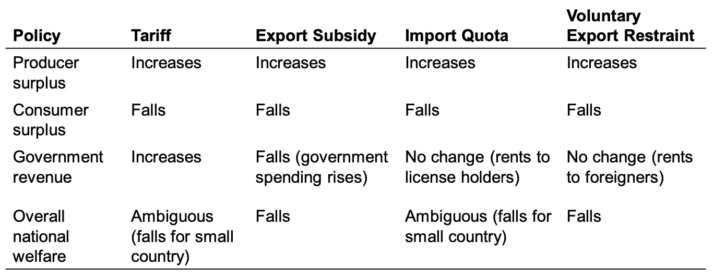
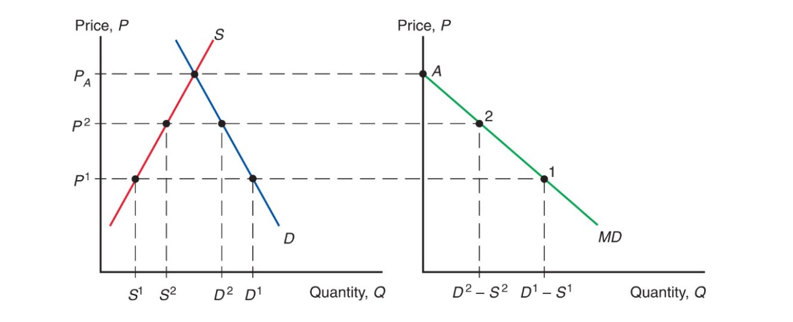
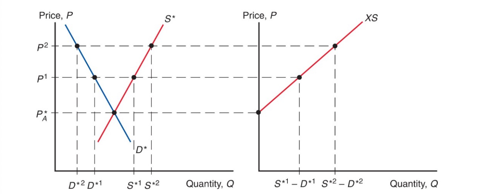
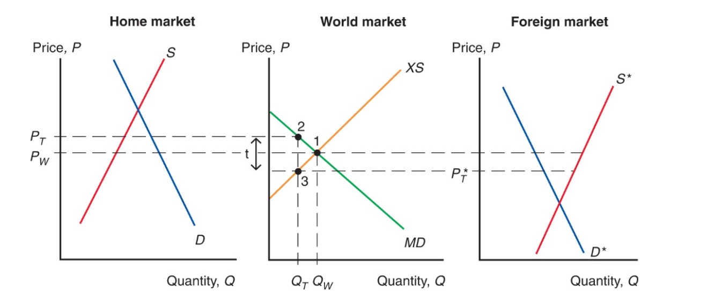
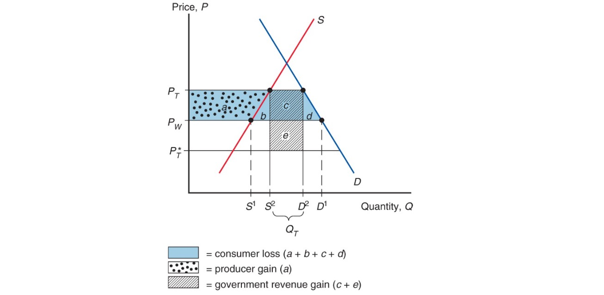
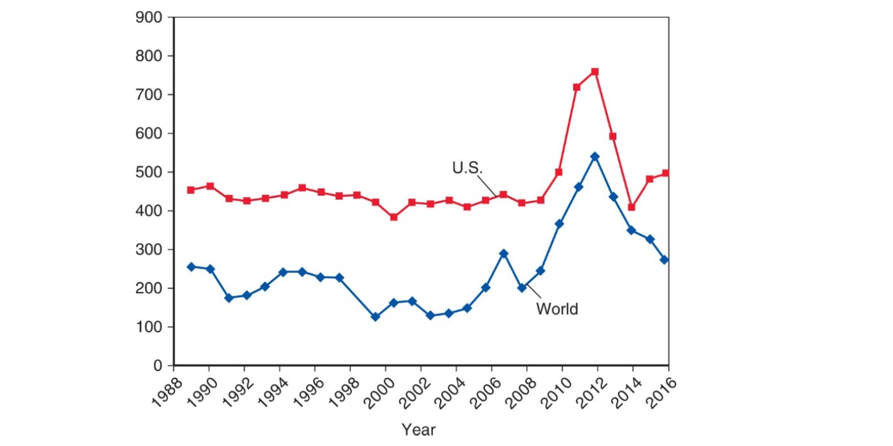

# 05.07.2023 Instruments of Trade Policy

Summary of all options:

## Tariffs

Types:

- specific tariff: per unit
- ad valorem: as % of value

Situation in one-good and tariff:

### Import Demand Curve

- where foreign price less than home
- $MD = D-S$
- downward sloping (higher world price = less imports)

### Export Supply Curve

- from perspective of foreign country
- $XS^* = S^*-D^*$
- upward sloping

Equilibrium: Import Demand = Export Supply

### Effects of Tariff

= Transportation Cost 

- unwilling to trade unless foreign price compensates tariff
- $P_t - t > P_t^*$
- higher price home, leser foreign

=> less traded, higher prices

- tariff increase not completely on home price
- of country small = no effect on world price = complete markup tariff

### Amount of Protection

> **effective rate of Protection:** Change in value added for producers after trade policy change, depends on price change of good

Example:

- before: 8000€ Cars with inputs 6000€ = **2000€** value added
- After: 25% tariff increase
    - price now: 10000€ (8000*1,25) for car
    - factor prices same = 10000-6000 = **4000€** value added
- rate of protection: $\frac{ 4000-2000 }{2000}=100\%$

Here: rate of protection > tariff rate

### Cost and Benefits

- consumers = higher prices
- producers = more profit
- government = tariff money

- *d+e* = efficiency loss
- *e* = terms of trade gain (lower foreign prices)
    - only possible for large countries

Problem: Retaliation and Wasteful activities

## Export Subsidy

Types: *specific* or *ad valorem*

- less government revenue
- lowers price in importing country: $P^* = P_s-S$
- higher price for home consumers

## Import Quota

Restriction of Quantity that may be imported

- no government revenue
- quota rents to license holders
- rents to producers, cost to consumers

US Sugar Prices vs. World

## Voluntary Export Restraint

> **Voluntary Export Restraint (VER):** quota imposed by exporting country on its exporting industry

- due to pressure by Importing Country
- Example: Japanese Cars in US Market
    - Price rose of japanese fuel efficient cars 
    - rent to japanese firms

## Local Content Requirement

> **Local Content Requirement:** regulation, that fraction of end product domestically produced

- either value terms of unit terms
- no revenues
- home producers of inputs like import quota
- home producers of outputs not as strict
- price diff average between no quota and import quota

