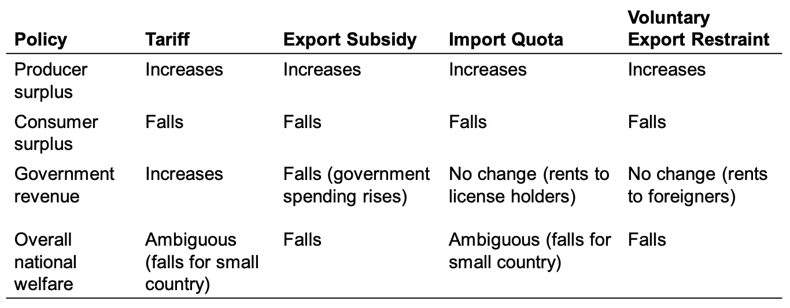
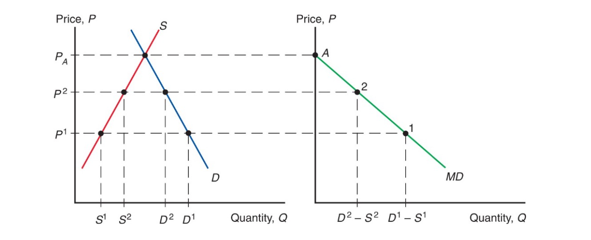
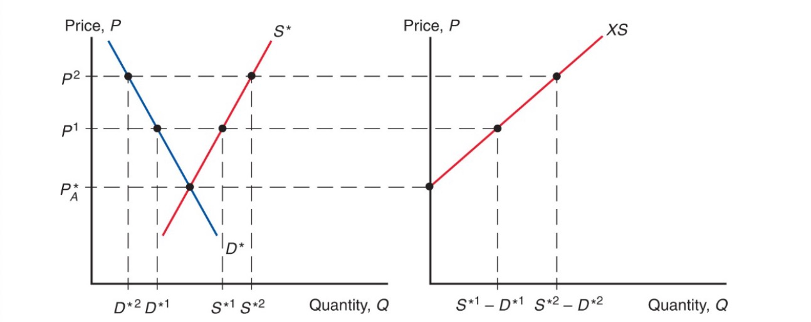
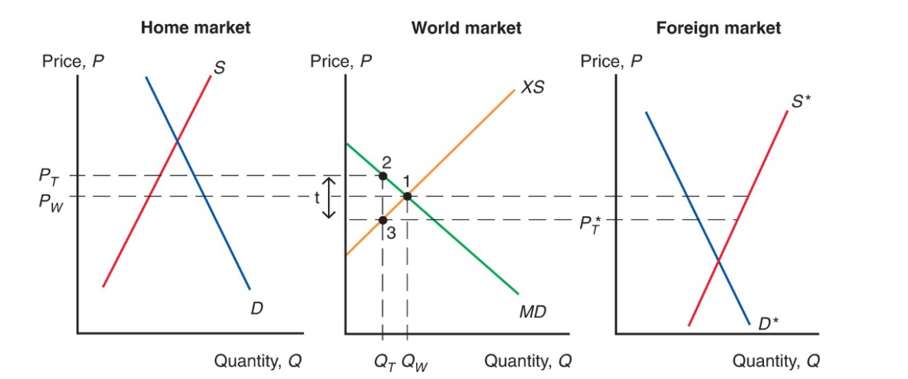
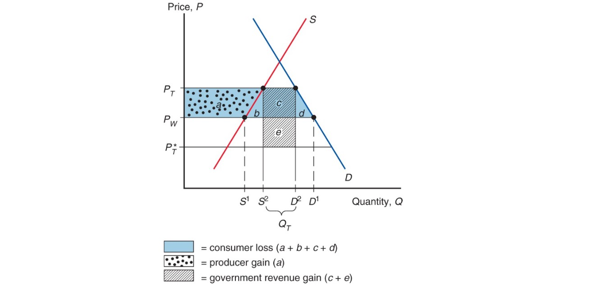
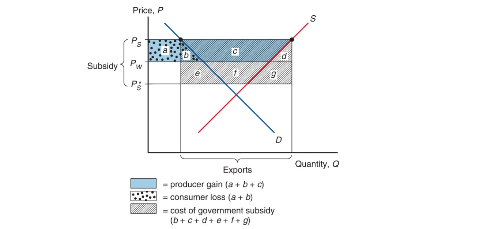
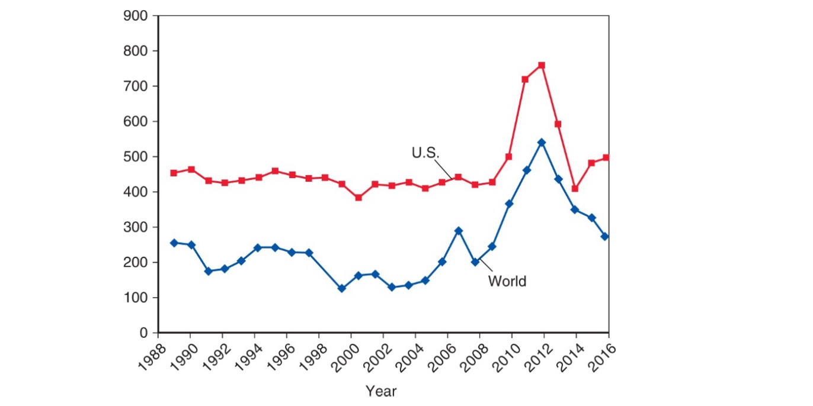
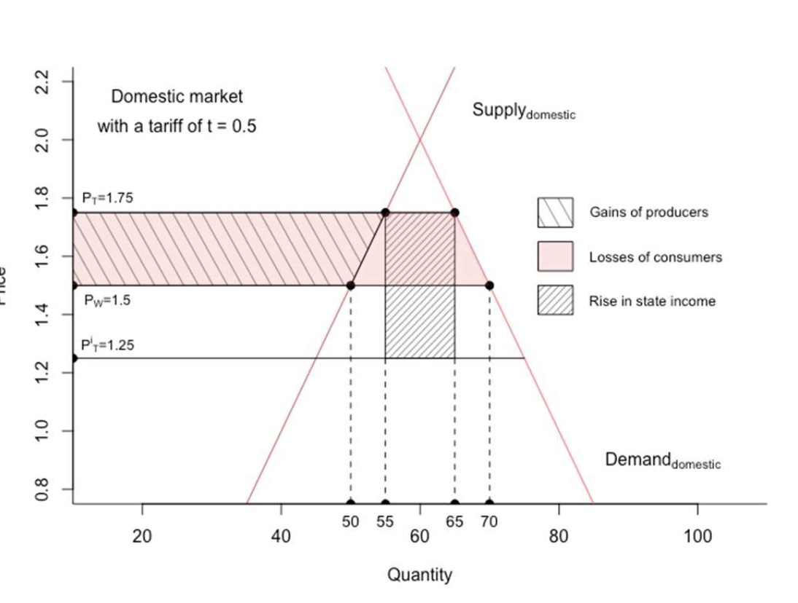
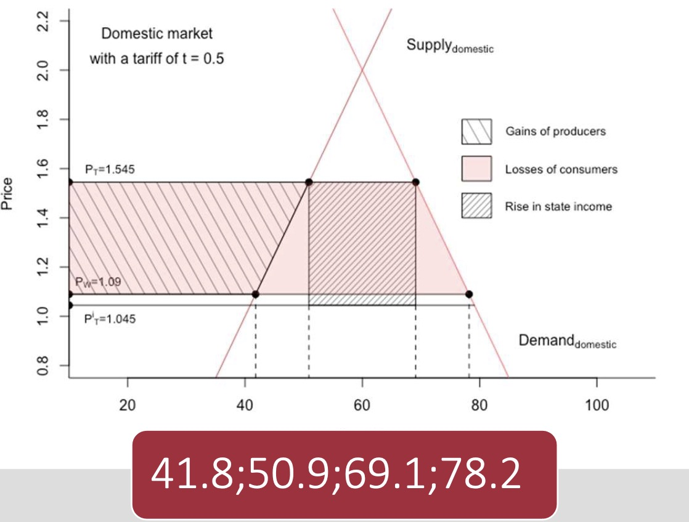
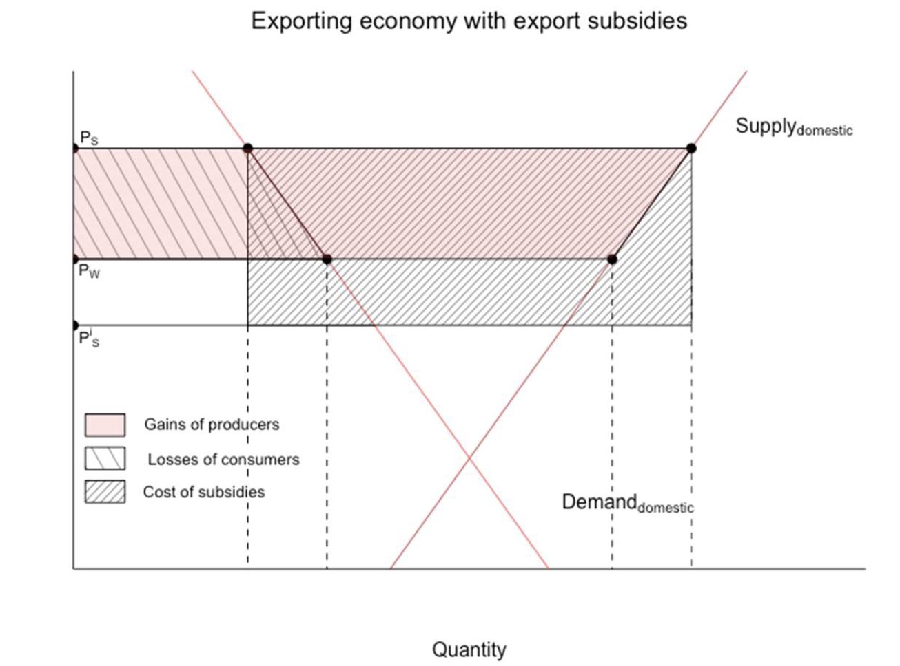

# 05.07.2023 Instruments of Trade Policy

Summary of all options:

## Tariffs

Types:

- specific tariff: per unit
- ad valorem: as % of value

Situation in one-good and tariff:

### Import Demand Curve

- where foreign price less than home
- $MD = D-S$
- downward sloping (higher world price = less imports)

### Export Supply Curve

- from perspective of foreign country
- $XS^* = S^*-D^*$
- upward sloping

Equilibrium: Import Demand = Export Supply

### Effects of Tariff

= Transportation Cost 

- unwilling to trade unless foreign price compensates tariff
- $P_t - t > P_t^*$
- higher price home, leser foreign

=> less traded, higher prices

- tariff increase not completely on home price
- of country small = no effect on world price = complete markup tariff

### Amount of Protection

> **effective rate of Protection:** Change in value added for producers after trade policy change, depends on price change of good

Example:

- before: 8000€ Cars with inputs 6000€ = **2000€** value added
- After: 25% tariff increase
    - price now: 10000€ (8000*1,25) for car
    - factor prices same = 10000-6000 = **4000€** value added
- rate of protection: $\frac{ 4000-2000 }{2000}=100\%$

Here: rate of protection > tariff rate

### Cost and Benefits

- consumers = higher prices
- producers = more profit
- government = tariff money

- *d+e* = efficiency loss
- *e* = terms of trade gain (lower foreign prices)
    - only possible for large countries

Problem: Retaliation and Wasteful activities

## Export Subsidy

Types: *specific* or *ad valorem*

- less government revenue
- lowers price in importing country: $P^* = P_s-S$
- higher price for home consumers

## Import Quota

Restriction of Quantity that may be imported

- no government revenue
- quota rents to license holders
- rents to producers, cost to consumers

US Sugar Prices vs. World

## Voluntary Export Restraint

> **Voluntary Export Restraint (VER):** quota imposed by exporting country on its exporting industry

- due to pressure by Importing Country
- Example: Japanese Cars in US Market
    - Price rose of japanese fuel efficient cars 
    - rent to japanese firms

## Local Content Requirement

> **Local Content Requirement:** regulation, that fraction of end product domestically produced

- either value terms of unit terms
- no revenues
- home producers of inputs like import quota
- home producers of outputs not as strict
- price diff average between no quota and import quota

## Exercise

### Free Trade Situation

Country A
$$
\begin{aligned}
D &= 100-20P \\
S &= 20+20P \\
MD &= D - S = 80-40P
\end{aligned}
$$
Country B
$$
D = 80-20P \\
S = 40+20P \\
XS = S-D = -40+40P
$$
Equilibrium
$$
80-40P = -40+40P \\
\to P = 1.5 \ , Q_{trade} = 20
$$

### Tariff

Tariff inhome country: $t=0.5$
$$
MD = 80-40 (P+t) \\
XS = -40 + 40P
$$
Equilbirum:

- Import Demand to the Left
- less Imports / Exports from other country
- higher price

$$
80-40 (P+0.5) = -40+40P \\
120 = 40P+40P+20 \\
100 = 80P \to P = 1,25
$$

world market price: 1.25 + tax = 1.75 home price

**=> tariffs leads to sinking world prices, cancels out some of the tariff**

### Tariff with big country

$$
MD = 80-40(P+t) \\
XS = -400+400P \\
$$

Equilibrium without Tariff
$$
80-40P = -400+400P \\
480 = 440P \\
\to  P=1.0909, Q= 36,36
$$
with Tariff
$$
80-40(P+t) = -400+400P \\
480 = 400P+40P+20 \\
460 = 440P \\
\to P_{world}=1.045, Q=18,2
$$
Price with tariff: $P_{tariff} = 1.545$

**=> small country shoulders most of the price increase!**

Effective Tariff = nicht klausurrelevant

### Surplus

with original Situation

with small country 

- $P_t-P_w=1.545-1.09=0,455$
- Zwischending = 9,1
- Triangle: $0.455*9.1 = 4,1405$

Surpluses:

- Government: $0.5*(69.1-50.9)$
- Producer: $41,8*0,455+4,1405$
- Consumer: $69,1*0,455$

### Export Subsidy

new Sitatuion
$$
MD = 80-40P \\
XS = -40+40(1+0,5)P
$$
Equilibrium
$$
80-40P = -40+60P \\
P_{import} = 1.2, Q=32\\
P_{export} = 1.8
$$

