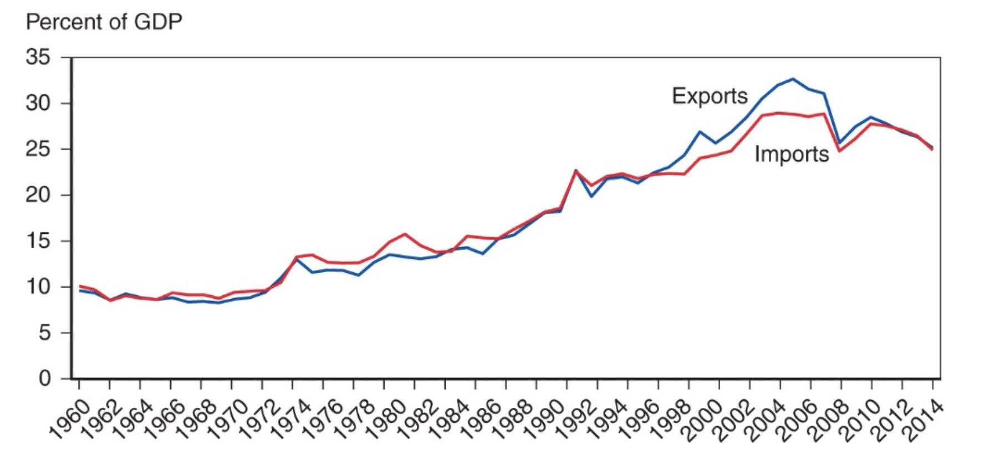

# 13.07.2023 Developing Countries and Trade Policy

> **Low / middle income countries**: Countries with GDP and HDI lower than certain treshold (2021: < 12.000 GDP World Bank)

## Import Substitutin Industrialization

Policy: encourage local industry 

- tariffs for competing imports
- add export-subsidy

Goals:

- Protect *infant industry* in first steps
- build up industry for export

problems:

- Wasteful
- Industry not getting competitive

## Trade Liberalization

less tariffs and non-trade barriers

- high growth for some countries (China, Taiwan)
- no clear effects on ohter (Brazil)
- higher income inequality 

World Bank: Exports and Improt as % of GDP

Why is Asia different than South America?

- high saving and investment
- rapid education
- other reforms

